# TabPFN-2.5: 表形式基盤モデルの最先端を前進させる

> 原題: TabPFN-2.5: Advancing the State of the Art in Tabular Foundation Models
> 出典: arXiv:2511.08667（Prior Labs テクニカルレポート, 2025）

> 注: 本翻訳は **本文 §1〜7 ＋ 付録 A〜I を含む**（ユーザー指示で appendix も対象）。ただし **Appendix B（公開済み100件の応用事例カタログ）は件数サマリのみ**訳出し、個別事例・外部リンクの列挙は省略する（原典 Appendix B を参照）。文献参照記号は省略。図は markdown 原典（ar5iv）から `raw/assets/2025-tabpfn-2-5/` にローカル保存し、該当位置に引用する。

<figure>

<figcaption>Prior Labs ロゴ（原典冒頭の図）。</figcaption>
</figure>

## Abstract（要旨）

最初の表形式基盤モデル TabPFN とその後継 TabPFNv2 は表形式 AI に大きな影響を与え、数十の手法がその上に構築され、さまざまなユースケースで数百の応用が生まれた。

本レポートは、我々の表形式基盤モデルの次世代である TabPFN-2.5 を紹介する。これは最大 50,000 データ点・2,000 特徴量のデータセット向けに構築され、TabPFNv2 と比べてデータセル数で 20× の増加である。

TabPFN-2.5 は今や業界標準ベンチマーク TabArena（最大 100,000 訓練データ点のデータセットを含む）の首位手法であり、チューニングした木ベースモデルを大きく上回り、前世代の TabPFNv2 さえ含む 4 時間チューニングの複雑なアンサンブルである AutoGluon 1.4 の精度に並ぶ。

注目すべきことに、デフォルトの TabPFN-2.5 は、小〜中規模の分類データセット（≤10,000 データ点・500 特徴量）でデフォルトの XGBoost に対し 100% の勝率、最大 100K サンプル・2K 特徴量のより大きいデータセットで 87% の勝率（回帰では 85%）を持つ。

本番ユースケースのため、TabPFN-2.5 をコンパクトな MLP または木アンサンブルに変換する新しい蒸留エンジンを導入する。これはその精度の大半を保ちつつ、桁違いに低いレイテンシとプラグアンドプレイの展開を提供する。

この新リリースは、TabPFN エコシステム上に既に構築された多くの応用と手法の性能を即座に強化する。

<figure>

<figcaption>図1: 標準的な TabArena-Lite ベンチマーク（TabPFNv2 分類サブセット）での TabPFN-2.5 の性能。TabPFN-2.5 は順伝播で他のどのモデルも上回り、TabPFNv2 からの大きな飛躍を示す。実データでファインチューンした Real-TabPFN-2.5 はさらに強い性能を示す。水平の点線は、TabPFNv2 を含むモデルのアンサンブルを 4 時間チューニングした AutoGluon 1.4 extreme モードを表す。</figcaption>
</figure>

## 1 Introduction（はじめに）

表形式データは遍在し、金融からヘルスケアまで無数の領域で意思決定の屋台骨を成す。

数十年にわたり、勾配ブースティング木・ランダムフォレスト・線形/加法モデルに基づく伝統的な表形式機械学習が、応用データサイエンスの主力であり続けてきた。

しかしこれらの手法には限界がある。データセットごとの大がかりなチューニングを要し、大きな修正なしにはしばしば較正されていない・信頼できない不確実性推定しか与えず、現代の基盤モデルが持つ汎化性・転移性を欠く。

表形式基盤モデル（tabular foundation models, TFMs）は新しいパラダイムを提供する。これらは表形式タスクの大きな合成分布で事前訓練し、勾配降下の代わりに文脈内学習で推論することで、これらの限界に対処する。

それらは訓練不要の予測器であり、勾配ブースティング木に必要な時間と労力のかかるハイパーパラメータチューニングなしに、強い較正をもたらすようメタ訓練されている。

その強い汎化性は、データの乏しい領域で特に魅力的である。

我々の最初のリリース TabPFNv1 は、Transformer がベイズ的な推論アルゴリズムを学習できることの概念実証として機能したが、小さく（最大 1k サンプル）・クリーンで・数値のみのデータに限られていた。

後継の TabPFNv2 は、このアイデアを最大 10,000 サンプルのデータセット向けの実用モデルへとスケールさせた。TabPFNv2 は、カテゴリ特徴量・欠損値・外れ値を含む、実世界で見られる雑然として異質なデータを扱う。

本論文は TabPFN の次のリリース、TabPFN-2.5 を述べる。我々の主要な貢献は以下である。

- **SOTA 性能**: 順伝播で、TabPFN-2.5 はチューニングした木ベースモデル（XGBoost や CatBoost など）を上回り、4 時間チューニングした AutoGluon 1.4——前世代の TabPFNv2 を含むすべての従来手法を含む複雑なアンサンブル——の精度に並ぶ。
- **改善されたスケーラビリティ**: 文脈内学習の力を最大 50,000 サンプル（TabPFNv2 比 5 倍）・2,000 特徴量（4 倍）のデータセットへスケールし、TFM をはるかに広範な実世界問題で実用可能にする。TabPFN-2.5 は最大 50,000 行向けに設計されたが、この上限は厳密ではなく、最大 100,000 訓練サンプルのベンチマークでも強い結果を報告する。
- **高速な推論**: 推論速度を劇的に改善する。MLP または木アンサンブルを出力する独自の出力エンジン TabPFN-as-MLP/TreeEns を導入し、TabPFN の精度の大半を、MLP や木アンサンブルの低レイテンシ推論・容易な展開と組み合わせる。

まず TabPFN の応用と拡張の成長するエコシステムを概観し（第 2 節）、次に方法論的進展を述べ（第 3 節）、実験結果を提示する（第 4 節）。続いて一般的なハードウェアで TabPFN から最良の速度を引き出す方法（第 5 節）と、非商用オープンソースライセンス（第 6 節）を論じる。残る限界と今後の課題を論じて締めくくる（第 7 節）。

## 2 Ecosystem & Adoption（エコシステムと採用）

ここでコミュニティの採用、TabPFN の上に構築された手法、我々の TabPFN 拡張について論じる。

### 2.1 Community Adoption（コミュニティの採用）

リリース以来、TabPFNv2 は表形式 ML で広く使われるベースラインになった。Nature 論文は出版後 10 か月以内にほぼ 400 本の論文で引用され、オープンソースパッケージは PyPI で 2,000,000 ダウンロードを超えた。

採用は研究と本番の両方に及び、特にデータが疎な、あるいは頻繁な再訓練を要する設定で顕著である。

この広範な採用は、TabPFN を研究モデルから安定したプロダクトへと成熟させた。Discord の約 1,500 ユーザーのコミュニティと数百のクローズされた GitHub issue からのフィードバックにより、多数の安定性修正とクロスプラットフォームのデバイス互換性を出荷した。

商用ユースケースに加え、幅広い分野で公開された 100 件のユースケースも収集した（詳細リストは Appendix B を参照）。

- **ヘルスケアとライフサイエンス**: 採用はヘルスケアで最も強く（50 件以上の公開応用）、データの乏しい設定での TabPFN の卓越した性能——医療で一般的な課題——に牽引されている。腫瘍学・神経学・循環器学・薬理学に及び、複雑なマルチモーダル（臨床・画像・オミクス）データからの診断・予後・治療反応予測のような応用を支える。
- **金融サービス・銀行・保険**: 強い商用的牽引が見られるが、この業界の競争的・私的な性質のため公開ユースケースは稀（3 件収集）。この領域の応用は典型的に独自予測・アップリフトモデリング・リスク評価を含む。
- **エネルギーと公益事業**: 複雑な予測と最適化を中心に 15 件の公開事例を特定。主要応用は環境予測（藻類ブルーム・山火事リスク）・再生可能エネルギーのナウキャスト・水/石油ガスにわたるプロセス/資産最適化を含む。
- **製造業と産業**: この分野の 12 件の多様な公開ユースケースは TabPFN の柔軟性を強調する。応用は IIoT セキュリティの異常検知・回転機械の予知保全・電池熱モデリングの物理考慮最適化・半導体テスト最適化を含む。
- **その他の産業**: さらに 19 件の応用が、地球科学・農業・材料・工学にわたる広い有用性を示す。マイクロバイオーム分類や月レゴリス分析から、土壌特性モデリング・燃料配合最適化・作物収量予測まで及ぶ。

### 2.2 A Foundational Layer for New Research（新研究の基盤層）

直接の応用を超え、TabPFN は今や新しい研究領域の基盤層として機能する。強力な事前訓練済みの「箱入りアルゴリズム」として働く能力は、複雑な問題への新しいアプローチを開いた。TabPFN-2.5 はこれらすべての領域で性能を直接押し上げると期待する。

- **時系列予測**: TabPFN-TS は時間的文脈を文脈内学習機構に組み込むことで TabPFN を時系列予測に拡張し、再訓練なしで専用の時系列モデルを上回る。
- **グラフのノード分類**: 各種研究がグラフノードを関係的・構造的特徴を持つ表形式インスタンスとして表現し、TabPFN のような表形式基盤モデルで直接問題を解く。
- **データストリーム**: TabPFNv2 が進化するデータストリーム上の文脈内学習に用いられた。TabPFN は再訓練なしで非定常なデータストリームにオンラインで適応でき、進化する環境での継続学習を可能にする。
- **強化学習**: TabPFNv2 が勾配ベースの方策最適化を軌跡上の文脈内最適化で置き換えるのに用いられ、RL タスクの強力な汎用最適化器を作った。
- **ベイズ最適化**: GIT-BO は高次元ベイズ最適化の内部で TabPFNv2 を用い、高次元で異質な設計空間での効率的探索を可能にする。
- **マルチモーダル学習・エンコーディング**: TabPFN は表形式データを他のモダリティと統合するのに用いられる。画像などと組み合わせるロバストな埋め込みを生成する**凍結された表形式エンコーダ**として機能でき、モダリティ固有の射影器を加えることで統一的にモダリティを扱える。
- **因果推論**: Do-PFN・CausalPFN・CausalFM は介入結果を予測するよう PFN を事前訓練し、因果効果の推定で強い性能を示す。

### 2.3 The TabPFN-Extensions Ecosystem（TabPFN 拡張エコシステム）

我々は TabPFN–Extensions リポジトリを保守しており、TabPFN を取り巻く成長するコミュニティと共同で開発した、コアモデル周辺の拡張を提供する。これらの拡張は TabPFN の能力を以下に活用する。

- **解釈可能性**: SHAP 値、特徴量選択、部分依存。
- **教師なしタスク**: データ生成、拡張、外れ値検出。
- **高度なモデリング**: 多クラス分類、分類器経由の回帰。
- **性能と統合**: 軽量 HPO、アンサンブル、木/フォレストベースラインとの統合。

付録の図 11 は、ユーザーがタスクに適した構成要素を選ぶのを助ける最小ワークフローを提供する。

## 3 Model Overview（モデル概要）

TabPFN-2.5 は TabPFNv2 と同じ全体設計に従うが、より深いアーキテクチャ・より豊かな合成事前分布・新しい較正/推論モジュールを導入する。ここでは主要な変更点のみ要約する。

#### データ.

我々は事前分布データ生成を大幅に改善し、分布の集合を広げ、より多くのデータ点・特徴量へスケールアップしつつ、予測タスクを難しく保った。

元の TabPFNv2 と同様、TabPFN-2.5 は純粋に合成生成データで訓練される。我々はまた、Real-TabPFN に従って実データでファインチューンした版も公開する。これは OpenML と Kaggle から収集した 43 個の実世界表形式データセットの厳選コーパスで訓練され、すべての内部ベンチマークと TabArena スイート全体に対して重複除去されている。この版を Real-TabPFN-2.5 と呼び、図 3・4 で強い改善を報告する。訓練と重複除去の詳細は Appendix C を参照。

#### アーキテクチャ.

データ点と特徴量の両方にわたって注意を向けて順列不変性を達成する TabPFNv2 の交互アテンション Transformer 設計に従うが、いくつかの変更を導入する。

- 回帰モデルでネットワーク深さを 12 層から 18 層へ、分類モデルで 24 層へ増やす。
- 同時に特徴量グループサイズ（一緒に埋め込まれる特徴量数）を増やし、より速い訓練と推論を可能にする。TabPFN-2.5 ではグループサイズ 3 を用いる（TabPFNv2 は 2）。
- 回帰モデルでは、TabPFNv2 で用いた線形エンコーダを 2 層 MLP で置き換えることで小さな改善を見出した。
- 最後に、事前訓練中に学習される 64 個の追加の「思考（thinking）」行を TabPFN-2.5 の入力データセットに加える。LLM 文献の結果に着想を得たこれらの行は、モデルに追加の計算容量を与え、他の行を無視するのを助けるアテンションシンクとしても働きうる。

TabPFNv2 の他のコア構成要素——特徴量/サンプルの双対アテンション、訓練/テスト文脈のキャッシュ分離、位置的特徴量埋め込み——は変わらない。

#### 前処理.

ロバスト性と汎化を高めるため、複数のデータセット順列と特徴量変換にわたって予測を集約する。

更新された TabPFN-2.5 構成では、外れ値の多い特徴量分布へのロバスト性を高め、個々の推定器間の多様性を増すため、追加の特徴量変換を導入する。具体的には、ロバストスケーリングとソフトクリッピングを、分位点変換と標準スケーリングと組み合わせ、特徴量間で安定性と感度のバランスを取る。

TabPFNv2 に従い、一部の推定器では特異値分解（SVD）成分を追加特徴量として含め、補完的な大域構造情報を与える分散の高エネルギー方向を捉える。

#### TabPFN による TabPFN のハイパーパラメータチューニング.

TabPFN のハイパーパラメータ空間はアーキテクチャ・訓練・事前分布データのパラメータに及び、網羅的なグリッド探索は計算的に実行不能である。この空間を効率的に探索するため、サロゲートベースの最適化戦略を採用した。

まず、もっともらしい事前範囲から引いた広いが疎なハイパーパラメータ構成のグリッドで約 100 個のモデルを訓練し、厳選した社内検証スイートで評価して、コンパクトなハイパーパラメータ–性能ペアの集合を作った。

約 50 個のハイパーパラメータと 100 個のデータ点だけでは、直接の補間は過適合しがちだった。そこで、データの乏しい構造化予測によく適した回帰モデル——前世代の TabPFNv2——をサロゲートとして用い、より密な 10,000 構成のグリッドで検証性能を予測した。この自己参照的な「TabPFN が TabPFN をチューニングする」戦略は、本格的で計算集約的な訓練実行のために探索空間の有望な領域を効率的に浮かび上がらせた。

#### カスタム指標のチューニング.

TabPFN-2.5 は、較正と指標特化の最適化の両方を高める新しい後処理機能を追加する。我々の枠組みは今や分類器の決定閾値のチューニングをサポートし、精度を超える指標——F1 スコアなど——の直接最適化を、精度と再現率の望ましいトレードオフへ動作点を調整することで可能にする。

多クラス分類では、最終ソフトマックス出力に温度スケーリングを適用して確率較正を改善できる。この閾値チューニング手順は実質的な性能改善をもたらしうる（Appendix H 参照）。ただし、特に断らない限り、本レポートのすべての分類結果は、温度スケーリングや閾値チューニングなしの未較正のデフォルトスコアで計算される。

#### 推論コストの削減.

TabPFNv2 より大きいモデルであるにもかかわらず、TabPFN-2.5 は最適化された前処理とより大きな特徴量グループのおかげで 1x〜2.3x 速い（図 20 参照）。これにより TabPFN-2.5 は最大 50,000 行・2,000 特徴量のデータセットへ推論をスケールできる。さらに、FlashAttention-3 の採用と複数 GPU にわたる並列評価で大きな速度向上を見出した。

#### 高速で展開可能なモデルの作成.

展開の柔軟性を高めるため、訓練データセットを与えると、その上で TabPFN に近い性能を持つ多層パーセプトロン（TabPFN-2.5-as-MLP）または木アンサンブル分類器（TabPFN-2.5-as-TreeEns）を出力する独自の蒸留エンジンを開発した（図 7 参照）。

TabPFN と対照的に、得られる MLP または木アンサンブル分類器はデータセット固有であり、文脈内学習を行わず、単一のデータ点を入力に取り、予測に非常に低いレイテンシとメモリフットプリントを持つ。レイテンシ・解釈可能性・規制要件で展開モデルのクラス変更が妨げられる本番パイプラインにもシームレスに統合できる。これは実世界の意思決定システムでの TabPFN-2.5 の実用性を高める。他の種類のモデルも容易にサポートできる。

<figure>

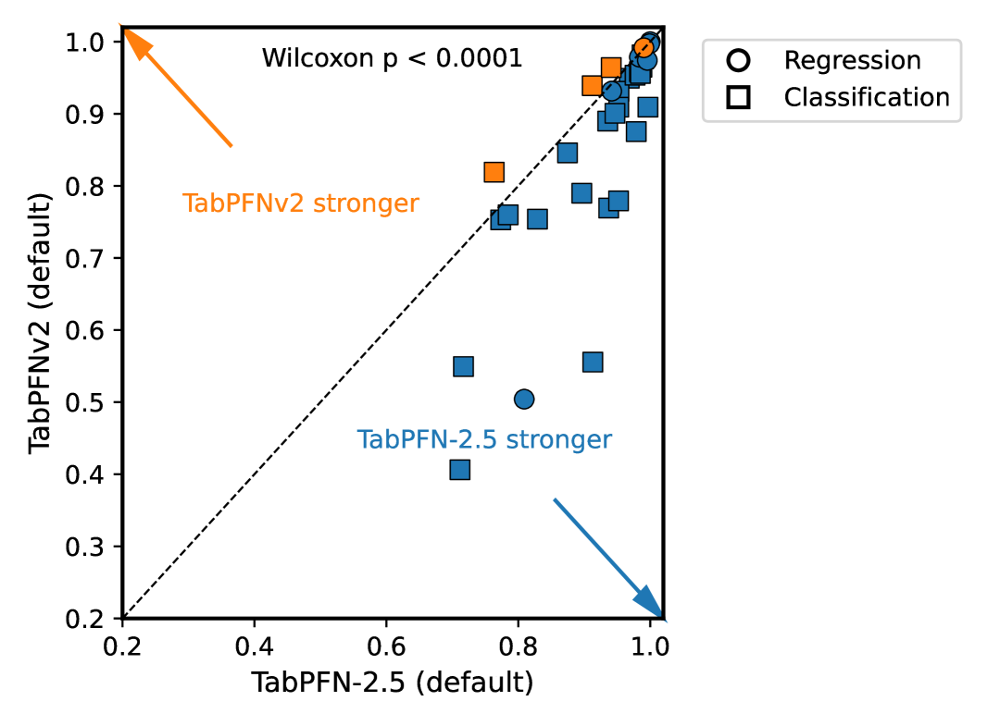

<figcaption>表1: TabPFN モデル各種の要約。Max Rows と Features は推奨最大サイズ。モデルはより大きいデータセットにも当てはまるが、その設定向けには構築・評価されていない。</figcaption>
</figure>

## 4 Experimental Results（実験結果）

まず業界標準ベンチマーク TabArena と我々独自のベンチマーキング枠組みで最先端の性能を示す。次に推論レイテンシ削減の進展を報告する。最後に、TabPFN-2.5 が因果機械学習で新しい最先端性能をもたらすことを示す。

### 4.1 Performance on the Industry Standard Benchmark TabArena（業界標準ベンチマーク TabArena での性能）

TabArena は、考慮された候補データセット数が最大の、最も厳選された表形式ベンチマークであり、幅広い機関のオープンソース貢献者によって作られた。NeurIPS 2025 Datasets & Benchmarks トラックに登場予定で、最も最新である。

論文の推奨に従い、1 つのテストフォールドのみを使う、安価だが代表的な版「TabArena-Lite」でベンチマークする。このベンチマークは 1053 から選ばれた 51 個のデータセットを含み、実世界の表形式データを代表する。

#### 小〜中規模データセットで限界を押し上げる.

図 3 は、最大 10,000 データ点・500 特徴量での TabArena-Lite における TabPFN-2.5 の結果を示し、TabPFN-2.5 が順伝播で既存の幅広い表形式予測手法を上回ることを実証する。

分類では、TabPFN-2.5 は順伝播で、4 時間チューニングされ最良の他手法（TabPFNv2 さえ）を含むアンサンブルである AutoGluon 1.4 を上回る。実データセット（TabArena データセットから重複除去）でファインチューンした Real-TabPFN-2.5 版を用いると、リードはさらに広がる。一方、我々の回帰モデルはチューニングからより多くの恩恵を受け、60 構成チューニング後に AutoGluon 1.4 を上回る。

#### より大きいデータセットへのスケーリング.

図 4 は、最大 100,000 データ点・2,000 特徴量の全 TabArena データセットでの類似実験を示し、TabPFN-2.5 を最良のデフォルトモデルとして明確にランク付けし、チューニング時に（回帰データセットでは）AutoGluon 1.4（4 時間チューニング）を上回るか（分類データセットでは）肉薄する。再び、これらより大きい分類データセットでの Real-TabPFN-2.5 の非常に強いデフォルト性能を強調する。1 回の順伝播で、他のどのチューニング・アンサンブルモデルも上回る。

#### TabPFNv2 からの大きな改善.

TabPFN-2.5 と TabPFNv2 のデフォルト性能を比較すると、図 3 で大きな性能の飛躍が見える。加えて、TabArena（TabPFNv2 互換サブセット）の各データセットでの性能を図 2 で見ると、TabPFN-2.5 がほぼすべてのデータセットで TabPFNv2 を明確に上回り、大きく劣ることが決してないことがわかる。Appendix G では TabArena-Lite の結果を詳述し、異なるモデルのペアワイズ勝率を示し、TabPFN-2.5 を TabICL や LimiX のような他の基盤モデルと比較する。

<figure>

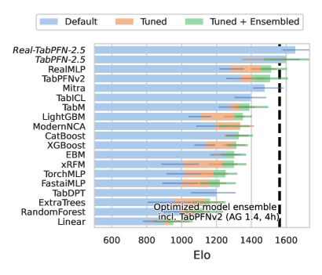

<figcaption>図3: 分類（左）と回帰（右）の TabArena-Lite 結果。1 万訓練サンプル・500 特徴量未満のデータセットに限定。TabPFN-2.5 のチューニングはベースラインの 200 に対し 60 のランダム構成のみに基づく。縦の点線は TabPFNv2 を含むモデルのアンサンブルを 4 時間チューニングした AutoGluon 1.4 extreme モードを表す。</figcaption>
</figure>

<figure>

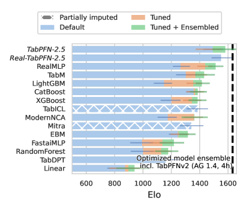

<figcaption>図4: 分類（左）と回帰（右）の TabArena-Lite 結果。全データセットで評価し、最大 100K 訓練行・2K 特徴量まで。TabPFN-2.5 のチューニングは 60 ランダム構成のみ（ベースラインは 200）で、ベンチマーク最大の 4 データセットでは tuning 時間短縮のため探索空間から "dt-pfn" を除いた。縦の点線は 4 時間チューニングの AutoGluon 1.4 extreme モード。</figcaption>
</figure>

### 4.2 Performance on Internal Benchmarks（内部ベンチマークでの性能）

#### 多様な内部ベンチマーク.

公開 TabArena ベンチマークに加え、独自データを使った独自のベンチマーキング枠組みを構築した。ヘルスケア・金融・保険・小売・製造の 100 件超のユースケースを含む。

このベンチマークは、業界で頻繁に使われる勾配ブースティング決定木ライブラリ（XGBoost・CatBoost・LightGBM）への比較に焦点を当て、デフォルト版と 1 時間チューニング版の両方を見る。すべての場合で 3 つの標準勾配ブースティング木ライブラリの結果を示す。すべてのベースラインを TabPFNv2 の確立した探索空間でランダム探索により 1 時間チューニングする。TabPFN は我々の AutoTabPFN システムでチューニングし、チューニング・アンサンブルされたモデルを得る。

#### TabPFN-2.5 は最大 50,000 サンプル・2,000 特徴量で強い結果を示す.

図 5 と図 6 は、最大 50,000 データ点・500 特徴量の分類・回帰データセットでの内部ベンチマーク結果を示す。これらの図で、TabPFN が 1 回の順伝播で我々のチューニングした全ベースラインを上回ることがわかる。Section F では 500〜2,000 特徴量のデータセットでも強い結果を示し、各モデルの性能をデータセット間で正規化する方法の詳細を提供する。

<figure>

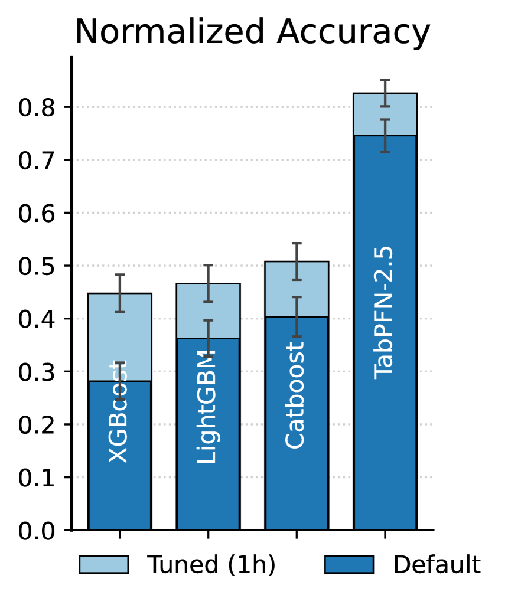

<figcaption>図5: 最大 50,000 データ点の分類データセットでの内部ベンチマーク結果。正規化の詳細は Appendix F。散布図（右）は各点が内部ベンチマークの異なるデータセットで、軸は TabPFN-2.5 と CatBoost（デフォルトまたは 1 時間チューニング）の正規化性能を測る。</figcaption>
</figure>

<figure>

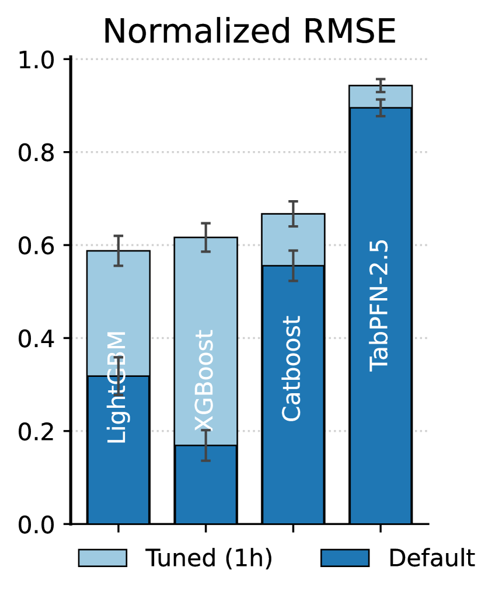

<figcaption>図6: 最大 50,000 データ点の回帰データセットでの内部ベンチマーク結果。正規化の詳細は Appendix F。散布図（右）は各点が異なるデータセットで、軸は TabPFN-2.5 と CatBoost（デフォルトまたは 1 時間チューニング）の正規化性能。</figcaption>
</figure>

<figure>

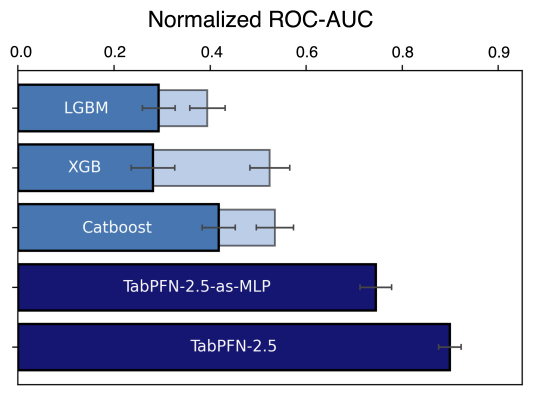

<figcaption>図7: TabPFN-as-MLP は、TabPFN よりはるかに速い推論速度を持ちながら、依然として木ベースモデルを上回る。ベースラインは薄い青が 1 時間チューニング、濃い青がデフォルト性能。TabPFN はデフォルト性能を報告。</figcaption>
</figure>

### 4.3 Measuring TabPFN-2.5 Training and Inference Speed（訓練・推論速度の測定）

図 8 は、1 個または 4 個の GPU を使い、データセットの行数・列数を変えたときに、TabPFN-2.5 の分類速度が訓練集合サイズとともにどうスケールするかを示す。測定時間は訓練行の処理時間（古典的 ML モデルの「訓練」に相当）とテスト行の「予測」時間の両方を含む。

行・列の双対アテンションと推定器あたり 500 特徴量での上限付き特徴量サブサンプリングのため、期待される $\mathcal{O}(r^{2}\min(c,500)+r\min(c,500)^{2})$ のスケーリング（$r$ は行数、$c$ は列数）が観察できる。第 5 節は回帰の結果、参照用の一般的な GPU モデルでの性能、TabPFNv2 からの高速化の測定を含む。ここで報告する推論速度は、完全な文脈内学習モデルのレイテンシを反映する。

<figure>

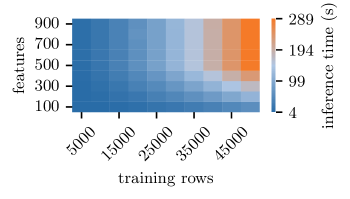

<figcaption>図8(a): H100 GPU 1 枚での、訓練集合サイズに対する TabPFN-2.5 分類速度のスケーリング。</figcaption>
</figure>

### 4.4 Fast Inference with TabPFN-2.5-as-MLP（TabPFN-2.5-as-MLP による高速推論）

TabPFN-2.5-as-MLP を、チューニングした LightGBM・XGBoost・CatBoost、ならびに標準の TabPFN-2.5 モデルと、1 万データ点未満の厳選した内部オープンソースデータセット集合でベンチマークする。

図 7 は代表的なテスト分割性能を示す。経験的に、TabPFN-2.5-as-MLP は推論コストを削減しつつ競合的な精度を提供し、高スループットまたは資源制約のある展開シナリオに魅力的である。

### 4.5 TabPFN for Causal Inference（因果推論のための TabPFN）

#### RealCause ベンチマーク.

TabPFN の因果推定器としての潜在能力を体系的に評価するため、RealCause ベンチマークを活用する。これは実世界のランダム化比較試験（RCT）データから始め、観測可能な交絡効果を合成的に作る半合成ベンチマークである。

異質効果の推定における精度（PEHE）を測る。これは予測値と RealCause の真の CATE 値の間の二乗平均平方根誤差に相当する。

図 10 で、CATE 推定のための PFN ベース手法がリーダーボードを支配し、上位 7 位を占めることを示す。T-Learner（処置群と対照群に別々のモデルを当てはめる単純な 2 モデルアプローチ）として適用した TabPFN-2.5 が全体で最も強い性能を達成し、専用の木・深層学習ベース手法を上回る。

また図 10 で、3 つのメタ学習器それぞれについて、TabPFN-2.5 が TabPFNv2 や HPO より箱出しで良い性能を示すことを観察する。この結果は、ベースモデルの予測性能の改善が因果推論の問題に転移することを示す。

#### 因果推論のための基盤モデル.

非交絡設定で強い結果を示すが、実世界の因果推論はしばしば不完全なデータと潜在交絡を伴う。成長する研究の流れは、因果推論のために PFN を明示的に事前訓練することを目指す——例えば介入結果の予測や因果構造の直接学習。我々はこれを基盤モデルの最もわくわくするフロンティアの 1 つと見る。TabPFN の推論を、何があるか（what is）の予測から、もし介入したら何が起きるか（what would happen if）の推論へ、そして最終的になぜか（why）の理解へと拡張する。

<figure>

<figcaption>図9: PFN ベースの CATE 推定器は RealCause を支配し、因果推論のための専用の木・深層学習ベース手法を上回る。傾向スコアと結果モデルの選択は CATE 推定に重要。</figcaption>
</figure>

## 5 How to Get Optimal Fit + Predict Speed from TabPFN-2.5（最適な fit+predict 速度を得る方法）

良い性能を達成するため、以下を推奨する。

- **専用 GPU を使う**: NVIDIA H100 または A100 を推奨。PyTorch がサポートする任意の専用 GPU が互換だが、一部のモデルは大きいデータセットに十分なメモリがないか低速なことがある。統合 GPU・MPS（Apple Silicon）・CPU もサポートされるが、小さいデータセットにのみ適する。
- **複数 GPU を使う**: より大きいデータセットでは、複数 GPU で推論を並列化することで fit+predict 時間を劇的に削減できる。TabPFNClassifier/TabPFNRegressor の device パラメータで有効化する。
- **バッチ推論を使う**: fit 済みモデルキャッシュを有効にしない限り、.predict() 呼び出しごとにモデルが再訓練される。したがって全テスト点を 1 回の .predict() 呼び出しで予測する方がはるかに速い。メモリ不足なら 1000〜10000 のバッチに分けて .predict() を呼ぶ。
- **PyTorch 2.8 以降を使う**: TabPFN-2.5 は以前の版もサポートするが、性能が低いことがある。
- **小さいデータセットでは fit 済みモデルキャッシュを有効にする**: これは実験的機能で、.fit() 中にモデルを訓練・保存し、KV-Cache を使って後続の .predict() を高速にする。fit_mode を fit_with_cache に設定して有効化。ただしこの設定では分類モデルが訓練データセットのセルあたり約 6.1KB の GPU メモリと 48.8KB の CPU メモリを消費する（回帰モデルは約 25% 少ない）ため、現状は小さい訓練データセットにのみ適する。より大きいデータセットや CPU ベース推論では TabPFN-as-MLP/Tree 出力エンジンを推奨。
- 速度が重要なら、TabPFNClassifier/TabPFNRegressor の memory_saving_mode と n_preprocessing_jobs パラメータの最適化を検討。

付録の図 18 は、1 個または 4 個の GPU を使うときの 3 つの一般的な GPU モデルで期待される推論レイテンシを示す。各 GPU のメモリに収まる最大データセットサイズも示す。

## 6 License and Availability（ライセンスと提供）

TabPFN-2.5 を、研究と内部評価に寛容に設計された TABPFN-2.5 License v1.0 の下で公開する。テスト・評価・内部ベンチマークを明示的に許可し、組織はモデルをダウンロードして自分のデータセットで予備評価を実行できる。

主要な制約は、モデル・その派生物・その出力をいかなる商用・本番目的にも使えないことである。これは収益を生む製品・調達のための競争的ベンチマーク・クライアント成果物・内部の商業的意思決定への結果利用を含むが、これに限らない。

本番ユースケースには、商用エンタープライズライセンスを提供する。これは独自の高速推論エンジン・専用サポート・統合ツール・他の内部モデルへのアクセスを提供する。

商用ライセンスの問い合わせは sales@priorlabs.ai へ。完全な非商用モードライセンス本文は Hugging Face にある。

### 6.1 Cloud API（クラウド API）

最適化された GPU インフラ上で動く、マネージドな TabPFN-2.5 クラウドエンドポイントを提供する。専用ローカル GPU を持たないユーザーや、完全なオンプレミスライセンスを購入せずに TabPFN を商用利用したいユーザーに推奨の選択肢である。

API は単純な Python SDK（pip install tabpfn-client）または標準 REST API でアクセスでき、非商用・商用両方のアプリケーションへの統合を可能にする。

## 7 Conclusion and The Road Ahead（結論と今後の道）

我々はこのリリースに胸を躍らせている。公開（TabArena）・private ベンチマークでの実験を総合すると、TabPFN-2.5 がチューニング不要の表形式モデルの新しい最先端を打ち立てることが実証される。

最大 50,000 行・2,000 特徴量向けに構築された TabPFN-2.5 は、前世代の TabPFNv2 さえ含む複雑な 4 時間チューニングのアンサンブルの性能に並び、制約のない公開 TabArena ベンチマーク（最大 100,000 訓練データ点のデータセットを含む）で他のどのチューニングモデルも順伝播で上回る。

次のステップは数百万行のデータセットへのスケーリングである。検索・ファインチューニング・新しいアーキテクチャを含む新技術を積極的に開発しており、表形式基盤モデル（TFMs）に基づくシステムが数百万データ点のデータセットでも近く最先端性能を定義すると見込む。

本リリースを超えた我々の広いビジョンは、時系列・マルチモーダル表形式データ・因果推論・教師なしタスク・領域知識の統合・意思決定支援を含む、表形式的データの問題のスタック全体に取り組み、最終的に構造化・マルチモーダルデータ上の推論のためのコア知能エンジンを構築することである。

## Appendix A Contributors（貢献者）

> 氏名はそのまま記載（人名は翻訳しない）。役職見出しのみ訳出。

### モデル開発・展開（Model dev & Deployment）

Léo Grinsztajn, Klemens Flöge, Oscar Key, Felix Birkel, Brendan Roof, Phil Jund, Benjamin Jäger, Adrian Hayler, Dominik Safaric, Simone Alessi, Felix Jablonski, Mihir Manium, Rosen Yu, Anurag Garg, Jake Robertson, Shi Bin (Liam) Hoo, Vladyslav Moroshan, Magnus Bühler, Lennart Purucker, Bernhard Schölkopf, Noah Hollmann, Frank Hutter

### 流通・プロダクト（Distribution & Product）

Clara Cornu, Lilly Charlotte Wehrhahn, Alessandro Bonetto, Sauraj Gambhir

## Appendix B TabPFN Use Case Overview（ユースケース概観）

> **件数サマリのみ訳出**（ユーザー指示）。原典は TabPFNv2 が適用された公開済み 100 件のユースケースを業界別に列挙し、各件に出典リンクを付している。個別事例の訳出とリンク列挙は省略する。詳細は原典 Appendix B を参照。

公開された 100 件のユースケースの内訳:

- **ヘルスケアとライフサイエンス**: 51 件（他のどの分野より圧倒的に多い。データの乏しさとオープンな公開文化に起因。腫瘍学・神経学・循環器学・精神医学・腎臓学・薬理学に及び、診断・予後・治療反応予測など。多くは深刻なデータ希少下）。
- **金融サービス・銀行・保険**: 3 件（競争的性質と非公開傾向のため少数）。
- **エネルギーと公益事業**: 15 件（環境予測・再エネナウキャスト・水/石油ガス/材料のプロセス最適化）。
- **製造業と産業**: 12 件（異常検知・予知保全・物理考慮最適化。IIoT セキュリティ・回転機械・半導体テスト・電池熱モデリング等）。
- **その他の産業**: 19 件（地球科学・法科学・農業・材料・工学。マイクロバイオーム分類・月レゴリス分析・土壌特性モデリング・作物収量/フェノロジー予測・燃料配合最適化・空間回帰など）。

## Appendix C Data Contamination and Deduplication for Real-TabPFN-2.5（データ汚染と重複除去）

公正な評価とデータ汚染の排除のため、Real-TabPFN-2.5 のために強化された多層の重複除去・フィルタリングパイプラインを実装した。Real-TabPFN の方法論に基づくが、訓練データセットをすべての内部ベンチマーク・厳選した社内検証スイート・公開 TabArena ベンチマークに対して重複除去するよう拡張した。

我々の重複除去手順は、データセット識別子・特徴量スキーマ・行/列レベルのハッシュの自動相互参照と、手動のメタデータ検査を組み合わせ、いかなる訓練データセットも評価データセットと重複したり、そこから派生したりしないことを保証する。これらの基準を満たさないデータセットは最終訓練コーパスから除外した。

### C.1 Training Datasets（訓練データセット）

以下の表は、ファインチューニング用に厳選したデータセットを出典・アクセスリンクとともに列挙する（リンクは原典参照）。

| 名前 | 出典 |
| --- | --- |
| artificial-characters | OpenML |
| BNG(breast-w) | OpenML |
| BNG(tic-tac-toe) | OpenML |
| connect_4 | OpenML |
| eeg-eye-state | OpenML |
| Employee-Turnover-at-TECHCO | OpenML |
| eye_movements | OpenML |
| FOREX_eurpln-hour-High | OpenML |
| gas-drift | OpenML |
| higgs | OpenML |
| Intersectional-Bias-Assessment-(Training-Data) | OpenML |
| law-school-admission-binary | OpenML |
| Medical-Appointment | OpenML |
| microaggregation2 | OpenML |
| fried | OpenML |
| mushroom | OpenML |
| NewspaperChurn | OpenML |
| nursery | OpenML |
| WBCAtt | OpenML |
| Internet Firewall Data | OpenML |
| aam_avaliacao_dataset | Kaggle |
| Air Traffic Data | Kaggle |
| ansible-defects-prediction | Kaggle |
| AV Healthcare Analytics II | Kaggle |
| Candidate Selection | Kaggle |
| Cardio Disease | Kaggle |
| Classification - Crop Damages in India (2015-2019) | Kaggle |
| CSGO Round Winner Classification | Kaggle |
| Flower Type Prediction Machine Hack | Kaggle |
| Horse Racing - Tipster Bets | Kaggle |
| How severe the accident could be | Kaggle |
| hr-comma-sep | Kaggle |
| ip-network-traffic-flows-labeled-with-87-apps | Kaggle |
| Janatahack cross-sell prediction | Kaggle |
| L&T Vehicle Loan Default Prediction | Kaggle |
| League of Legends Diamond Games (First 15 Minutes) | Kaggle |
| Richter's Predictor Modeling Earthquake Damage | Kaggle |
| Server Logs - Suspicious | Kaggle |
| Sloan Digital Sky Survey DR14 | Kaggle |
| Sloan Digital Sky Survey DR16 | Kaggle |
| Term Deposit Prediction Data Set | Kaggle |
| trajectory-based-ship-classification | Kaggle |
| Travel Insurance | Kaggle |

## Appendix D Details on Causal Inference Results（因果推論結果の詳細）

#### 因果推論.

ほとんどの実世界の意思決定問題は、究極的には因果的な問い——単に相関を観察するのではなく、介入したら何が起きるかの理解——に帰着する。条件付き平均処置効果（CATE）の推定は、これらの「もし〜なら」の問いに答える中心的な方法の 1 つである。すなわち、処置を施した場合と差し控えた場合で、個人の結果はどう変わるか。

#### 非交絡設定.

多くの因果推論手法は非交絡性（unconfoundedness）を要する。これは大まかに、処置変数と結果の両方に影響する、データセットに含まれない特徴量が存在しないことを述べる。最近の研究はこの仮定の妥当性と検証可能性に疑問を投げかけ始めているが、現在、非交絡設定向けに設計された多様な因果推論手法が存在する。

#### ベースモデルの重要性.

最近の経験的知見は、非交絡性が成り立つとき、CATE 推定が AutoML 問題として枠組み化できることを示している。多くの CATE 推定器が、個人の特徴量を所与とした処置の尤度（傾向）と結果を近似するため、分類または回帰モデルの選択を要するからである。並行する研究は、TabPFN が X-・T-・S-Learner のようなメタ学習器にとって特に強い選択肢であることを示し、表形式予測での強い性能が因果推論の問題に転移すると仮説立てている。

表3: RealCause ベンチマークの因果推論データセットの記述。

| 特性 | ACIC-2016 | IHDP | Lalonde-CPS | Lalonde-PSID |
| --- | --- | --- | --- | --- |
| Realizations | 10 | 100 | 100 | 100 |
| サンプル数 | 4,802 | 747 | 16,177 | 2,675 |
| 特徴量数 | 58 | 25 | 8 | 8 |

## Appendix E The TabPFN Ecosystem（TabPFN エコシステム）

図 11 は、TabPFN–Extensions エコシステムの構成要素を通る最小ユーザーワークフローを提供する。

<figure>

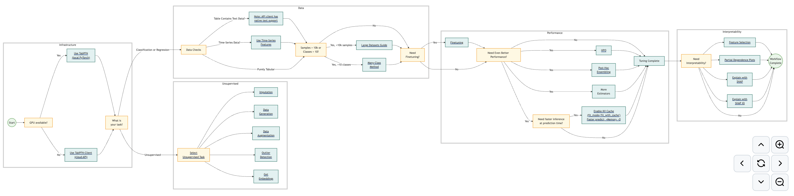

<figcaption>図11: TabPFN–Extensions エコシステムの構成要素を通る最小ユーザーワークフロー。</figcaption>
</figure>

## Appendix F Additional Internal Benchmark Details（内部ベンチマークの追加詳細）

### F.1 Details on the normalization（正規化の詳細）

ベンチマーキングのため、データセット間での平均化とより明確な比較を可能にし、データセット難易度の違いが比較を偏らせないよう、スコアをデータセットごとに正規化する。各データセットについて、スコアを 0（このデータセットで最悪のモデル）と 1（最良）の間で線形にスケールする。各モデルについて、デフォルト版とチューニング版は正規化のため 2 つの異なるモデルとして扱う。バーの高さは平均正規化性能を示し、誤差棒はデータセット間の平均の標準誤差（SEM）を表し、データセットのばらつきによる不確実性を反映する。

### F.2 Additional results on many features（多特徴量での追加結果）

図 12 で、500〜2,000 特徴量を含む内部データセット集合での結果を示し、強いデフォルト性能を示す。

<figure>

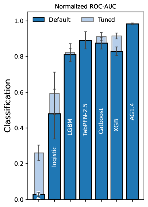

<figcaption>図12: TabPFN-2.5 のデフォルトは最大 2,000 特徴量までよく機能する。500〜2,000 特徴量のデータセットでの内部ベンチマークで、分類（左）・回帰（右）ともデフォルト TabPFN-2.5 が他のどのデフォルトモデルも上回り、回帰では任意のチューニング単一モデルより良い。</figcaption>
</figure>

## Appendix G Detailed TabArena Results（TabArena 詳細結果）

第 4 節で示した結果に加え、TabArena 上の異なるモデルのペアワイズ勝率を図 13（1 万行・500 特徴量未満の TabPFNv2 互換データセット）と図 14（最大 10 万訓練行・2K 特徴量の全データセット）で報告する。

また TabPFN-2.5 モデルを他の基盤モデルとより詳細に比較する。図 15 で、TabICL が設計対象とするデータセットに TabArena を制限すると TabPFN-2.5 が TabICL を上回ることを示し、図 16 で、5 万サンプル・2,000 特徴量未満のデータセット（TabArena 保守者が執筆時点で LimiX を実行できたデータセットに対応）での LimiX の結果と比べてはるかに良い性能を示す。

<figure>

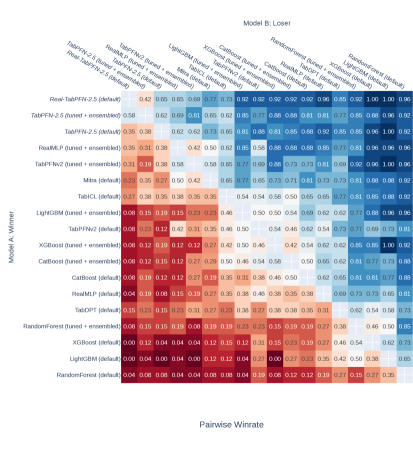

<figcaption>図13: 分類（左）・回帰（右）の TabArena-Lite ペアワイズ勝率。TabPFNv2 互換データセット（1 万訓練サンプル・500 特徴量未満）に限定。TabPFN-2.5 のチューニングは 60 ランダム構成のみ（ベースラインは 200）。</figcaption>
</figure>

<figure>

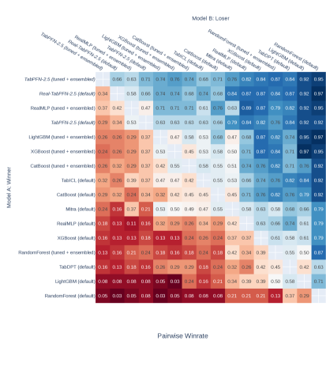

<figcaption>図14: 分類（左）・回帰（右）の TabArena-Lite ペアワイズ勝率。全データセット（最大 10 万訓練サンプル・2K 特徴量）で評価。TabPFN-2.5 のチューニングは 60 ランダム構成のみ（ベースラインは 200）。</figcaption>
</figure>

<figure>

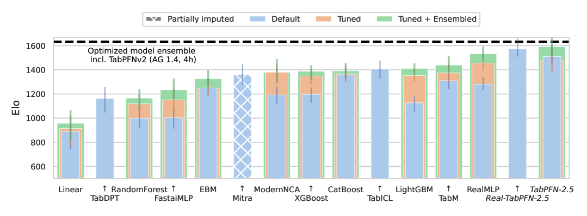

<figcaption>図15: TabICL との比較。TabICL 互換の TabArena-lite サブセット（500 特徴量未満の分類データセット）での TabPFN-2.5 と TabICL の性能。TabICL が設計対象とするこのサブセットで、TabPFN-2.5 が TabICL を有意に上回る。</figcaption>
</figure>

<figure>

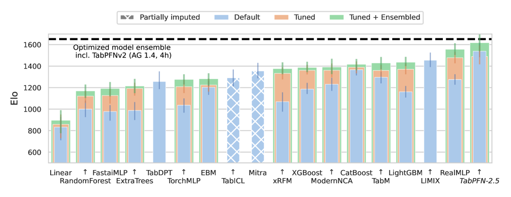

<figcaption>図16: LimiX との比較。TabArena-Lite の 5 万訓練サンプル・2,000 特徴量未満のデータセット（TabArena 保守者が執筆時点で LimiX を実行できたもの）での TabPFN-2.5 と LimiX の性能。このサブセットで TabPFN-2.5 が LimiX を有意に上回る。これらの結果は執筆時点で原著者により未検証のため本文には含めていない。</figcaption>
</figure>

## Appendix H Results with Tuned Decision Thresholds（決定閾値チューニングの結果）

TabPFN-2.5 から、我々の枠組みは特定の指標を最適化するための決定閾値チューニングをサポートする。図 17 はこの手順がもたらしうる性能向上を定量化し、いくつかの不均衡データセットで閾値をチューニングしたときの F1 スコアの実質的改善を示す。

<figure>

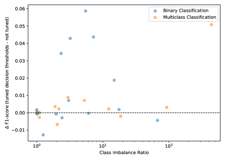

<figcaption>図17: 決定閾値チューニングで F1 スコアが時に実質的に改善する。最適化した決定閾値を持つモデルと、デフォルト（未チューニング）閾値を使う同じモデルの F1 スコア（macro）の差を示す。指標特化の最適化に対する手順の有効性を実証する。</figcaption>
</figure>

## Appendix I Supplementary Inference Time Details（推論時間の補足詳細）

図 18 は 3 つの一般的な GPU モデルで期待される推論レイテンシを示す。図 19 はテスト行数に対して時間が線形にスケールすることを示す。図 20 は TabPFN-2.5 と TabPFNv2 の fit+訓練時間を比較し、TabPFN-2.5 がデータセットサイズに応じて 1x〜2.3x 速いことを示す。

<figure>

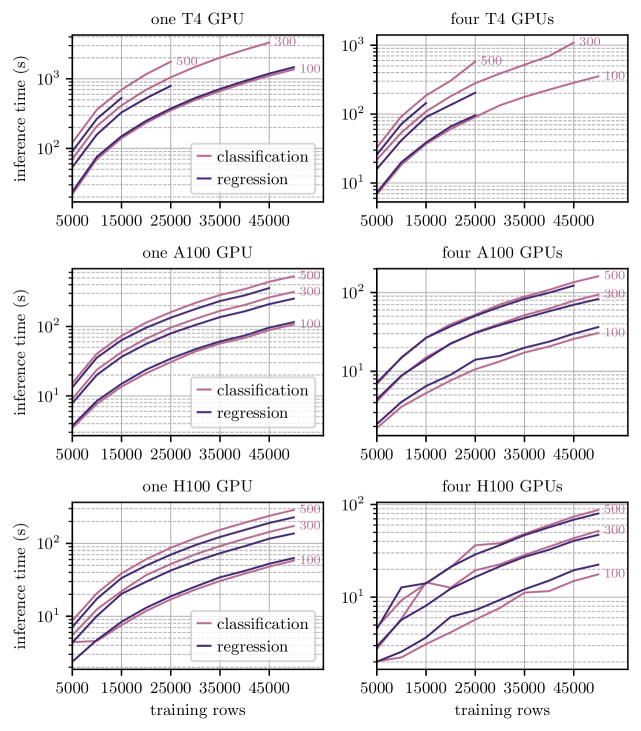

<figcaption>図18: 各種訓練集合サイズで TabPFN-2.5 モデルを訓練し、500 テスト行を予測するのにかかる時間（秒）。3 つの一般的な NVIDIA GPU（T4 15GB, A100 SXM 40GB, H100 SXM 80GB）で測定。100・300 特徴量で性能を表示。線が途切れている箇所は、その GPU がそのデータセットサイズに十分なメモリを持たなかったことを示す。</figcaption>
</figure>

<figure>

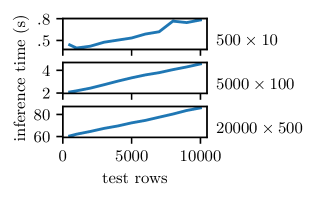

<figcaption>図19: TabPFN-2.5 の訓練・予測時間はテスト集合サイズに対して線形にスケールする。500 行×10 特徴量・5,000 行×100 特徴量・20,000 行×500 特徴量で訓練した分類モデルで示す。H100 GPU 1 枚で測定。</figcaption>
</figure>

<figure>

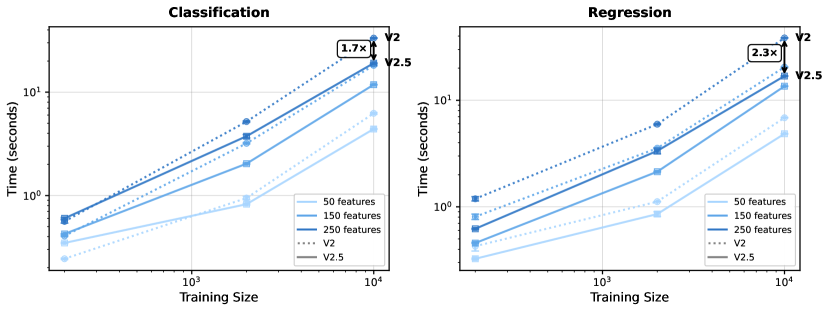

<figcaption>図20: TabPFN-2.5 は TabPFNv2 より有意に速い。異なる行数・特徴量数での TabPFN-2.5 と TabPFNv2 の fit+predict 時間の比較。100 テスト点・H100 1 枚・同じ推定器数（8）で測定。TabPFN パッケージ最新版の v2/v2.5 で測定しており、TabPFNv2 の初版以降の性能改善の上に乗っている。</figcaption>
</figure>
