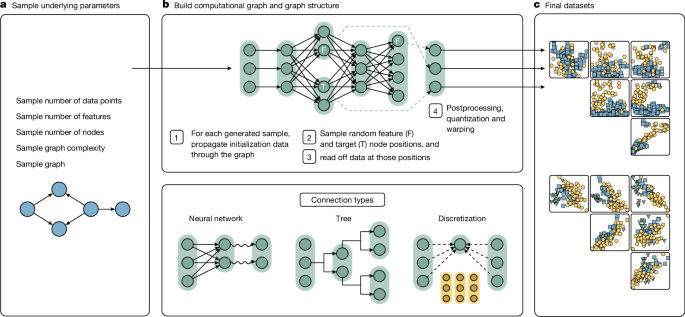
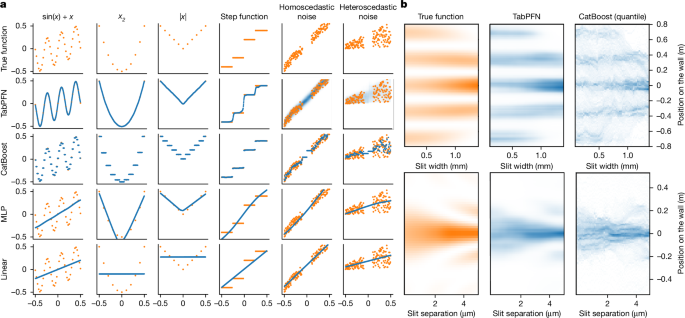
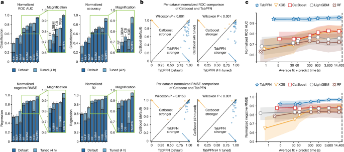
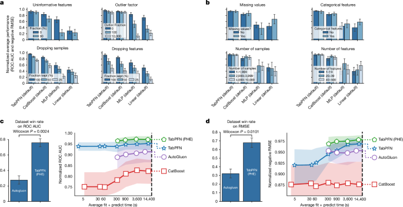

# 表形式基盤モデルによる小規模データでの正確な予測

> 原題: Accurate predictions on small data with a tabular foundation model
> 著者: Noah Hollmann, Samuel Müller, Lennart Purucker, Arjun Krishnakumar, Max Körfer, Shi Bin Hoo, Robin Tibor Schirrmeister, Frank Hutter
> 出典: Nature, 2025-01-08（doi:10.1038/s41586-024-08328-6）

> 注: 本翻訳は **Main ＋ Methods のみ**を一文ずつ訳出している（ユーザー指示）。Extended Data 図表・Supplementary・References・Acknowledgements・Ethics・Peer review・Rights は対象外。図は markdown 原典のため `raw/assets/2025-tabpfn-v2/` にローカル保存し、該当位置に引用する。文献参照記号は省略した。

## Abstract（要旨）

表形式データ（行と列で構成されたスプレッドシート）は、生物医学から素粒子物理学、経済学、気候科学まで、科学のあらゆる分野に遍在している。

残りの列に基づいてラベル列の欠損値を埋めるという基本的な予測タスクは、生物医学的リスクモデル、創薬、材料科学など多様な応用に不可欠である。

深層学習は生データからの学習に革命をもたらし、多くの著名な成功例を生んだが、過去 20 年間、表形式データは勾配ブースティング決定木に支配されてきた。

ここで我々は Tabular Prior-data Fitted Network（TabPFN）を提示する。これは表形式基盤モデルであり、最大 10,000 サンプルのデータセットで、これまでのすべての手法を大差で上回り、しかも訓練時間が大幅に少ない。

分類設定では、TabPFN は 2.8 秒で、4 時間調整された最強のベースラインのアンサンブルを上回る。

生成的な Transformer ベースの基盤モデルとして、このモデルはファインチューニング、データ生成、密度推定、再利用可能な埋め込みの学習も可能にする。

TabPFN は、それ自体が数百万の合成データセットにわたって学習された学習アルゴリズムであり、このアプローチがアルゴリズム開発に持つ威力を実証する。

多様な分野でのモデル化能力を向上させることで、TabPFN は科学的発見を加速し、さまざまな領域での重要な意思決定を強化する可能性を持つ。

## Main（本論）

人工知能の歴史を通じて、手作業で作られたアルゴリズム的構成要素は、より高性能なエンドツーエンドで学習されたものに置き換えられてきた。

コンピュータビジョンにおける手設計の特徴量、例えば SIFT（Scale Invariant Feature Transform）や HOG（Histogram of Oriented Gradients）は学習された畳み込みに、自然言語処理における文法ベースのアプローチは学習された Transformer に、ゲームプレイにおける専用の序盤・終盤ライブラリの設計はエンドツーエンドで学習された戦略に置き換えられた。

ここで我々は、このエンドツーエンド学習を、遍在する表形式データの領域へ拡張する。

表形式データの多様性は、テキストや画像のような未加工のモダリティとは一線を画する。

例えば言語モデル化では単語の意味が文書間で一貫しているのに対し、表形式データセットでは同じ値が根本的に異なるものを意味し得る。

例えば創薬のデータセットは化学的性質を記録するが、材料科学の別のデータセットは熱的・電気的性質を記録するかもしれない。

この専門化は、より小規模で独立したデータセットと、それに付随するモデルの増殖をもたらす。

例を挙げると、人気のある表形式ベンチマークサイト openml.org では、執筆時点でデータセットの 76% が 10,000 行未満である。

深層学習手法は伝統的に表形式データを苦手としてきた。データセット間の異質性と生データ自体の異質性のためである。表は、さまざまなスケールと型（ブール、カテゴリ、順序、整数、浮動小数点）の列（特徴量とも呼ぶ）、不均衡または欠損したデータ、重要でない特徴量、外れ値などを含む。

これにより、木ベースモデルのような非深層学習手法が、これまで最強の対抗馬となってきた。

しかし、これらの伝統的な機械学習モデルにはいくつかの欠点がある。大きな修正なしには、分布外予測が貧弱で、あるデータセットから別のデータセットへの知識転移も貧弱である。

最後に、それらは勾配を伝播しないため、ニューラルネットワークと組み合わせるのが難しい。

その解決策として、我々は小〜中規模の表形式データのための基盤モデル TabPFN を導入する。

この新しい教師あり表形式学習手法は、任意の小〜中規模データセットに適用でき、最大 10,000 サンプル・500 特徴量のデータセットで支配的な性能をもたらす。

1 回の順伝播で、TabPFN は我々のベンチマークにおいて、勾配ブースティング決定木を含む最先端のベースラインを、それらに 4 時間の調整を許した場合でも有意に上回り、分類で 5,140 倍・回帰で 3,000 倍の高速化を達成する。

最後に、ファインチューニング、生成能力、密度推定を含む TabPFN のさまざまな基盤モデル的特性を実証する。

## Principled in-context learning（原理的な文脈内学習）

TabPFN は、大規模言語モデルの驚異的な性能をもたらしたのと同じメカニズムである文脈内学習（in-context learning, ICL）を活用し、完全に学習された強力な表形式予測アルゴリズムを生成する。

ICL は大規模言語モデルで最初に観察されたが、最近の研究は、Transformer が ICL を通じてロジスティック回帰のような単純なアルゴリズムを学習できることを示している。

Prior-data Fitted Networks（PFNs）は、ガウス過程やベイズニューラルネットワークのような複雑なアルゴリズムでさえ ICL で近似できることを示した。

ICL は、閉形式解が存在しない場合を含む、より広い空間の可能なアルゴリズムを学習することを可能にする。

我々は TabPFN の予備版の上に構築する。それは表形式データに対する ICL の適用可能性を原理的に実証したが、ほとんどの場合に適用不能にする多くの限界を持っていた。

一連の改善に基づき、新しい TabPFN は 50 倍大きいデータセットへスケールし、回帰タスク・カテゴリデータ・欠損値をサポートし、重要でない特徴量や外れ値に対してロバストである。

TabPFN の背後にある鍵となる発想は、大規模な合成表形式データセットのコーパスを生成し、次に Transformer ベースのニューラルネットワークを訓練して、これらの合成予測タスクを解くことを学習させることである。

伝統的なアプローチは欠損値のようなデータ課題に対して手作業で設計された解決策を必要とするが、我々の手法はこれらの課題を含む合成タスクを解くことで効果的な戦略を自律的に学習する。

このアプローチは ICL を、アルゴリズムの例示ベースの宣言的プログラミングのための枠組みとして活用する。

我々は、望ましい挙動を示す多様な合成データセットを生成し、それを満たすアルゴリズムをエンコードするようモデルを訓練することで、望ましいアルゴリズム的挙動を設計する。

これはアルゴリズム設計のプロセスを、明示的な命令を書くことから入力–出力の例を定義することへとシフトさせ、さまざまな領域でアルゴリズムを作成する可能性を開く。

ここで我々は、このアプローチを影響の大きい表形式学習の分野に適用し、強力な表形式予測アルゴリズムを生成する。

我々の ICL アプローチは、標準的な教師あり深層学習と根本的に異なる。

通常、モデルはデータセットごとに訓練され、Adam のような手作りの重み更新アルゴリズムに従って、個々のサンプルやバッチでモデルパラメータを更新する。推論時には、学習されたモデルがテストサンプルに適用される。

対照的に、我々のアプローチはデータセットにわたって訓練され、推論時には個々のサンプルではなくデータセット全体に適用される。

実世界データセットに適用される前に、モデルは異なる予測タスクを表す数百万の合成データセットで一度だけ事前訓練される。

推論時には、モデルはラベル付き訓練サンプルとラベルなしテストサンプルの両方を持つ未知のデータセットを受け取り、このデータセットに対する訓練と予測を 1 回のニューラルネットワークの順伝播で行う。

図 1 と図 2 が我々のアプローチを概説する。

1. データ生成: 我々は、特徴量とターゲット間の関係が変化する多様な表形式データセットを合成する生成プロセス（我々の事前分布と呼ぶ）を定義する。これはモデルが遭遇しうる幅広い潜在シナリオを捉えるよう設計される。生成プロセスから数百万のデータセットをサンプリングする。各データセットについて、サンプルの一部のターゲット値をマスクし、教師あり予測問題をシミュレートする。事前分布設計の詳細は「因果モデルに基づく合成データ」節を参照。
2. 事前訓練: 入力特徴量とマスクされていないサンプルを文脈として、すべての合成データセットのマスクされたターゲットを予測するよう Transformer モデル（我々の PFN）を訓練する。このステップはモデル開発中に一度だけ行われ、任意のデータセットの予測に使える汎用の学習アルゴリズムを学習する。
3. 実世界予測: 得られた訓練済みモデルは、任意の未知の実世界データセットに適用できる。訓練サンプルが文脈としてモデルに与えられ、モデルは ICL を通じてこれら未知データセットのラベルを予測する。

<figure>

<figcaption>図1: 提案手法の概観。(a) TabPFN は合成データで訓練され、データセット全体を入力として受け取り 1 回の順伝播で予測する。訓練済み TabPFN は任意の未知の実世界データセットに適用できる。(b) 入力データセットの各セルを 1 トークンとして表現し、2 次元 TabPFN 層（12 層）で「特徴量方向の 1D アテンション」と「サンプル方向の 1D アテンション」＋MLP を行う。出力ベクトルは MLP で区分定数（リーマン）分布に変換される。</figcaption>
</figure>

我々のアプローチは理論的基盤も持つ。それは、合成データセットによって定義される事前分布に対するベイズ予測の近似とみなせる。

訓練済み PFN は事後予測分布 $p(\widehat{\mathbf{y}}_{\text{test}}\mid \mathbf{X}_{\text{test}},\mathbf{X}_{\text{train}},\mathbf{y}_{\text{train}})$ を近似し、したがって PFN 事前訓練中に用いた人工データセット上の指定された分布に対するベイズ予測を返す。

## An architecture designed for tables（表のために設計されたアーキテクチャ）

Transformer アーキテクチャは現在、柔軟な深層学習と基盤モデルにとって好まれるアーキテクチャである。

Transformer モデルは系列上で動作し、アテンション機構と呼ばれるものを用いて系列要素間の情報を結合する。これにより長距離依存を効果的に捉え、データ内の複雑な関係を学習できる。

Transformer ベースのモデルは表形式データに適用できるが、TabPFN はそれらに内在する 2 つの鍵となる限界に対処する。

第一に、Transformer は系列向けに設計されているため、入力データを単一の系列として扱い、表形式の構造を用いない。

第二に、機械学習モデルはしばしば fit-predict モデルで用いられる。すなわち、モデルは訓練集合に一度当てはめられ、その後複数のテストデータセットで再利用される。しかし Transformer ベースの ICL アルゴリズムは訓練データとテストデータを 1 回のパスで受け取るため、訓練と予測を同時に行う。したがって、当てはめたモデルを再利用するとき、訓練集合の計算をやり直さなければならない。

表形式の構造をよりよく用いるため、我々は表の各セルに別々の表現を割り当てるアーキテクチャを提案する。

図 1b に可視化した我々のアーキテクチャは、双方向のアテンション機構を用いる。各セルは、その行（すなわちサンプル）内の他の特徴量に注意を向け、次にその列（すなわち他のすべてのサンプル）にわたって同じ特徴量に注意を向ける。

この設計により、アーキテクチャはサンプルと特徴量の両方の順序に対して不変になり、訓練時に遭遇したものより大きな表（サンプル数・特徴量数の両面で）への、より効率的な訓練と外挿を可能にする。

fit-predict 設定で各テストサンプルごとに訓練集合の計算を繰り返すのを軽減するため、我々のモデルは訓練サンプルとテストサンプルの推論を分離できる。

これにより、訓練集合に対する ICL を一度行い、得られた状態を保存して複数のテスト集合推論に再利用できる。

10,000 訓練サンプル・10 特徴量のデータセットでは、最適化された訓練状態のキャッシングにより、CPU で約 300 倍（32 秒から 0.1 秒へ）、GPU で 6 倍の推論高速化が得られる。

特徴量が 10 倍（100）になると、高速化は CPU で 800 倍、GPU で 30 倍に増える。

これらの測定はコアの推論プロセスのみに焦点を当て、「推論の詳細」節で詳述する前処理やアンサンブルのステップを除外している。

GPU での高速化が低いのは、その大規模並列アーキテクチャの利用率が低いためである。

我々はさらに、層正規化を半精度で計算し、flash attention・活性化チェックポイント・状態の逐次計算を用いることで、アーキテクチャのメモリと計算の要件を最適化する。

我々の最適化はメモリ要件を 4 分の 1 に削減し、セルあたり 1,000 バイト未満となる。

これにより、単一の H100 GPU で最大 5,000 万セル（例えば 500 万行 × 10 特徴量）のデータセットでの予測が可能になる。

回帰タスクでは、区分定数（piece-wise constant）の出力分布を用いる。これにより、単一の値ではなく、例えば双峰分布を含むターゲット値の確率分布を予測できる。

## Synthetic data based on causal models（因果モデルに基づく合成データ）

TabPFN の性能は、実世界の表形式データの特性と課題を捉える適切な合成訓練データセットを生成することに依存する。

そのようなデータセットを生成するため、我々は構造的因果モデル（structural causal models, SCMs）に基づくアプローチを開発した。

SCM は、データの背後にある因果関係と生成プロセスを表す形式的な枠組みを提供する。

大量の公開表形式データの収集の代わりに合成データに依拠することで、プライバシーや著作権侵害、訓練データのテストデータ汚染、データ可用性の制限といった、基盤モデルにありがちな問題を回避する。

図 2 に示すように、我々の生成パイプラインはまず、データセットサイズ・特徴量数・難易度といった高レベルのハイパーパラメータをサンプリングし、各合成データセットの全体的な性質を支配する。

これらのハイパーパラメータに導かれて、データセットの背後にある因果構造を指定する有向非巡回グラフ（DAG）を構築する。

<figure>

<figcaption>図2: TabPFN 事前分布の概観。高レベルのハイパーパラメータ（サイズ・特徴量数・難易度）をサンプリングし、因果 DAG を構築。ルートノードに初期化ノイズを流し、各辺で多様な計算写像（小さな NN・離散化・決定木）とガウスノイズを適用して伝播させ、サンプリングした特徴量ノードとターゲットノードの値を取り出して 1 サンプルとする。</figcaption>
</figure>

データセット内の各サンプルを生成するため、初期化データ（initialization data）と呼ぶランダムに生成したノイズを、因果グラフのルートノードを通して伝播させる。

この初期化データは、サンプル間に様々な程度の非独立性を持たせたランダムな正規分布または一様分布からサンプリングして生成する（「初期化データのサンプリング」節参照）。

これらのデータが計算グラフの辺を通過する際、多様な計算写像の集合を適用する。すなわち、線形または非線形の活性化（例えばシグモイド、ReLU、剰余、正弦）を持つ小さなニューラルネットワーク、カテゴリ特徴量を生成する離散化機構、局所的でルールベースの依存をエンコードする決定木構造である。

各辺でガウスノイズを加え、生成データに不確実性を導入する。

後で取り出せるよう、各ノードの中間データ表現を保存する（詳細は「計算辺写像」節参照）。

因果グラフを通過した後、サンプリングした特徴量ノードとターゲットノードの中間表現を抽出し、特徴量値とそれに関連付けられたターゲット値から成るサンプルを得る。

合成データセットに様々なデータ課題と複雑さを組み込むことで、TabPFN が実世界データセットの類似の問題を扱う戦略を発達させる訓練の場を作る。

例えば、表形式データに一般的に存在する欠損値の場合を考える。合成データ生成プロセスで、様々なパターンと割合の欠損値を持つ合成データセットに TabPFN をさらすことで、モデルは実世界データセットに一般化する欠損値の効果的な扱い方を学習する。

我々は、学習された予測アルゴリズムの現実性を高め、ロバスト性を試すために、後処理技法を適用する。

これには、Kumaraswamy 分布によるワーピング（複雑な非線形歪みの導入）、離散化された特徴量を模した量子化が含まれる（詳細は「後処理」節参照）。

この生成プロセスを通じて、モデル訓練ごとに約 1 億の合成データセットの巨大なコーパスを作成した。それぞれが固有の因果構造、特徴量型、関数的特性を持つ。

## Qualitative analysis（定性分析）

我々はまず、直感を養い様々なデータセット特性の影響を切り分けるため、トイ問題での TabPFN の挙動を分析する。

回帰問題の方が可視化しやすいため、定性分析ではこれに焦点を当てる。

図 3a で、TabPFN を多様な標準的予測器と比較する（すべての手法はデフォルト設定）。

<figure>

<figcaption>図3: 単純な関数に対する TabPFN とベースライン群の挙動。(a) 各種トイ関数での予測（線形回帰・MLP・CatBoost・TabPFN）。(b) 二重スリット実験の検出器スクリーン上の光強度の密度を、スリット間距離・幅を変えてモデル化。TabPFN は 1 回の順伝播（1.2 秒）で多峰パターンを予測する。</figcaption>
</figure>

線形（リッジ）回帰は線形関数しか自然にモデル化できず、単純で解釈可能な予測をもたらすが、多くのトイ関数で壊滅的に失敗する。

多層パーセプトロン（MLP）は、非常に非滑らかなパターンを持つデータセットで性能が劣る。これはステップ関数で特に顕著である。

対照的に、TabPFN は滑らか・非滑らかのいずれの関数型も最初からモデル化する。これにはニューラルネットワークでありながらステップ関数のよい近似も含まれる。

木ベース手法の代表である CatBoost は区分定数関数しか当てはめない。これは近似誤差と直感に反する予測をもたらすが、壊滅的な失敗は避ける。

すべてのベースラインに対する TabPFN の主な利点は、追加コストなしで不確実性をモデル化できる固有の能力である。

古典的回帰手法が単一の実数値予測を出力するのに対し、TabPFN はターゲット分布を返し、予測の不確実性を捉える。

TabPFN のこの不確実性モデル化能力は単純な分布を超え、複雑な多峰分布を扱える。

図 3b はこれを、二重スリット実験で検出器スクリーンに届く光の密度を異なるスリット間距離・幅についてモデル化することで示す。

この古典的な実験では、光子が 2 つのスリットを通り、光の波としての干渉挙動のために多峰の強度パターンを作る。

TabPFN はこの複雑なパターンをわずか 1 回の順伝播・1.2 秒で予測する。

対照的に、CatBoost のような伝統的手法は異なる分位点で複数の分位点モデルを訓練し、それらの予測から分布を再構成する必要がある。

このタスク専用に CatBoost を調整しても、TabPFN と比べて実質的に劣る予測を生んだ（図 3b）。デフォルト設定では CatBoost は 169.3 秒を要し、さらに悪化した結果をもたらす。

定性的には、TabPFN は非常に低い密度の予測がより正確で、CatBoost と比べてアーティファクトが少ないことを観察する。

## Quantitative analysis（定量分析）

我々は TabPFN を 2 つのデータセットコレクション、AutoML Benchmark と OpenML-CTR23 で定量的に評価する。

これらのベンチマークは、複雑さ・関連性・領域の多様性についてキュレートされた、多様な実世界の表形式データセットから成る。

これらのベンチマークから、最大 10,000 サンプル・500 特徴量・10 クラスを持つ 29 個の分類データセットと 28 個の回帰データセットを用いる。

我々はさらに、先行研究の追加のベンチマークスイートと、Tabular Playground Series からの 5 つの Kaggle コンペティションも評価した。

TabPFN を、木ベース手法（ランダムフォレスト、XGBoost（XGB）、CatBoost、LightGBM）、線形モデル、サポートベクターマシン（SVM）、MLP を含む最先端ベースラインと比較した。

評価指標は、分類について ROC AUC（受信者動作特性曲線下面積; One-vs-Rest）と精度、回帰について $R^{2}$（決定係数）と負の RMSE（二乗平均平方根誤差）を含む。

スコアはデータセットごとに正規化し、1.0 がすべてのベースラインに対する最良、0.0 が最悪の性能を表す。

各データセットと手法について、異なるランダムシードと訓練–テスト分割（訓練 90%・テスト 10%）で 10 回の反復を実行した。

ハイパーパラメータは 5 分割交差検証によるランダム探索で調整し、時間予算は 30 秒から 4 時間とした。

すべての手法は 8 CPU コアで評価し、TabPFN は加えてコンシューマ向け GPU（RTX 2080 Ti）を用いた（他の手法はこれの恩恵を受けなかった）。

TabPFN は 8 台の NVIDIA RTX 2080 GPU で 2 週間かけて一度だけ事前訓練され、すべての新しいデータセットに対する ICL を 1 回の順伝播で可能にする。

これらの控えめな計算要件は、同様の研究を学術ラボでも利用可能にする。

### Comparison with state-of-the-art baselines（最先端ベースラインとの比較）

図 4a は、XGBoost・CatBoost・ランダムフォレストの調整済み・デフォルト設定と比較した TabPFN の強力な箱出し性能を示す。

分類タスクでは、TabPFN は最強のデフォルトベースラインである CatBoost を、デフォルト設定で正規化 ROC AUC で 0.187（0.939 対 0.752）、調整済み設定で 0.13（0.952 対 0.822）上回る。

回帰では、TabPFN は CatBoost を正規化 RMSE で、デフォルト設定で 0.051（0.923 対 0.872）、調整済み設定で 0.093（0.968 対 0.875）上回る。

図 4b ではデータセット単位の比較を示す。一部のデータセットでは CatBoost が TabPFN を上回るが、TabPFN はほとんどのデータセットで勝つ。

<figure>

<figcaption>図4: 最大 10,000 サンプル・500 特徴量のデータセットを含む我々のテストベンチマークでの TabPFN の比較。(a) 調整済み・デフォルト設定の XGBoost/CatBoost/ランダムフォレストとの正規化スコア比較。(b) データセット単位の比較。(c) ハイパーパラメータ探索に費やす時間に対する性能。TabPFN のデフォルト（分類 2.8 秒・回帰 4.8 秒）は、4 時間調整したベースラインすら上回る。</figcaption>
</figure>

図 4c は、TabPFN とベースラインの性能がハイパーパラメータ探索に費やす時間とともにどう改善するかを示す。

TabPFN のデフォルト（分類で平均 2.8 秒、回帰で 4.8 秒）は、ベースラインを 4 時間調整した場合でもすべてを上回り、それぞれ 5,140 倍・3,000 倍の高速化となる。

より多くの指標での比較を Extended Data Table 1・2 に示す。

Extended Data Fig. 2 に示すように、我々の主要ベンチマークと同様、TabPFN は先行研究のベンチマークでもすべてのベースラインを実質的に上回った。

ある先行研究のベンチマークは特筆に値する。このベンチマークでは、これまで木ベース手法が優れているとされていたからである。

さらに、Extended Data Table 6 に示すように、デフォルトの TabPFN は、最新の完了済み Tabular Playground Series からの 10,000 訓練サンプル未満の 5 つの Kaggle コンペティションすべてで、デフォルトの CatBoost を上回る。

### Evaluating diverse data attributes（多様なデータ属性の評価）

図 5a,b で、ニューラルネットワークベースのアプローチが伝統的に扱いにくいデータセット特性に対する TabPFN のロバスト性を示す。

<figure>

<figcaption>図5: データセットにわたるロバスト性と、調整済みアンサンブル手法との性能比較。(a) 無情報特徴量・外れ値の追加、サンプル・特徴量の削減に対する頑健性。(b) カテゴリ特徴量・欠損値・サンプル数・特徴量数でのサブグループ別性能。(c,d) TabPFN・TabPFN (PHE)・AutoGluon・CatBoost の比較。</figcaption>
</figure>

図 5a は、様々なデータセット型にわたる TabPFN の性能の分析を提供する。

第一に、無情報な特徴量（元のデータセットからランダムにシャッフルした特徴量）と外れ値（各セルを 2% の確率で 0 から外れ値係数までの乱数で乗じる）を加える。

結果は、TabPFN が無情報な特徴量と外れ値に対して非常にロバストであることを示す。これは MLP ベースラインで見られるように、ニューラルネットワークには通常難しい。

第二に、サンプルまたは特徴量を落とすことはすべての手法の性能を損なうが、半分のサンプルでも TabPFN は全サンプルを用いた次善の手法と同等の性能を示す。

図 5b では、テストデータセットをサブグループに分け、サブグループごとに分析する。

カテゴリ特徴量の有無、欠損値、サンプル数、特徴量数に基づいてサブグループを作る。

サンプル数・特徴量数のサブグループは、データセットの 3 分の 1 ずつが各グループに入るよう分割する。

これらの特性のいずれも、他の手法と比べた TabPFN の性能に強く影響しないことがわかる。

ただし、これらの結果は、TabPFN がここで考慮した 10,000 サンプル・500 特徴量を大きく超えてよくスケールする証拠とみなすべきではない。

さらに 4 つのアブレーションを Extended Data Fig. 1 に示す。

### Comparison with tuned ensemble methods（調整済みアンサンブル手法との比較）

我々は TabPFN の性能を AutoGluon 1.0 と比較する。これは我々のベースラインを含む様々な機械学習モデルをスタックドアンサンブルに統合し、それらのハイパーパラメータを調整し、事後アンサンブル（post hoc ensembling, PHE）を用いて最終予測を生成する。したがって、個々のベースラインとは異なるクラスの手法を表す。

TabPFN もまた調整済みアンサンブルアプローチで改善できるかを評価するため、我々は TabPFN (PHE) を導入する。

TabPFN (PHE) は、TabPFN モデルのみを PHE で自動的に結合し、探索空間からのランダムなポートフォリオを用いてそれらのハイパーパラメータを調整する。

図 5c–d は、TabPFN・TabPFN (PHE)・AutoGluon・CatBoost の性能を比較する。

TabPFN (PHE) と AutoGluon については、AutoGluon がそうしないと信頼して結果を返さないため、調整に最小予算 300 秒から始める。

わずか 2.8 秒で、TabPFN（デフォルト）は分類タスクで AutoGluon を、AutoGluon に最大 4 時間を許した場合でも上回り、5,140 倍の高速化となる。

TabPFN (PHE) はさらに性能を改善し、平均正規化 ROC AUC スコア 0.971 をもたらす（TabPFN デフォルトの 0.939、AutoGluon の 0.914 に対し）。

回帰タスクでは、ハイパーパラメータの調整がより重要である。ここでは TabPFN (PHE) が、最小調整予算 300 秒の後に、（4 時間を許した）AutoGluon を上回り、48 倍の高速化となる。

## Foundation model with interpretability（解釈可能性を備えた基盤モデル）

強力な予測性能とは別に、TabPFN はデータ生成、密度推定、再利用可能な埋め込みの学習、ファインチューニングといった鍵となる基盤モデル能力を示す。

我々はこれらの能力を、信用リスク情報を含む German Credit Dataset と、表形式表現に基づいて手書き数字を分類する mfeat-factors データセットでの概念実証実験を通じて示す。

TabPFN は、図 6a に示すように数値特徴量の確率密度関数を、またカテゴリ特徴量の確率質量関数を推定できる。

サンプル密度の計算は、詐欺・機器故障・医療緊急事態・低品質データのような問題を特定する異常検知を可能にする。

<figure>

<figcaption>図6: 表形式基盤モデルとしての TabPFN の応用のショーケース。(a) 数値特徴量の密度推定。(b) 実データの特性を模した新しい表形式データの生成。(c) mfeat-factors データセットから抽出した埋め込みの可視化（生データより良いクラス分離）。(d) 正弦曲線データセットでのファインチューニング例。</figcaption>
</figure>

TabPFN はまた、図 6b に示すように、実世界データセットの特性を模した新しい表形式データサンプルの合成を可能にする。

これはデータ拡張やプライバシー保護データ共有のような応用を可能にする。

TabPFN のアーキテクチャは、データ補完やクラスタリングのような下流タスクに再利用できる意味のある特徴量表現をもたらす。

図 6c で mfeat-factors データセットから学習された埋め込みを抽出・可視化し、第 1・第 2 主成分上で生データと比べて改善されたクラス分離を示す。

さらに、関連データセットでのファインチューニングを通じて性能を改善する TabPFN の能力を実証する。

木ベース手法と異なり、TabPFN のニューラルアーキテクチャは特定のデータセットクラスでのファインチューニングを可能にする。

ファインチューニング用データとテストデータ間のオフセットを変えた正弦曲線データセットを用いて概念実証実験を行う。

図 6d はファインチューニング結果の例を示す。

50 回の実行にわたる我々の分析（Extended Data Fig. 4）は、ファインチューニングタスクとテストタスクの間でラベルが大きく異なる場合でも TabPFN がうまく知識を転移し、分布が類似するほど性能が改善することを示す。

これは例えば、医学研究の様々なデータセットに対するファインチューニングを可能にし、医療診断タスクのための改善された汎用モデルを得ることにつながりうる。

最後に、TabPFN の予測を容易に解釈する方法論を開発した。

解釈可能性は、高リスク領域でモデルを展開する際の信頼と説明責任の構築に不可欠である。

我々は SHAP（Shapley Additive Explanations、予測を説明するゲーム理論的アプローチ）を通じた特徴量重要度の計算をサポートする。

SHAP 値は、各特徴量のモデル出力への寄与を表す。

Extended Data Fig. 3 は、ロジスティック回帰・CatBoost・TabPFN の特徴量重要度と影響を比較する。

TabPFN は、単純で解釈可能な特徴量関係を学習しながら高い精度を達成する。対照的に、ロジスティック回帰は解釈可能だが精度が低く、CatBoost は精度が高いが、複雑で非滑らかな決定境界のため定性的に解釈しにくい。

## Conclusion（結論）

TabPFN は表形式データのモデル化における大きな変化を表す。ICL を活用して、最大 10,000 サンプル・500 特徴量のデータセットで伝統的な人間設計のアプローチを上回る、非常に効率的なアルゴリズムを自律的に発見する。

合成データで訓練された基盤モデルへのこのシフトは、様々な領域での表形式データ分析に新しい可能性を開く。

今後の方向性としては、より大きなデータセットへのスケーリング、データドリフトの扱い、関連する表形式タスクにわたるファインチューニング能力の調査、我々のアプローチの理論的基盤の理解が含まれる。

今後の研究はまた、時系列やマルチモーダルデータといったデータ型、あるいは ECG・神経画像データ・遺伝データのような専門的モダリティを扱う専用の事前分布の作成も探求できる。

表形式データモデル化の分野が進化を続ける中、我々は TabPFN のような基盤モデルが研究者を力づける鍵となる役割を果たすと信じる。

TabPFN の広範な利用を促進するため、「ユーザーガイド」節でその効果的な使い方を論じる。

## Methods（方法）

### User guide（ユーザーガイド）

#### When to use TabPFN（TabPFN をいつ使うか）

TabPFN は最大 10,000 サンプル・500 特徴量の小〜中規模データセットの扱いに優れる。

より大きなデータセットや非常に非滑らかな回帰データセットでは、CatBoost・XGB・AutoGluon のようなアプローチが TabPFN を上回る可能性が高い。

TabPFN は CatBoost のような伝統的な表形式データモデルの強力な代替を提供するが、それらと同様、データサイエンティストのツールキットの一構成要素にすぎないことを意図している。

実世界の問題で最高性能を達成するには、しばしば領域の専門知識とデータサイエンティストの創意工夫が必要である。

他のモデル化アプローチと同様、データサイエンティストは TabPFN を最大限活用するため、特徴量エンジニアリング・データクリーニング・問題設定にスキルと洞察を適用し続けるべきである。

TabPFN の訓練速度が、データサイエンスのワークフローでのより速い反復を促進することを期待する。

#### Limitations of TabPFN（TabPFN の限界）

TabPFN の限界は次のとおりである。(1) TabPFN の推論速度は CatBoost のような高度に最適化されたアプローチより遅いことがある。(2) TabPFN のメモリ使用量はデータセットサイズに対して線形にスケールし、非常に大きいデータセットでは制約となりうる。(3) 我々の評価は最大 10,000 サンプル・500 特徴量のデータセットに焦点を当てており、より大きいデータセットへのスケーラビリティはさらなる研究を要する。

#### Computational and time requirements（計算と時間の要件）

TabPFN は計算効率がよく、ほとんどのデータセットでコンシューマハードウェアで動作する。

ただし、新しいデータセットでの訓練は（コンシューマ）GPU で実行することを推奨する。これにより 1〜3 桁高速化されるためである。

TabPFN は訓練が非常に速いが、リアルタイム推論タスク向けには最適化されていない。

10,000 行・10 列のデータセットでは、我々のモデルは 1 サンプルの予測に 0.2 秒（GPU なしで 0.6 秒）を要するが、CatBoost（デフォルト）は同じことを 0.0002 秒でできる。

ある先行研究では、推論タスク向けに TabPFN をさらに最適化することが既に探求されており、XGBoost よりも 4 倍速い推論性能をもたらしたが、これまでのところ予測品質も低下させている。

#### Data preparation（データ準備）

TabPFN は最小限の前処理で生データを扱える。

データを表形式（NumPy 行列）で与えるだけで、TabPFN は欠損値の自動処理、カテゴリ変数のエンコード、特徴量の正規化を行う。

TabPFN は箱出しでよく機能するが、データセット固有の前処理で性能をさらに改善できる。

これは PHE 技法で部分的に自動的に、またはデフォルト設定の変更で手動でも行える。

手動でデータを前処理する際、TabPFN のニューラルネットワークはすべての前処理ステップの後におよそ正規分布した特徴量とターゲットを期待することに留意すべきである。

例えば、ある特徴量が対数分布に従うと分かっているなら、TabPFN に与える前に指数化すると役立つかもしれない。

TabPFN はすべての入力に z 正規化を行うため、スケーリングは予測に影響しない。

ただし、すべてのアルゴリズムと同様、領域知識を用いて特徴量を結合・除去することは性能を高めうる。

#### Hyperparameter tuning（ハイパーパラメータ調整）

TabPFN は大規模なハイパーパラメータ調整なしで箱出しで強い性能を提供する。

追加の計算資源があれば、ハイパーパラメータ最適化（HPO）または PHE 技法を用いて TabPFN の性能をさらに最適化できる。

我々の実装は、ランダム探索による HPO と PHE を直接提供する。

### Details on the neural architecture（ニューラルアーキテクチャの詳細）

我々のアーキテクチャは、オリジナルの Transformer エンコーダとオリジナルの PFN アーキテクチャの変種だが、表の各セルを別々の時間位置として扱う。したがって、訓練時に見たものより多くの訓練サンプルや特徴量に一般化できる。

図 1b が我々の新しいアーキテクチャを詳述する。

我々のアーキテクチャに入るすべての特徴量はまず浮動小数点値に写像される。すなわちカテゴリは整数に変換される。

これらの値は、訓練集合全体で特徴量ごとに別々に平均と標準偏差を用いて z 正規化される。

これらの値は今や単純な線形エンコーダでエンコードされる。

各層はまず特徴量にわたるアテンションを持ち、続いてサンプルにわたるアテンションを持つ。両者はそれぞれ各列または各行で別々に動作する。

これら 2 つのサブ層に MLP サブ層が続く。

各サブ層には残差加算と半精度の層正規化が続く。

我々は、表現ごとに 1 つの値をエンコードするのと比べて、特徴量のグループをエンコードする方がさらに効果的でありうることを見出した。

ハイパーパラメータ探索空間では、分類に 6 つ、回帰に 5 つのアーキテクチャを選んだ。

6 つの分類モデルのうち 3 つと、5 つの回帰モデルのうち 4 つ（TabPFN デフォルトを含む）では、1 つの Transformer 位置が 1 つの例の 2 つの特徴量をエンコードする。他では 1 つの値を表す。

特徴量間アテンションは古典的な全結合アテンションだが、我々のサンプル間アテンションはテストサンプルが互いに注意を向けることを許さず、訓練データにのみ注意を向けることを許す。

したがって、テストサンプルが互いに、または訓練集合の表現に影響しないようにする。

同じ統計量を持つ特徴量（例えば、エントリは同じだが順序だけが異なる 2 つの特徴量）をモデルがより容易に区別できるように、最初の層の前にすべての埋め込みに加えるランダムな特徴量埋め込みを用いる。

特徴量ごとに 1 つの埋め込みを、埋め込みの 4 分の 1 のサイズのランダムベクトルを学習された線形層で射影して生成し、その特徴量のインスタンスを表すすべての埋め込みに加える。

訓練サンプルの表現はテスト集合に影響されないため、訓練と推論の分割を可能にするよう訓練サンプルのキーと値をキャッシュする。

テストサンプルからのサンプル間アテンションには、表現をキャッシュする際のメモリ節約のため、マルチクエリアテンションの特別な変種を用いる。

我々の変種では、訓練集合のサンプル間のアテンションにはすべてのキーと値を用いるが、テストサンプルからのアテンションには最初のキーと値を繰り返し用いる。

これにより、新しいテストサンプルのサンプル間アテンションに供給される訓練集合のセルあたり 1 組のキー・値ベクトルのみをキャッシュできる。

このアーキテクチャの計算要件はサンプル数 $n$ と特徴量数 $m$ に対して二次、すなわち $O(n^{2}+m^{2})$ にスケールし、メモリ要件はデータセットサイズに対して線形、$O(n\cdot m)$ にスケールする。

最後に、入力の前処理が性能を助けうることを見出したため、サンプル次元にわたってすべての入力を z 正規化し、入力が欠損だったかを示す追加入力を各セルに加えることができる。欠損の場合、入力自体は 0 に設定される。

すべての入力は最終的に TabPFN の埋め込み次元に線形にエンコードされる。

### Details on the causal generative process（因果生成プロセスの詳細）

SCM $\mathcal{G}:=(Z,\epsilon)$ は、構造的代入（メカニズムと呼ぶ）の集まり $Z:=(z_{1},\dots,z_{k})$ から成る: $z_{i}=f_{i}(z_{\text{PA}_{\mathcal{G}}(i)},\epsilon_{i})$。ここで $\text{PA}_{\mathcal{G}}(i)$ は基底の有向非巡回グラフ（DAG）$\mathcal{G}$（因果グラフ）におけるノード $i$ の親（直接の原因）の集合、$f_{i}$ は（潜在的に非線形な）決定論的関数、$\epsilon_{i}$ はノイズ変数である。

$\mathcal{G}$ における因果関係は、原因から結果へ向かう辺で表される。

我々の事前分布はサンプリング手順なので、例えばグラフサイズや複雑さについて多くの選択ができる。

事前分布でこれらのハイパーパラメータ上に確率分布を定義することで、TabPFN が推論時に近似する事後予測分布は、重み付きハイパーパラメータ空間にわたって同時に積分する、暗黙的なベイズアンサンブルを表す。

特定のハイパーパラメータ範囲とサンプリング戦略は、実世界の表形式データで遭遇すると予想される多様なシナリオを網羅するよう選ばれる。

#### Graph structure sampling（グラフ構造のサンプリング）

各データセットの背後にある構造的因果モデルは DAG $\mathcal{G}$ に基づく。

これらのグラフを、growing network with redirection サンプリング法（ランダムなスケールフリーネットワークを生成する優先的選択過程）を用いてサンプリングする。

単一の連結成分をサンプリングするか、複数の互いに素な部分グラフを統合する。

互いに素な部分グラフは、ターゲットノードに接続されていなければターゲットと周辺的に独立な特徴量をもたらし、無情報な予測子を持つ実世界シナリオを反映する。

サンプリングされる DAG の複雑さを制御するため、2 つのハイパーパラメータを用いる。ノード数 $N$ とリダイレクト確率 $P$ である。

$N$ は対数一様分布 $\log N\sim\mathcal{U}(a,b)$ からサンプリングされる。ここで $a,b$ はグラフサイズの範囲を制御するハイパーパラメータである。

リダイレクト確率 $P$ はガンマ分布 $P\sim\Gamma(\alpha,\beta)$ からサンプリングされる。ここで $\alpha,\beta$ はそれぞれ形状・率パラメータである。

$N$ が大きいほどノードの多いグラフをもたらし、$P$ が小さいほど平均してより多くの辺を持つ密なグラフをもたらす。

#### Computational edge mappings（計算辺写像）

我々の実装では、各 SCM ノードとサンプルは $\mathbb{R}^{d}$ のベクトルとして表される。

SCM を通してデータを伝播する際、各辺の決定論的関数 $f_{i}$ は、4 種類の計算モジュールを用いて入力ベクトルを出力ベクトルに写像する。

1. 小さなニューラルネットワーク: ここでは重み行列 $W\in\mathbb{R}^{d\times d}$ を Xavier 初期化で初期化し、入力ベクトル $x\in\mathbb{R}^{d}$ に線形変換 $Wx+b$ を適用する（$b\in\mathbb{R}^{d}$ はバイアスベクトル）。線形射影の後、集合からランダムにサンプリングした要素ごとの非線形活性化関数 $\sigma:\mathbb{R}^{d}\to\mathbb{R}^{d}$ を適用する。集合には恒等・対数・シグモイド・絶対値・正弦・双曲線正接・ランク操作・二乗・べき関数・smooth ReLU・ステップ関数・剰余操作が含まれる。
2. カテゴリ特徴量の離散化: 各ノードの数値ベクトルからカテゴリ特徴量を生成するため、$K$ カテゴリの特徴量について、ノードごとにランダムサンプリングしたベクトル集合 $\{p_{1},\dots,p_{K}\}$ の最近傍のインデックスにベクトルを写像する。この離散インデックスがカテゴリ特徴量として特徴量集合に観測される。カテゴリ数 $K$ は、最小クラス数 2 を得るためオフセット 2 を持つ丸めガンマ分布からサンプリングする。これら離散的なクラス割当を計算グラフでさらに用いるには、連続値として埋め込む必要がある。各クラスに対して 2 つ目の埋め込みベクトル集合 $\{p'_{1},\dots,p'_{K}\}$ をサンプリングし、クラスをこれらの埋め込みに変換する。
3. 決定木: 構造化されたルールベースの依存を組み込むため、SCM に決定木を実装する。ある辺では、特徴量の部分集合を選び、その値に決定境界を適用して出力を決める。決定木のパラメータ（特徴量分割・閾値）は辺ごとにランダムサンプリングする。
4. ノイズ注入: 各辺で、正規分布 $\mathcal{N}(0,\sigma^{2}I)$ からランダム正規ノイズを加える。

#### Initialization data sampling（初期化データのサンプリング）

生成すべき各サンプルについて、DAG のルートノードに挿入され計算グラフを通して伝播される初期化データ $\epsilon$ をランダムに生成する。

ノイズ変数 $\epsilon$ は、3 つのサンプリング機構の 1 つに従って生成される。

1. 正規: $\epsilon\sim\mathcal{N}(0,\sigma_{\epsilon}^{2})$。$\sigma_{\epsilon}^{2}$ はハイパーパラメータ。
2. 一様: $\epsilon\sim\mathcal{U}(-a,a)$。$a$ はハイパーパラメータ。
3. 混合: 各ルートノードについて、初期化ノイズ $\epsilon$ をサンプリングする正規分布または一様分布をランダムに選ぶ。

さらに、一部のデータセットでは様々な程度の非独立性を持つ入力データをサンプリングする。

ここではまず、プロトタイプとして機能するサンプルのランダムな割合 $\rho$ を $x^{*}_{1},\dots,x^{*}_{M}$ としてサンプリングする（$M=\rho n$、$n$ はデータセットサイズ）。

次に、サンプリングすべき各入力ベクトル $x_{i}$ について、プロトタイプに重み $\alpha_{ij}$ を割り当て、最終入力を次のように線形混合する。

$$
x_{i}=\sum_{j=1}^{M}\alpha_{ij}x^{*}_{j},
$$

ここで $\sum_{j}\alpha_{ij}=1$。重み $\alpha_{ij}$ は多項分布 $\alpha_{i}\sim\text{Multinomial}(\beta)$ からサンプリングされる。$\beta$ は非独立性の程度を制御する温度ハイパーパラメータで、$\beta$ が大きいほど均一な重みを、小さいほどサンプルごとに少数のプロトタイプに重みを集中させる。

#### Post-processing（後処理）

各データセットは、次の後処理の 1 つ以上でランダムに後処理される。(1) 一部のデータセットでは、特徴量に非線形歪みを導入する Kumaraswamy 特徴量ワーピングを用いる。(2) いくつかの連続特徴量を、ランダムサンプリングした基数 $K$ のバケットに量子化し、データセットで一般的に遭遇するビン化・離散化された特徴量を模す。特徴量値 $x$ を、その特徴量が取る値の集合からサンプリングした $K+1$ 個のビン境界で決まる、それが入るバケットのインデックスに写像する。(3) 動的補完と不完全データセットの扱いのシナリオを導入するため、missing completely at random 戦略に従って、データの割合 $\rho_{\text{miss}}$ をランダムに欠損として指定する。各値はデータ値とは独立に確率 $\rho_{\text{miss}}$ で欠損としてマスクされる。

#### Target generation（ターゲット生成）

回帰タスクのターゲットラベルを生成するため、後処理されていないランダムに選んだ連続特徴量を選ぶ。

分類ラベルには、最大 10 クラスを含むランダムなカテゴリ特徴量を選ぶ。

したがって、ネイティブには我々の手法は最大 10 クラスの予測に限られる。

この数は、より多くのクラス数のデータセットで事前訓練するか、one-vs-one 分類器・one-vs-rest 分類器の構築や、誤り訂正出力符号（ECOC）のようなアプローチを用いることで増やせる。

### Training details（訓練の詳細）

任意の PFN の訓練損失は、合成データセットの保留サンプルのターゲットとモデル予測の間の交差エントロピーである。

テスト集合 $(\mathbf{X}_{\text{test}},\mathbf{y}_{\text{test}})=D_{\text{test}}$ について、訓練損失は $\mathcal{L}_{\text{PFN}}=\mathbb{E}_{((\mathbf{X}_{\text{test}},\mathbf{y}_{\text{test}})\cup D_{\text{train}})\sim p(D)}[-\log q_{\theta}(\mathbf{y}_{\text{test}}\mid\mathbf{X}_{\text{test}},D_{\text{train}})]$ で与えられる。

この損失を最小化することで、PFN はデータセット（および潜在変数）$D$ 上の選ばれた事前分布に対する真のベイズ事後予測分布を近似することを学習する。

我々は最終モデルを、64 データセットのバッチサイズで約 2,000,000 ステップ訓練した。

つまり、TabPFN に用いるモデルはそれぞれ約 130,000,000 個の合成生成データセットで訓練される。

1 回の訓練には、8 台の Nvidia RTX 2080 Ti GPU を持つ 1 ノードで約 2 週間を要する。

各データセットの訓練サンプル数を最大 2,048 まで一様にサンプリングし、固定の検証集合サイズ 128 を用いる。

特徴量数をベータ分布（$k=0.95$, $b=8.0$）でサンプリングし、それを範囲 1–160 に線形スケールする。

メモリ使用量のピークを避けるため、各表の総サイズは、特徴量数が多い場合にサンプル数を減らすことで 75,000 セル未満に制限した。

事前分布のハイパーパラメータは、訓練ごとに単一 GPU を用い開発集合で評価するランダム探索に基づいて選んだ。

線形ウォームアップとコサインアニーリングを伴う Adam オプティマイザを用い、$[0.0001,0.0005]$ の学習率の集合をテストし、最終訓練損失が最も低いものを用いた。

### Inference details（推論の詳細）

TabPFN から最大限の性能を引き出すには、その推論パイプラインを最適化することが重要である。

我々は一般に常に TabPFN を小さなアンサンブルで適用し、各アンサンブルメンバーごとにデータの前処理・後処理を異なる形で行う。

我々のモデルは完全には順列不変でないため、各アンサンブルメンバーで特徴量の順序をシャッフルし、順序不変性を近似する。

分類タスクでは、加えてラベルをランダムに置換する。

較正のため、モデル出力のソフトマックス分布に温度も適用する。

上記に加え、各デフォルトアンサンブルメンバーで以下の部分集合を用いる。

1. Quantile + Id: 入力を 0 と 1 の間の等間隔値に量子化するが、各元の特徴量のコピーも保持する。これにより TabPFN に渡す特徴量数が実質的に倍増する。
2. カテゴリシャッフル: 基数の低いカテゴリ特徴量のラベルをシャッフルする。
3. SVD: 特徴量の SVD 圧縮を特徴量に追加する。
4. 外れ値除去: 平均から 12 標準偏差より離れたすべての外れ値を除去する。
5. べき変換: 各特徴量（回帰の場合はラベル）を Yeo–Johnson 変換で変換し、分散を安定化しデータをより正規分布に近づける。
6. one-hot エンコーディング: カテゴリ特徴量を one-hot エンコーディングでエンコードし、各カテゴリを二値ベクトルとして表す。

PHE と TabPFN のハイパーパラメータ調整には、対数・指数・KDI 変換を追加で含む、より大きな前処理技法の集合を用いる。

これらの変換は、非線形関係・歪んだ分布・特徴量間の様々なスケールに対処するのに役立つ。

予測の不確実性を較正するため、ソフトマックス温度（デフォルト $T=0.9$）を、ソフトマックス計算の前にロジットを割ることで適用する。

$$
P(y_{i}\mid x)=\frac{\exp(z_{i}/T)}{\sum_{j}\exp(z_{j}/T)},
$$

ここで $z_{i}$ はロジット、$T$ は温度、$P(y_{i}\mid x)$ は較正された確率である。

最大 50 個のランダムに選んだ特徴量ペアを乗じることで 2 次の多項式特徴量を生成するオプションも提供する。

$$
f_{ij}=x_{i}\cdot x_{j},\quad\text{for }(i,j)\in\mathcal{S},
$$

ここで $\mathcal{S}$ はランダムに選ばれた特徴量ペアの集合である。これは特徴量間の非線形な相互作用を捉えうる。このオプションはデフォルトで無効である。

アーキテクチャのサンプル順列不変性のもとで重複サンプルを適切に扱うため、固有のサンプル識別子特徴量を加える。

これは標準正規分布から引いた乱数で、各サンプルがアテンション機構で別個に扱われることを保証する。

アンサンブルの多様性を高めるため、各推定器でのサブサンプリング（復元なしのランダムサンプリングを行う）のオプションも提供する。このオプションはデフォルトで無効である。

#### Regression details（回帰の詳細）

モデルが広範囲のスケールとターゲット分布で分類を行えるよう、以下のアプローチを用いる。

事前訓練中、回帰ターゲットを平均 0・標準偏差 1（z スコア）に再スケールする。

我々の特徴量間の境界がどこにあるかを決めるため、事前分布から大きなデータセットサンプルを引き、この分布から 1/5,000 分位点を選ぶ。

推論時には、再び z スコア正規化を適用して実世界データを類似の範囲に持っていく。

さらに、デフォルトの一部としてべき変換を含む一連の変換の適用を許す。

z スコアを含むすべての変換は、予測時にバケット間の境界に変換の逆を適用することで反転される。

これは、出力分布が表す確率変数に変換の逆を適用するのと等価である。ただし完全サポートのために両端に用いる半正規分布については別である。

これは、すべての変換が厳密に単調で、境界が累積分布関数上の位置を表すためである。

#### Data grouping based on random forest（ランダムフォレストに基づくデータグループ化）

非常に異質なデータセットでよく機能するため、ランダム木を用いて訓練データをより小さく均質なデータセットに分割することも提案する。

この技法は TabPFN の HPO または PHE を行うときのみ用いる。

我々のモデルは小さなデータセットで最もよく機能するため、TabPFN に特に有用である。

単一のアンサンブルメンバー（すなわち単一の木）の前処理は次のように働く。特徴量・サンプルのブートストラップと Gini 不純度損失を持つ標準的なランダム木を用いる。

決定木の各葉ノードについて、そのノードに入る訓練サンプルの部分集合を保存し、それらで TabPFN を訓練する。

テストサンプル $x$ のクラスラベルを予測するには、$x$ を決定木に通して用いる TabPFN を決める。

得られるデータグループが強いモデルを訓練するのに十分大きくなるよう、最小葉サイズを大きく（500–2,000）設定する。

### TabPFN (PHE)（TabPFN の事後アンサンブル版）

TabPFN の推論性能をさらに高めるため、TabPFN (PHE) では、Extended Data Table 5 に詳述する探索空間からの TabPFN 構成の固定ポートフォリオに PHE を用いる。

TabPFN (PHE) では、まずホールドアウト検証を用いて、時間制限に達するまでポートフォリオのモデルを逐次評価する。

すべてのモデルを一度評価した後、時間制限に達するまで新しいデータ分割でホールドアウト検証を繰り返す。

次に、評価したすべての TabPFN モデルを、それらの予測を重み付き算術平均で集約してアンサンブルする。

重みは、ホールドアウト検証からの予測データで 25 反復の貪欲アンサンブル選択（greedy ensemble selection, GES）を用いて学習する。

最後に、重みがゼロの各モデルを刈り込み、残りのすべてのモデルを全データで再当てはめし、それらの予測の重み付き平均を返す。

AutoML の標準的慣行に従い、GES を用いる。その予測性能はしばしば最良の個別モデルより優れるからである。

ICL のおかげで、TabPFN は伝統的に訓練されたアルゴリズムの予測より訓練データに過適合しにくいと期待されるため、（繰り返し）交差検証ではなく（繰り返し）ホールドアウト検証を選ぶ。

さらに、GES は通常疎な重みベクトルを生成するため、各ゼロ重みモデルを刈り込んだ後の最終アンサンブルは、バギングのような他のアンサンブルアプローチより少数のモデルから成ると期待される。

その結果、PHE は他のアンサンブルアプローチと比べて TabPFN アンサンブルの推論効率も改善できる。

### Foundation model abilities（基盤モデルの能力）

#### Density estimation（密度推定）

回帰 TabPFN と分類 TabPFN の組み合わせは、ターゲットだけでなく特徴量もモデル化する、表形式データの生成モデルとして使える。

$\mathcal{D}=\{(\mathbf{x}_{i},y_{i})\}_{i=1}^{N}$ を元のデータセットとする。$\mathbf{x}_{i}\in\mathbb{R}^{d}$ は $d$ 次元の特徴量ベクトル、$y_{i}$ は対応するターゲット値、$q_{\theta}$ はターゲット型に応じた回帰または分類の訓練済み TabPFN モデルを表す。

我々は新しい例とそのラベルの同時分布 $p(\mathbf{x},y\mid\mathcal{D})$ を近似することを目指す。

これを行うため、同時分布を次のように因数分解する。

$$
p(\mathbf{x},y\mid\mathcal{D})=\prod_{j=1}^{d}p(x_{j}\mid\mathbf{x}_{<j},\mathcal{D})\cdot p(y\mid\mathbf{x},\mathcal{D})
$$

$$
\approx\prod_{j=1}^{d}q_{\theta}(x_{j}\mid\mathbf{x}_{<j},\mathcal{D}_{:,<j})\cdot q_{\theta}(y\mid\mathbf{x},\mathcal{D}),
$$

ここで訓練集合の特徴量の部分集合（$\mathcal{D}_{:,<j}$）にのみ条件付ける。

同時密度の因数分解の特徴量順序は、推定される密度に影響する。

この要因による分散を減らすため、推論時に Janossy Pooling の順列サンプリング近似を適用し、$N_{j}$ 個の特徴量順列の出力を平均する（実験では $N_{j}=24$）。

技術的理由で空の特徴量集合に条件付けできないため、最初の特徴量 $x_{1}$ の予測はランダムノイズの特徴量（すなわち情報なし）に条件付ける。

上記のサンプル密度の因数分解は完全に扱いやすいため、データ点の尤度推定に用いる。

これは異常検知や外れ値特定のようなタスクを可能にする。

#### Synthetic data generation（合成データ生成）

TabPFN の生成能力を活用して、与えられた実世界データセットの特性を模した新しい表形式データサンプルを、上記の因数分解に従って各特徴量を一歩ずつサンプリングすることで合成できる。

生成された合成サンプル $(\mathbf{x}^{*},y^{*})$ は、データ拡張・プライバシー保護データ共有・シナリオシミュレーションなど様々な目的に使える。

#### Embeddings（埋め込み）

TabPFN は意味のある特徴量表現または埋め込みの取得に使える。

データセット $\mathcal{D}=\{(\mathbf{x}_{i},y_{i})\}_{i=1}^{N}$ が与えられたとき、目標は元の $d$ 次元特徴量ベクトル $\mathbf{x}_{i}$ を次元 $k$ の埋め込み空間に変換する写像 $f_{\theta}:\mathbb{R}^{d}\to\mathbb{R}^{k}$ を学習することである。

得られる埋め込み $f_{\theta}(\mathbf{x}_{i})\in\mathbb{R}^{k}$ は特徴量間の学習された関係を捉え、下流タスクに使える。

この問題に TabPFN を用いるには、その最終層のターゲット列表現を埋め込みとして単に用いる。

### Detailed evaluation protocol（詳細な評価プロトコル）

TabPFN の性能とロバスト性を厳密に評価するため、標準的な表形式データセットベンチマークで、標準化されたプロトコルのもと最先端ベースラインと比較する包括的な定量評価を行う。

#### Default configuration of TabPFN（TabPFN のデフォルト構成）

伝統的なアルゴリズムと異なり、文脈内学習されたアルゴリズムは訓練手順を直接制御するハイパーパラメータを持たない。

代わりに、TabPFN の推論のためのハイパーパラメータは、データの前処理と予測の後処理（例えば特徴量スケーリングやソフトマックス温度）のみを制御する。

分類・回帰両方の我々のデフォルト構成（TabPFN（デフォルト））は、最小の当てはめ時間で正確な予測を行うよう最適化されている。

ここでは同じモデルを異なる前処理・後処理で複数回適用し、予測を平均して、4 通り（回帰は 8 通り）のアンサンブルをもたらす。

データ処理の設定は、開発データセットで最適化したハイパーパラメータ探索で得た。選んだ正確な設定は Extended Data Table 5 に列挙されている。

他の基盤モデル（GPT など）と同様、我々は TabPFN モデルを一度訓練し、すべての新しいデータセットで順伝播の ICL を行うのに同じモデルを用いたことを強調する。

#### Baselines（ベースライン）

木ベース手法（ランダムフォレスト、XGBoost、CatBoost、LightGBM。専門家が表形式データで予測を行う最先端）と比較する。

リッジ回帰・ロジスティック回帰・SVM のようなより単純な手法とも比較する。

TabPFN と異なり ICL を用いない標準的なニューラルネットワークは、小さな（< 10,000 サンプル）表形式データで性能が劣ることが示されているが、参照点として単純なニューラルネットワークである MLP も考慮する。

#### Tabular dataset benchmarks（表形式データセットベンチマーク）

広く用いられ公開されている 2 つのベンチマークスイート、標準 AutoML ベンチマークと最近の回帰ベンチマーク OpenML-CTR23 で分析を行う。

両ベンチマークは、様々な領域とデータ特性を代表するよう注意深くキュレートされた多様な実世界表形式データセットから成る。

ベンチマークスイートの著者は、十分な複雑さ・実世界の関連性・自由形式テキスト特徴量の不在・問題領域の多様性といった基準でこれらのデータセットを選んだ。

TabPFN の分類タスクの定量分析には、AutoML ベンチマークから最大 10,000 サンプル・500 特徴量・10 クラスを持つ 29 個すべてのデータセットを用いる。

回帰タスクでは、AutoML ベンチマークにこれらの制約に合うデータセットが 16 個しかない。統計的検出力を高めるため、最近の OpenML-CTR23 ベンチマークから制約に合うすべてのデータセットでこの集合を補強し、合計 28 個の固有な回帰データセットを得た。

我々はさらに先行研究の追加のベンチマークスイートを評価した。ある先行研究には、異質な列・中程度の次元・十分な難易度といった基準で選ばれた 22 個の表形式分類データセットがある。別の先行研究には、最大の表形式データベンチマークの 1 つを代表する 176 個の分類データセットの集まりがある。ただし、これらのデータセットのキュレーションは AutoML Benchmark や OpenML-CTR23 ほど厳格または品質管理されていないかもしれない。

最新の完了済み Tabular Playground Series からの 10,000 訓練サンプル未満の 5 つの Kaggle コンペティションも評価した。

#### Development datasets（開発データセット）

TabPFN のハイパーパラメータと探索空間を決めるため、別のデータセット集合（開発データセット）を考慮した。

上記のテストデータセットと重複しないよう注意深く選んだ。

開発データセットのリストは Supplementary Tables 5・6 にある。

正規化スコア（ROC/RMSE）の平均とランク分位点を考慮し、これら開発データセットで最良のモデル構成を選んだ。

#### Metrics and cross-validation（指標と交差検証）

分類タスクのスコアを得るため、広く採用されている 2 つの評価指標、ROC AUC（One-vs-Rest）と精度を用いる。

ROC AUC は異なる感度–特異度のトレードオフにわたって性能を平均し、精度は正しくラベル付けされたサンプルの割合を測る。

回帰タスクでは $R^{2}$ と負の RMSE を評価指標として用いる。

$R^{2}$ はモデルが予測できるターゲット列の分散の割合を表す。RMSE は予測値と実際の値の間の誤差の二乗の平均の平方根である。

負の RMSE を用いるので、4 つの指標すべてで値が高いほどよい当てはまりを示す。

統計的妥当性を高めるため、テストデータセットの各データセットと手法について、異なるランダムシードと訓練–テスト分割（訓練 90%・テスト 10%。すべての手法が OpenML が定義する同じ交差検証分割を用いる）で 10 回の反復を評価した。

データセットごとに全反復のスコアを平均する。

次に、データセットにわたってスコアを平均するため、先行ベンチマークに従ってデータセットごとに正規化する。

絶対スコアは、ある手法がそのデータセットで達成した最高値が 1.0、最低結果が 0 に対応するよう線形にスケールされる。

この正規化により、非常に異なるスコア範囲を持つデータセットにわたる意味のある平均を構築できる。

絶対性能の数値は Supplementary Data Tables 1–2 に示す。示すすべての信頼区間は 95% 信頼区間である。

すべての手法を、ROC AUC/RMSE による 5 分割交差検証を用いたランダム探索で、30 秒から 4 時間の所与の時間予算まで調整した。

ランダム探索の最初の候補は実装で提供されるデフォルト設定で、時間予算が尽きる前に 1 回の交差検証も終わらなかった場合にも用いられた。

すべての手法を 8 CPU コアで評価した。さらに TabPFN は 5 年前のコンシューマ向け GPU（RTX 2080 Ti）を用いる。

ベースラインにも GPU アクセラレーションをテストしたが、Extended Data Fig. 2 が示すように、おそらく小さなデータセットサイズのために性能は改善しなかった。
