# TabICLv2: より良く・速く・スケーラブルで・オープンな表形式基盤モデル

> 原題: TabICLv2: A better, faster, scalable, and open tabular foundation model
> 著者: Jingang Qu, David Holzmüller, Gaël Varoquaux, Marine Le Morvan（Inria, Soda チーム）
> 出典: arXiv:2602.11139（ICML）

> 注: 本翻訳は **本文 §1〜9 ＋ 付録 A〜K を全訳**する（ユーザー指示）。Acknowledgements・Contribution/Impact Statement・References は対象外。図は ar5iv 原典から `raw/assets/2026-tabicl-v2/` に全枚ローカル保存し、該当位置に引用する。数式は LaTeX を保持。ar5iv で複数ブロックに分割された数式は読みやすさのため結合した。文献参照記号は省略。

## Abstract（要旨）

TabPFNv2 や TabICL のような表形式基盤モデルは、最近、予測ベンチマークの頂点で勾配ブースティング木を打倒し、表形式データに対する文脈内学習の価値を実証した。

我々は TabICLv2 を導入する。回帰と分類のための新しい最先端基盤モデルで、3 本柱の上に構築される。(1) 高い事前訓練多様性のために設計された新しい合成データ生成エンジン、(2) アテンションにおける新しいスケーラブルソフトマックスを含む各種のアーキテクチャ革新——これは長系列の事前訓練を要さずに、より大きなデータセットへの汎化を改善する、(3) 最適化された事前訓練プロトコル、特に AdamW を Muon オプティマイザで置き換えること。

TabArena と TALENT ベンチマークにおいて、TabICLv2 は一切のチューニングなしで、現在の最先端である RealTabPFN-2.5（ハイパーパラメータ調整・アンサンブル・実データでファインチューン済み）の性能を上回る。

中程度の事前訓練計算量で、TabICLv2 は 50GB GPU メモリ未満で百万規模のデータセットに効果的に汎化し、RealTabPFN-2.5 より著しく高速である。

我々はオープンな研究にコミットし、まず推論コードとモデル重みを [https://github.com/soda-inria/tabicl](https://github.com/soda-inria/tabicl) で公開し、合成データエンジンと事前訓練コードも追って公開する。

<figure>

<figcaption>図1: TabArena での improvability 対訓練時間。Improvability（低いほど良い）は最良手法との相対誤差ギャップをデータセット平均したもの。訓練時間は 8 分割交差検証での訓練＋推論。基盤モデルでは ICL を行う順伝播が支配的。Default はデフォルトハイパラ、Tuned は検証で 200 のランダム構成から最良を選択、Tuned+Ens. は全構成の事後重み付きアンサンブル。TabICLv2 の実行時間は H100 GPU で測定、他は TabArena から。</figcaption>
</figure>

## 1 Introduction（はじめに）

表形式データは、スプレッドシートであれデータベースであれ、ヘルスケアからクレジットカード不正検知まで遍在する。表形式データの教師あり学習は長く勾配ブースティング決定木に支配されてきたが、事前訓練済み・スクラッチ訓練の両方の深層学習モデルが最近、最大 10 万サンプルの表でその精度に匹敵またはそれを超えられるようになった。特に TabPFN を起点に、表形式基盤モデル（TFM）は、Transformer ベースアーキテクチャの 1 順伝播で訓練と推論を行う能力により多大な注目を集めた。より良い TFM の開発は、因果推論・生成モデリング・同時予測分布・シミュレーションベース推論といった下流の適応にも恩恵を与える。この研究を促進するため、クローズドソースのものに匹敵する完全オープンソースの TFM が切に必要である。最高性能へのアクセスを民主化し、最高性能の TFM のレシピを解明するためである。

**貢献**　我々は最先端の表形式基盤モデル TabICLv2 を導入する（図 1）。貢献はアーキテクチャ革新（§3）、事前訓練の改善（§4）、新しい合成データ生成器（§5）、広範な評価（§6）、アブレーション研究（§7）を含む。

## 2 Related Work（関連研究）

### 2.1 Tabular foundation models（表形式基盤モデル）

Prior-data fitted networks（PFN）に基づく表形式基盤モデル（TFM）は、表形式学習のパラダイムシフトとして現れた。訓練集合とテスト入力が与えられると、パラメータ $\theta$ を持つ TFM $q_{\theta}$ は入力 $(x_{\mathrm{test}},\mathcal{D}_{\mathrm{train}})$ の順伝播で分布 $q_{\theta}(y_{\mathrm{test}}\mid x_{\mathrm{test}},\mathcal{D}_{\mathrm{train}})$ を直接予測する。単一データセットに対して、勾配更新なしの文脈内学習（ICL）を行う。事前訓練では、データセット $\mathcal{D}$（訓練＋テスト）をサンプリングできる事前分布 $p(\mathcal{D})$ が与えられたとき、TFM は次を最小化するよう訓練される。

$$
\mathcal{L}(\theta)=\mathbb{E}_{\mathcal{D}\sim p(\cdot)}\big[-\log q_{\theta}(y_{\mathrm{test}}\mid x_{\mathrm{test}},\mathcal{D}_{\mathrm{train}})\big]~.
$$

**アーキテクチャの観点**　TabPFN は各行をトークンとして扱い行に対して ICL を行う。TabPFNv2 はセルベース設計に移行し、行アテンションと列アテンションを交互に行い、各セルが別々の表現を受け取る。しかしこれは $n$ 行・$m$ 列の表で $O(n^{2}m+nm^{2})$ の計算量を招く。TabPFN-2.5 は TabPFNv2 をより深いネットワークで拡張する。TabICL は 2 段設計で計算量を $O(n^{2}+nm^{2})$ に削減する。すなわち軽量な列→行アテンションがまず固定次元の行埋め込みを構築し、その後これらの埋め込みに対して ICL を行う。最近の研究はこれらの基礎の上に革新を続けており、Mitra・LimiX・Orion-MSP などがある。

**合成事前分布データセット**　合成事前分布は PFN 系 TFM の中心である。TabPFN は構造的因果モデル（SCM）を使う。TabICL と TabForestPFN は木ベース事前分布を混ぜて木の帰納バイアスを注入してこれを拡張する。Mitra は事前分布の設計原則を研究し、決定境界をよりよく制御する混合事前分布（SCM＋木アンサンブル）を提案する。TabPFNv2 はより洗練された DAG 構築と計算写像で事前分布を豊かにする。LimiX は制御可能な難易度を持つ階層的 SCM を導入する。Drift-Resilient TabPFN は、SCM パラメータを時間で変調する 2 レベル生成事前分布で時間的分布シフトに取り組む。しかし TabDPT は実データセットでの大規模事前訓練が競争力を持ちうることを示し、Real-TabPFN は実データセットでの継続事前訓練が TabPFNv2 を改善しうることを示す。

**ファインチューニング・検索・蒸留**　事前訓練を超え、TFM の適応戦略には (a) 学習した事前分布をターゲット分布へシフトさせるファインチューニング、(b) 計算制約下のスケーラビリティを高める検索ベースの文脈選択、(c) TFM をコンパクトな MLP や木に蒸留すること、がある。

**LLM ベースの表形式モデル**　テーブルネイティブな TFM と並行して、大規模言語モデル（LLM）が表のシリアライゼーションと継続事前訓練によって表形式データに適応されてきた。これは有望だが、十分な訓練データがある場合は TFM に劣る。

### 2.2 Attention struggles with long-context generalization（アテンションは長文脈汎化に苦しむ）

**アテンションフェーディング（attention fading）**　アテンションは PFN 系 TFM の中心である。しかしソフトマックスに基づく標準的アテンションは *attention fading* に苦しむ。文脈長 $n$ が増えるにつれソフトマックスの分母が増大し、アテンション分布が平坦化して関連トークンへの鋭い集中を妨げる。これは長さ汎化を制限する。短い系列で訓練したモデルは、より長い系列に適用したとき識別的なアテンションパターンを維持できないからである。

**温度スケーリング**　attention fading に対処するため、ソフトマックスの代替に注目する研究もあるが、それは FlashAttention のようなソフトマックスのエコシステムと非互換な専用実装を要する。我々はより侵襲性の低い解、*温度スケーリング* に注目する。標準的アテンションは既に固定スケーリング温度因子 $1/\sqrt{d}$ を組み込んでドット積の大きさが次元とともに増えるのを防ぐが、これは長さ依存のフェーディングには対処しない。YaRN は RoPE 拡張のため温度を文脈長でスケールするが、スケーリングは固定で位置エンコーディングを要する。最近の研究は動的な代替を提案する。Scalable Softmax（SSMax）はアテンションロジットを $s\log n$ でスケールする（$s$ はヘッドごとの学習可能パラメータ）。並行する理論分析は、文脈長 $n$ が増えてもアテンションの鋭さを保つには $\log n$ スケーリングが必要であることを確立する。Adaptive-Scalable Entmax（ASEntmax）はこれを内容依存スケーリング $\delta+\beta(\log n)^{\gamma}$ で拡張する（$\delta$ は長さ非依存の定数オフセット、$\beta=\mathrm{softplus}(\text{MLP}(X))$、$\gamma=\tanh(\text{MLP}(X))$ は入力依存）。Selective Attention は軽量 MLP でクエリ依存の温度 $\tau(q)$ を導入し、スケーリングを文脈長から完全に切り離す別アプローチを取る。

## 3 Architecture（アーキテクチャ）

TabICLv2 のアーキテクチャは図 2 に示される。TabICL に従い、TabICLv2 は列ごと埋め込み・行ごと相互作用・データセット単位 ICL を連鎖させ、$n$ 行・$m$ 列の表に対する $O(n^{2}+nm^{2})$ の実行時間計算量という TabICL の効率を保つ。加えて、モデルサイズを増やさずに性能を大きく高めるいくつかの改善を導入する（§7 のアブレーション参照）。以下、これらの改善を $\blacktriangleright$ で示す。モデル構成の詳細（層数など）は §A.4 を参照。nanoTabPFN に着想を得た TabICLv2 アーキテクチャの教育・実験用の自己完結実装を [https://github.com/soda-inria/nanotabicl](https://github.com/soda-inria/nanotabicl) で提供する。

$\blacktriangleright$ **反復特徴量グループ化（Repeated feature grouping）**。TabICL は各特徴を独立に埋め込むため、特徴が似た分布を共有すると表現崩壊を招きうる。TabPFNv2 と TabPFN-2.5 は複数列を単一トークンにグループ化してこの崩壊を緩和し、有効特徴量数も減らして効率を上げるが、この削減は細粒度の特徴情報を失いうる。我々は *反復特徴量グループ化* を提案する。各特徴を巡回シフトで複数グループに配置しつつ有効特徴量数を保つ。具体的に、$m$ 列の表に対し $m$ 個のグループを作り、$j$ 番目のグループは位置 $(j,j+1,j+3)\bmod m$ の列を含む。各グループは共有線形層 $\mathrm{Lin}:\mathbb{R}^{3}\to\mathbb{R}^{d}$ でエンコードされる。

$$
E_{1}[i,j]=\mathrm{Lin}\big(x_{i,j},\,x_{i,(j+1)\bmod m},\,x_{i,(j+3)\bmod m}\big).
$$

シフトパターン $(0,1,3)$ は、$\geq 7$ 列に対しどの列ペアも 2 つ以上のグループに同時に現れないことを保証する。§A.1 でこのパターンが任意のグループサイズに一般化することを示すが、より大きいグループから一貫した改善は観察されなかった。

<figure>

<figcaption>図2: TabICLv2 のアーキテクチャ。入力 X∈ℝ^{n×m} に対し、反復特徴量グループ化が巡回シフトで列を複数グループにエンコードして特徴の対称性を破り、target-aware embedding が最初からターゲット情報を注入する。TF_col が各特徴を set transformer で埋め込み、TF_row が特徴を行表現 h に集約し、TF_icl が ICL でテストターゲット ŷ を予測する。QASSMax（query-aware scalable softmax）は、誘導点が入力情報を集約する部分と TF_icl に適用され、attention fading を緩和し長文脈汎化を改善する。</figcaption>
</figure>

<figure>

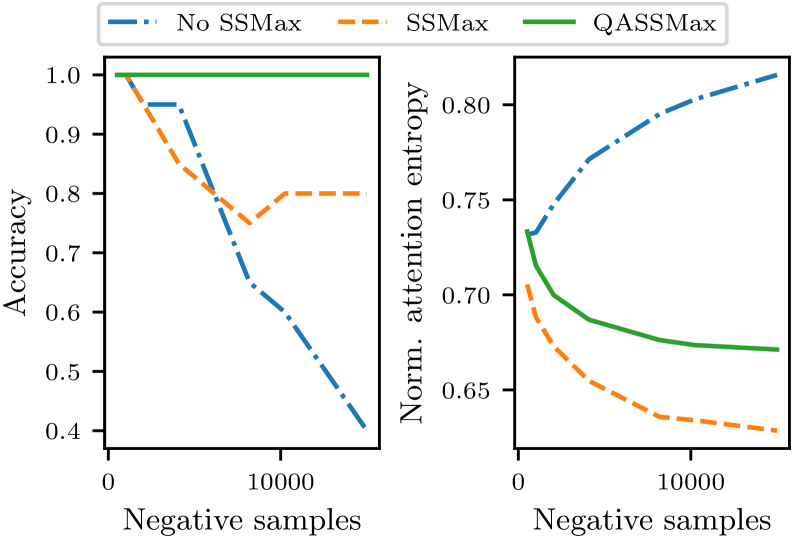

<figcaption>図3(a): 負例数に対する精度とアテンションエントロピー。needle-in-haystack トイ課題で、scalable softmax なしだとエントロピーが上がり精度が落ちるが、QASSMax は 15K 負例でも低エントロピー・100% 精度を保つ。</figcaption>
</figure>

$\blacktriangleright$ **ターゲット認識埋め込み（Target-aware embedding）**。ターゲット情報を早期に注入することが有益と分かった。反復特徴量グループ化が入力データ表現 $E_{1}\in\mathbb{R}^{n\times m\times d}$ を生んだ後、各訓練トークンにターゲット埋め込みを加える。

$$
E_{2}[i,j]=E_{1}[i,j]+\mathrm{Embed_{\text{TAE}}}(y_{i}),\quad i\in\mathcal{D}_{\mathrm{train}},
$$

ここで $\mathrm{Embed_{\text{TAE}}}$ は回帰では線形層、分類では学習可能なルックアップテーブル。TabPFNv2 がターゲットを追加列として付加するのと違い、我々はターゲット埋め込みを全特徴に直接加える。これは表現崩壊の緩和にも役立つ。2 つの特徴が似た分布を共有しても、ターゲット値との関連はサンプル間でしばしば異なるからである。

**圧縮ののち ICL（Compression then ICL）**　TabICLv2 は $E_{2}$ を 3 段で処理する。(1) *列ごと埋め込み* は各列に set transformer $\text{TF}_{\text{col}}$ を適用、(2) *行ごと相互作用* は [CLS] トークンを持つ transformer $\text{TF}_{\text{row}}$ で行ごとの特徴量埋め込みを単一ベクトルに潰す、(3) *データセット単位 ICL* は行埋め込みをターゲット埋め込みと結合し、テストサンプルが訓練サンプルにアテンションして予測する transformer $\text{TF}_{\text{icl}}$ を使う。詳細は §A.2。$\blacktriangleright$ TabICL と比べた鍵となる革新は、新しいスケーラブルソフトマックスを $\text{TF}_{\text{icl}}$ と、誘導点が入力情報を集約する $\text{TF}_{\text{col}}$ の部分に適用することである。

$\blacktriangleright$ **クエリ認識スケーラブルソフトマックス（QASSMax）**。より大きいデータセットへの汎化を改善するため、Scalable Softmax（SSMax）——ロジット計算前にクエリを再スケールしてアテンション分布を鋭くする温度スケーリング——を拡張する。ヘッド $h$ のクエリベクトルを $q_{h}=(q_{hi})$（$i$ はヘッド次元のインデックス）、$n$ を訓練集合のサイズとする。SSMax はヘッドごとの学習可能スカラー $s_{h}$ でクエリを再スケールする。

$$
\tilde{q}_{hi}=q_{hi}\cdot s_{h}\log n~.
$$

我々はクエリ認識スケーラブルソフトマックス（QASSMax）を提案し、各クエリ要素を次のように再スケールする。

$$
\tilde{q}_{hi}=q_{hi}\cdot\underbrace{\mathrm{MLP}_{\mathrm{base}}(\log n)_{hi}}_{\text{base scaling}}\cdot\underbrace{\big(1+\tanh(\mathrm{MLP}_{\mathrm{gate}}(q_{h})_{i})\big)}_{\text{query-aware gating}}
$$

ここで $H$ アテンションヘッドに対し、$\mathrm{MLP}_{\mathrm{base}}:\mathbb{R}\to\mathbb{R}^{H\times d_{\mathrm{head}}}$ と $\mathrm{MLP}_{\mathrm{gate}}:\mathbb{R}^{d_{\mathrm{head}}}\to\mathbb{R}^{d_{\mathrm{head}}}$ は隠れ 64・GELU の 2 層 MLP。

QASSMax を次の論拠で設計する。(a) $\log n$ 因子はソフトマックス分母の $n$ に対する線形増加を相殺するため決定的、(b) ASEntmax の学習可能な $\delta+\beta(\log n)^{\gamma}$ が $\mathrm{MLP}_{\mathrm{base}}(\log n)$ への一般化を着想させた、(c) 要素ごとのスケーリングはヘッドごとスカラーを超える表現力を与える、(d) Selective Attention の温度スケーリングへのクエリ認識性が、$\log n$ トレンドを支配せずに base scaling を変調する有界なクエリ認識ゲーティング $\in(0,2)$ の使用を動機づけた。加えてこのゲーティング設計は、アテンション出力にゲーティングを適用しクエリ依存・要素ごとのゲーティングが最も効果的と見出した Gated Attention と類似の洞察を共有する。

$\text{TF}_{\text{col}}$ と $\text{TF}_{\text{icl}}$ に適用した QASSMax は実質的な性能改善をもたらす（§7 のアブレーション）。その attention fading への効果を調べるため、トイの needle-in-haystack 分類課題を設計する（図 3）。モデルは増えていく負例（haystack）の中で単一のアンカーサンプル（needle）に集中しなければならない。scalable softmax なしではアテンションエントロピーが上がり精度が落ちる。しかし QASSMax は 15K 負例でも低エントロピーと 100% 精度を保ち、極端なスケールで大きく劣化する SSMax を上回る。

**多クラス分類**　多くの TFM と同様、TabICLv2 は最大 10 クラスで事前訓練される。より多くのクラスには ICL 段で階層的分類を使う。しかし target-aware embedding は階層分割の前にラベルを導入する。$\blacktriangleright$ これに対処するため *mixed-radix ensembling（混合基数アンサンブル）* を提案する。$C>10$ クラスに対し、各 $k_{i}\leq 10$ かつ $\prod_{i}k_{i}\geq C$ となるバランスの取れた基数 $[k_{0},\ldots,k_{D-1}]$ を計算し、各ラベル $y$ を混合基数表現で $D$ 桁 $y^{(i)}\in\{0,\ldots,k_{i}{-}1\}$ に分解する。各桁は元のクラスのより粗いグループ化を定義する。桁ごとに $\text{TF}_{\text{col}}$ を 1 回走らせ出力を平均する。

$$
O_{\mathrm{avg}}=\frac{1}{D}\sum_{i=0}^{D-1}\text{TF}_{\text{col}}(E_{1}+\mathrm{Embed_{\text{TAE}}}(y^{(i)}))~.
$$

$\text{TF}_{\text{icl}}$ での階層的分類と組み合わせることで、TabICLv2 は任意のクラス数を扱える。詳細は §A.3。

$\blacktriangleright$ **回帰のための分位点予測**。既存 TFM は回帰に異なる戦略を採る。TabPFNv2 と TabPFN-2.5 はターゲット空間をビンに離散化し交差エントロピー損失で完全な予測分布をモデル化し、Mitra と TabDPT は MSE 損失で点推定を予測する。加えて、LimiX を除くほとんどの TFM と同様、分類と回帰に別々のモデルを訓練する。

TabICLv2 は代わりに確率レベル $\alpha\in\{0.001,0.002,\ldots,0.999\}$ の 999 分位点を予測し、全分位点で合計した pinball 損失で訓練する。RMSE 評価を使った予備実験で、分位点回帰が MSE と TabPFNv2 のビンベースアプローチを上回ることを見出した。

推論時、点推定では予測分位点を単純に平均する（高速かつ効果的）。確率的予測では、ソート（デフォルト）または isotonic regression で単調性を強制し、パラメトリック指数モデルで裾を外挿し、閉形式の PDF・CDF・モーメントを導出することで分位点から完全な分布を構築する。詳細は付録 I。

## 4 Pretraining and Inference（事前訓練と推論）

### 4.1 Pretraining setup（事前訓練の設定）

オープンな事前訓練を持つ参照 TFM である TabICL と比べ、事前訓練設定を大きく改善する。

**3 段の事前訓練**　事前訓練データセットのサイズを漸進的に拡大する TabICL の 3 段構造を保つ（全段を通じ最大 100 特徴量）。ただし TabPFNv2 に従いバッチサイズを 64 に減らし、TabICL（約 8300 万）や TabPFNv2（約 1.3 億）より少ないデータセット数（約 3500 万）でより多くのステップを可能にする。3 段は:
- 段 1: 1,024 サンプルのデータセットで 500K ステップ、訓練 30〜90%、最大学習率 8e-4。
- 段 2: 400〜10,240 サンプル（対数一様）のデータセットで 40K ステップ、訓練 80%、最大学習率 1e-4。
- 段 3: 400〜60K サンプル（対数一様）のデータセットで 10K ステップ、訓練 80%、最大学習率 2e-5。

§B.1 で、段 2・3 が特に大規模データセットで漸進的な性能改善をもたらすことを示す。

**オプティマイザ**　TabICL（resp. TabPFNv2）が使う AdamW（resp. Adam）の代わりに Muon オプティマイザを使う。Moonlight に従い、この実装は各パラメータ $W\in\mathbb{R}^{n\times m}$ の学習率を $0.2\cdot\sqrt{\max\{n,m\}}$ 倍する。Muon ではより高い学習率が好ましいと分かった。結果として段 1 で TabICL の AdamW の 1e-4 に対し最大学習率 8e-4 を使う。更新とパラメータが同符号のときのみ減衰を適用し有益な勾配方向への干渉を避ける cautious weight decay（パラメータ 0.01）を採る。段 1・2 で勾配クリッピングを 1 から 10 に増やし、マイクロバッチごとに異なる train/test サイズをサンプリングし、全段でコサイン学習率スケジュールを使う。

**事前訓練コスト**　80GB メモリの H100 GPU で、段 1 は約 20 GPU-日、段 2 は約 2.5 GPU-日、段 3 は約 2 GPU-日、合計モデルあたり 24.5 GPU-日。1 H100 時間が約 2 A100 時間に相当することを考えると、我々の事前訓練コストは TabICL（60 A100-日）より低い。

### 4.2 Inference optimizations（推論最適化）

*ディスクオフロード*（§H.2）を実装し、100 万サンプル・500 特徴量の表を 450 秒以内に処理するのに CPU 24GB 未満・GPU 50GB 未満まで要件を削減する（図 H.2）。長文脈汎化のための QASSMax と組み合わせ、TabICLv2 は検索や蒸留なしに百万規模の表をネイティブに扱える。加えて $Q/K/V$ 射影を選択的に計算して冗長計算を削減する（§H.1）。

## 5 Synthetic data prior（合成データ事前分布）

<figure>

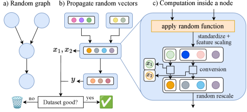

<figcaption>図4: 合成データ生成事前分布の高レベル構造。ランダムベクトル（サンプルごとに1つ）がランダム生成グラフを伝播し、各ノードは親のランダム関数を計算する。最終データセットの列はランダムに割り当てたノードから抽出。得たデータセットは各種フィルタリング基準で棄却されうる。(d) 適用する 8 種のランダム関数: MLP / Tree Ensemble（CatBoost 風の対称木のアンサンブル）/ Discretize（ランダム集合中の最近傍への離散化）/ GP（多変量ガウス過程関数）/ Linear / Quadratic / EM（EM アルゴリズムのクラスタ割当に着想したプラトーを持つ関数）/ Product（他のランダム関数の積）。(e) 生成された 2D 分類データセットの例。</figcaption>
</figure>

我々の事前訓練データは *完全に合成* で、TabPFN が開拓したアプローチに従う。データ生成機構は *事前分布（prior）* と呼ばれ、データセット上のベイズ事前分布を暗黙的に定義する。TabICLv2 では、TabPFN の構造的因果モデル枠組みを保ち、TabICL と TabPFNv2 の事前分布の革新を取り込み、多くの新しい設計オプションとサンプリング機構を加えた新しい事前分布を設計する（§E.1 参照）。アーキテクチャや事前訓練の選択と違い、新しい事前分布はほぼ実験的フィードバックなしに開発される。細粒度のアブレーションは非現実的で検証データセットへの過適合を起こしやすいからである。代わりに事前分布開発は一般的な設計原則に導かれ、データセット多様性（変数依存やカテゴリ基数など）を最大化しつつ有用な帰納バイアスをエンコードし計算効率を保つ。この新しい事前分布は最終性能の鍵である。TabICL の事前分布で TabICLv2 を事前訓練すると実質的に低い性能になる（図 10, 灰色）。TabPFNv2 の事前分布によるアブレーションはオープンソースでないため不可能。高レベルの事前分布記述を以下に与え、詳細は付録 E と F に譲る。

**高レベル構造**　図 4 が TabICLv2 の事前分布を要約する。まず数値・カテゴリ特徴量数やデータセットサイズといった大域的データセット特性をサンプリングする。次に親子関係を定義する有向非巡回グラフとランダム関数をサンプリングし、因果データ生成モデルを得る。$n$ サンプルのデータセットを得るため、各ルートノード $i$ で $n$ 個のランダムベクトルの行列 $X\in\mathbb{R}^{n\times d_{i}}$ をサンプリングしグラフを伝播させる。各データセット特徴はランダムに割り当てたノードから抽出される。ノードの次元の一部のみが各特徴の生成に使われ、他の次元は観測されずデータセットにノイズを導入する。先行研究と違い、ノードレベルでガウスノイズを加えない。数値特徴（例: $x_{1}$）は単一ノード次元から、カテゴリ特徴（例: $x_{2}$）は複数ノード次元を抽出し最近傍割当またはソフトマックスで離散化して得る。

**新しいサンプリング機構**　先行研究のランダムグラフサンプリングは木構造グラフしか生成できないため、異なる大域・局所のノード接続性をモデル化する「random Cauchy graph」機構を導入する（§E.4）。子ノードと親の関係は図 4(c) の数ステップで生成する。鍵となるステップは、親データに適用する多様なランダム関数のサンプリングである。8 種のランダム関数（図 4(d)）を使う。最初の 3 つは TabPFNv2 から、他の 5 つは新しい。これらの関数は異なる滑らかさ（ガウス過程関数については証明する）と異なる帰納バイアス（プラトーや軸整列など）をカバーするよう選ばれる。複数の親ノードの場合、2 択をランダムに選ぶ。全親行列を連結して単一ランダム関数を適用するか、各親行列にランダム関数を適用し sum/product/max/logsumexp で集約する。各関数型内でも、新しい/拡張した構成要素（複数のランダム行列型、ランダム重みベクトル、ランダム活性化）で生成関数を多様化する（付録 E）。ランダム関数適用後、$X$ を標準化し列をランダムに再スケールして異なる特徴量重要度を模す。random converters は特徴値を抽出するがノード値も変更でき、スカラーへのワーピングやサブベクトルへの離散化を適用する（§E.6）。最後にノードデータ $X$ を「ノード重要度」を模すランダムスカラーで乗じる。

**後処理**　TabICL に類似の後処理（問題のある列・データセットの破棄、列・クラスラベルの置換、特徴・ターゲットの前処理）を適用する。

**データフィルタリング**　単純な ExtraTrees モデルがブートストラップ検定で定数ベースラインを改善できないデータセットをフィルタアウトする。加えて、$x$ に対応するノードが $y$ に対応するノードと共通祖先を持たない（＝$y$ が $x$ と独立を含意する）グラフを直接フィルタする。事前訓練段 1 で、約 35% の分類・25% の回帰データセットがフィルタされる。図 10 はフィルタリングが事前訓練の収束を改善することを示す。

**相関スカラーのサンプリング**　数値・カテゴリのスカラー（「ハイパーパラメータ」、例: 列内のカテゴリ数）を同じ分布から複数回サンプリングすることがよくある。我々はそれらを相関させてサンプリングする方法を導入し、例えば多くの列が同じカテゴリ数を持つデータセットをサンプリングしやすくする。

## 6 Experiments（実験）

<figure>

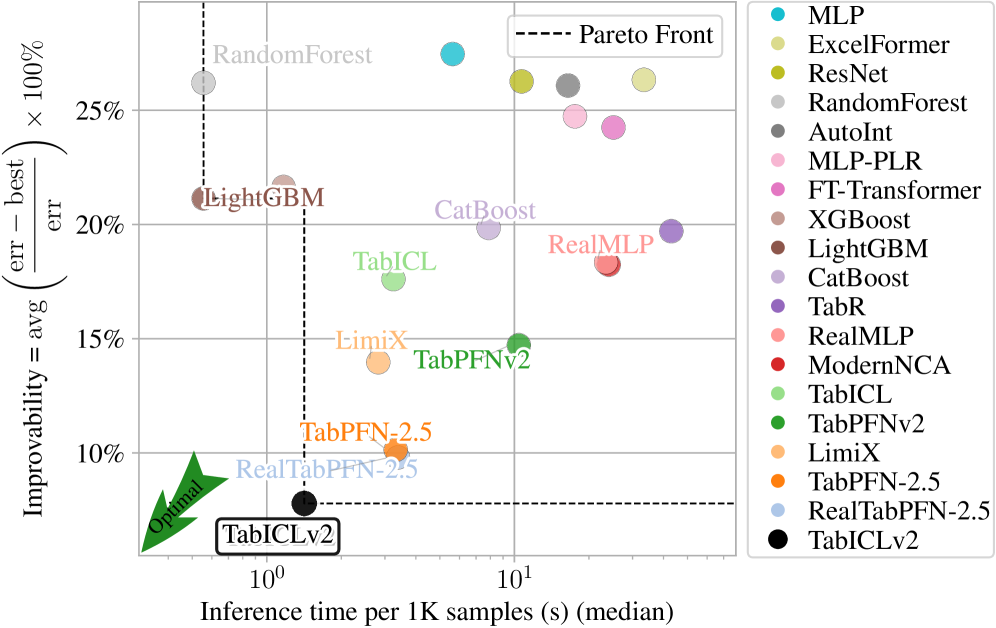

<figcaption>図5: TALENT での improvability 対推論時間。TabICLv2 の実行時間は H100 GPU で測定、他は TALENT から。</figcaption>
</figure>

**ベンチマーク**　TabArena と TALENT ベンチマークを使う。TabICLv2 は TabICL と同様、ランダムな列/クラスシャッフルと異なる前処理器で予測をアンサンブルする。TabArena は 51 データセット（≤10 クラスの分類 38、回帰 13）を含み、繰り返し交差検証で評価（二値は ROC AUC、多クラスは log-loss、回帰は RMSE）。TabArena では RealTabPFN-2.5 に合わせ TabICLv2 で 8 推定器を使う。TALENT は 300 データセット（二値 120、多クラス 80、回帰 100）を 64%/16%/20% の train/validation/test 分割で含む。ハイパラは検証集合で分類は精度・回帰は RMSE で選択。TALENT では TabICLv2 と TabPFN-2.5/RealTabPFN-2.5 の両方に 32 推定器を使う。

主に improvability を報告する。これは各データセットでの最良手法との平均相対誤差ギャップを測り（最良手法はデータセットごとに変わってよい）、ランクベース指標と比べ性能差の大きさを反映する。他の指標は付録 J・K に提供する。

加えて、TabArena・TALENT に従い、TabICL には TabICLv1.1 チェックポイントを使う。これは我々の事前分布の初期版で事後訓練した TabICL である。

**TabICLv2 は両ベンチマークで最先端**　図 1・5 に示すように、TabICLv2 は improvability 対実行時間のパレートフロントを支配する。一切のチューニングなしで、完全オープンソースでない現最先端 RealTabPFN-2.5（調整＋アンサンブル）を上回る。CatBoost や XGBoost のような重く調整した伝統的手法も、桁違いに少ない訓練時間で実質的に上回る。

<figure>

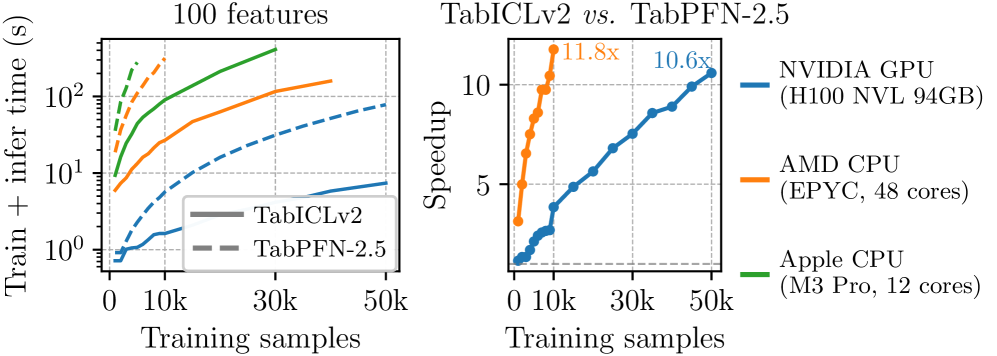

<figcaption>図6: 訓練サンプル数とハードウェアに対する TabICLv2 と TabPFN-2.5 の実行時間比較。両者 8 推定器、500 テストサンプルの分類。</figcaption>
</figure>

**TabICLv2 は TabPFN-2.5 より一貫して高速**　図 6 のように、100 特徴量で TabICLv2 は全ハードウェアで TabPFN-2.5 より速く、大規模ほど高速化が増す（H100・5 万サンプルで 10.6×）。効率差は CPU でさらに顕著で、わずか 1 万サンプルで 11.8× に達する。

<figure>

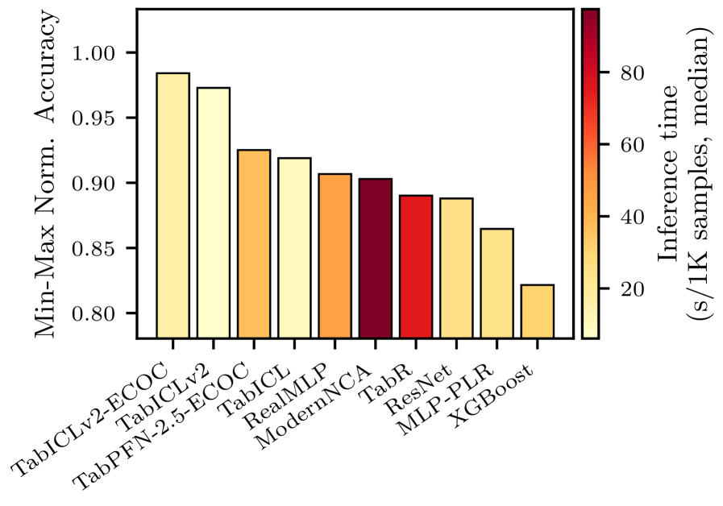

<figcaption>図7: TALENT の 10 クラス超の 12 データセットでの正規化精度。</figcaption>
</figure>

<figure>

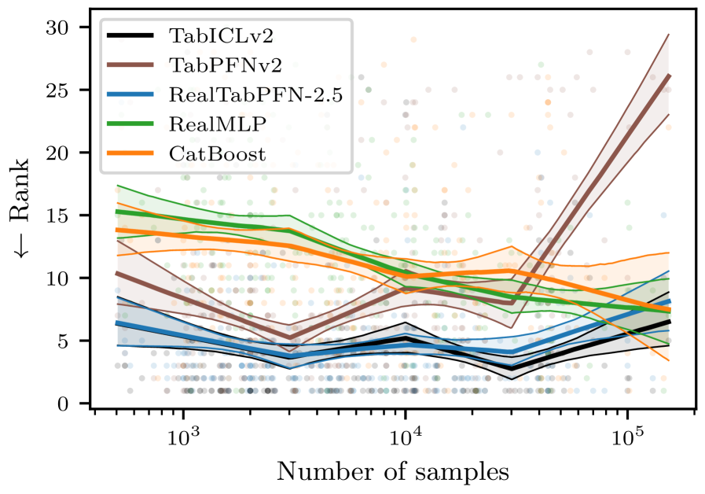

<figcaption>図8: TALENT でのサンプルサイズの関数としてのモデルランキング。線は区分線形当てはめのブートストラップ中央値と 10%/90% 信頼区間。</figcaption>
</figure>

**TabICLv2 は多クラス分類で優れる**　TabPFNv2 の誤り訂正出力符号（ECOC）ラッパと我々のネイティブな mixed-radix ensembling の両方を備えた TabICLv2 は、TALENT の 10 クラス超データセットで全ベースラインを実質的に上回る（図 7）。ECOC ラッパはわずかに良いが我々のネイティブ処理より 3× 遅い。

<figure>

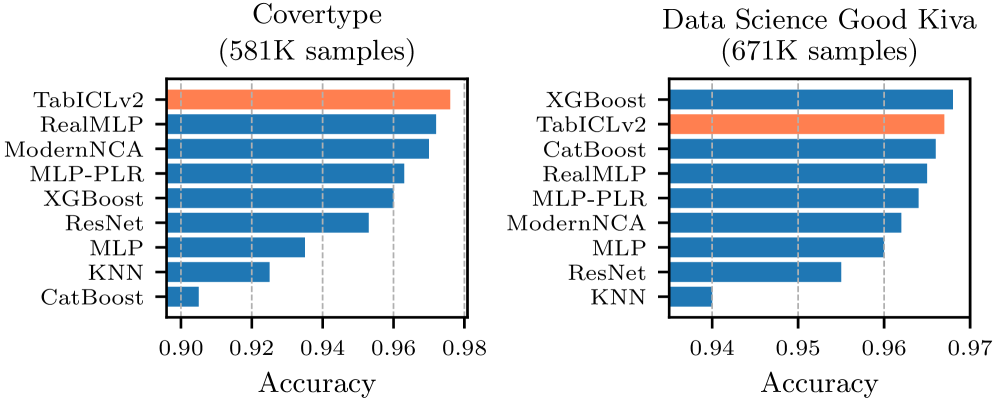

<figcaption>図9: TALENT 拡張の 2 つの巨大分類データセットでの精度。TabICLv2 は依然強く機能。TabPFN-2.5 は OOM エラーになった。</figcaption>
</figure>

**TabICLv2 は大規模データセットへスケールする**　図 8 のように、TabICLv2 は $10^{3}$〜$10^{5}$ の全サイズで上位ランクを保ち、大規模（>20K）で RealTabPFN-2.5 を上回る。TALENT 拡張のさらに大きい（60 万）データセットでも依然強く機能する（図 9）。これらは TabICLv2 が大規模データのネイティブ処理で TFM のフロンティアをさらに拡張することを示す。

## 7 Ablation study（アブレーション研究）

アーキテクチャ・事前分布・事前訓練の選択の影響を評価するアブレーションを行う（図 10）。追加結果は付録 C。参照 TabICLv2 チェックポイント（点線黒）とそのアブレーション（実線黒）の性能差は事前訓練長で説明される。アブレーションは 280K ステップ訓練だが、公式チェックポイントはより多く事前訓練（段 1 の 500K ＋段 2・3）し、$\text{TF}_{\text{col}}$・$\text{TF}_{\text{row}}$ で 4 でなく 8 アテンションヘッドを使う。興味深いことに、TabICLv2 は約 200K ステップ後に log-loss で RealTabPFN-2.5 に匹敵し、正規化精度では 100K ステップ未満で匹敵する。

第一に、アーキテクチャと事前分布の強い相互作用を観察する。TabICL の事前分布で TabICLv2 を事前訓練すると失敗する（灰色線）。性能は TabICL を下回り、検証損失が事前訓練後半で劣化する。これは TabICLv2 アーキテクチャが汎化により高い事前分布多様性を要することを示唆する。加えて、TabICLv2 の事前分布で TabICL アーキテクチャを事前訓練しても（橙）TabICL に並ぶだけで、TabICL アーキテクチャが増加した事前分布多様性を活かす能力が限られることを示す。

正規化精度・Elo・log-loss の各指標（図 C.1）でアブレーションの順序は一貫する。事前分布が最大の効果を持つ。3 成分（早期ターゲット注入・AdamW でなく Muon・QASSMax）が同程度の有意な利得（約 100 Elo、64% 勝率）を与える。反復特徴量グループ化と事前分布フィルタリングはより小さい利得。

<figure>

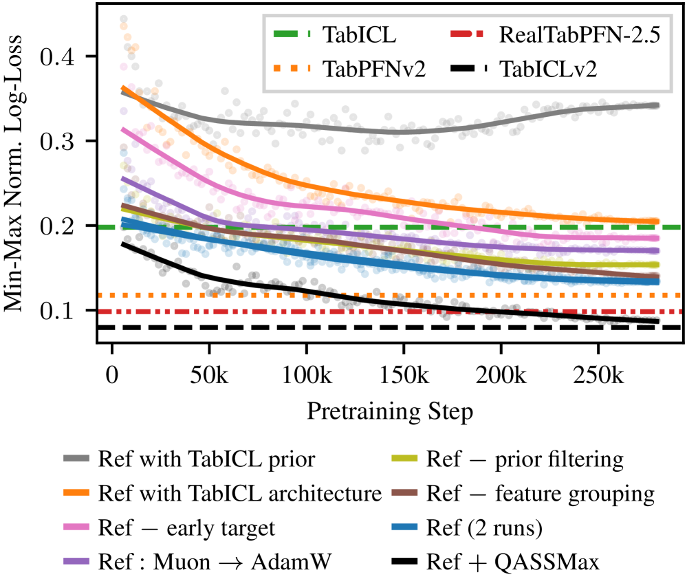

<figcaption>図10: TabICLv2 の各成分のアブレーション。非実線の水平線は公式チェックポイントの性能、実線は 280K ステップ事前訓練のアブレーションモデル。各アブレーションは参照モデル（青）の 1 成分を追加(+)/除去(−)/置換(→)する。参照モデルは QASSMax なし・TF_col/TF_icl で 8 でなく 4 ヘッドの TabICLv2。指標は TabPFNv2 開発に使った 60 検証データセットで計算。</figcaption>
</figure>

## 8 Limitations（限界）

TabICLv2 は関連モデルと共通の限界を持つ。列名やテキスト特徴の意味情報をネイティブに活用しない（価値があると示されている）が、多数特徴量へのスケーラビリティはテキスト埋め込みモデルと組み合わせても十分速いことを示唆する。加えて、スケーラビリティ改善にもかかわらず数百万サンプルのデータセットは依然挑戦的。多出力回帰や分布シフト処理などの多くの拡張も今後の課題。確立したベンチマークの不在のため、TabICLv2 の分布回帰能力はトイデータ（§I.9）を超えて評価していない。欠損指標の追加や事前訓練中の欠損導入は欠損値処理（現状は平均補完）を改善しうるが未探索。最後に、ハイパラ調整やファインチューニングは実行時間増と引き換えに性能をさらに改善しうるが、ここでは探索しない。

## 9 Conclusion（結論）

TabICLv2 は表形式基盤モデル（TFM）の大きな前進で、最先端性能を達成し TFM のネイティブなスケーラビリティを再定義する。最先端 TFM へのアクセスを民主化するため、すべてを完全オープンソース化することにコミットする。中程度の事前訓練・推論コストで、TabICLv2 は将来の適応の優れた基盤を提供する。加えて、実データへのファインチューニングや、より深い/広いアーキテクチャでのスケールアップより、箱出し性能と原理的革新を優先する。TabICLv2 がより小さく・速く・良いモデルへの継続的革新を動機づけることを願う。

## Appendix A More architecture details about TabICLv2（付録 A: TabICLv2 のアーキテクチャ詳細）

### A.1 Repeated feature grouping（反復特徴量グループ化）

反復特徴量グループ化のパターンを 3 列のグループから $m$ 列中 $k$ 列のグループへ一般化するには、グループ $i$（$i\geq 0$）を次のように定義する。

$$
(x_{i+2^{0}-1\bmod m},x_{i+2^{1}-1\bmod m},\dots,x_{i+2^{k-1}-1\bmod m})~.
$$

補題 A.1 は、$m\geq 2^{k}$ のときどの列ペアも 2 つのグループに同時に現れないことを示す。原理的には大きい $k$ ほど表現力が増す（線形層は常に一部の列を無視するよう学習できる）。実際には初期実験で大きい値が有益に見えなかったため $k=3$ を使う。

**補題 A.1（特徴量グループの交差）**　$k\geq 0,m\geq 1,i\in\{0,\ldots,m-1\}$ に対し、集合 $I_{i,k,m}:=\{i+2^{l}-1\bmod m\mid 0\leq l\leq k-1\}$ を定義する。すると $m\geq 2^{k}$ のとき、すべての $0\leq i<j\leq m-1$ で $|I_{i,k,m}\cap I_{j,k,m}|\leq 1$。

**証明**　$|I_{i,k,m}\cap I_{j,k,m}|\geq 2$ と仮定する。シフト不変性により、すべての $n\in\mathbb{Z}$ で $|I_{i+n\bmod m,k,m}\cap I_{j+n\bmod m,k,m}|\geq 2$。適切なシフトで一般性を失わず $i=0$ かつ $j\leq m/2\leq m-2^{k-1}$ と仮定でき、$I$ の定義中の剰余は何もしない。よって $a\neq b$ かつ $i+2^{a}-1=j+2^{c}-1$, $i+2^{b}-1=j+2^{d}-1$ となる $a,b,c,d\in\{0,\dots,k-1\}$ が見つかり、$2^{b}+2^{d}=2^{a}+2^{c}$ を得る。これは $\{b,d\}=\{a,c\}$ を意味する。$i<j$ から $a>c$ かつ $b>d$ で、$a=b$ かつ $c=d$ となり仮定に矛盾する。∎

### A.2 Compression then ICL（圧縮ののち ICL）

**列ごと埋め込み**　各列を set transformer $\text{TF}_{\text{col}}$ で処理する。その核は $k$ 個の誘導ベクトルを持つ *誘導自己アテンション* で、2 段で進む。第 1 段は入力情報を誘導ベクトルに集約し、第 2 段は入力へ戻して放送し、計算量を $O(n^{2})$ から $O(nk)$ に削減する。3 つの改善を行う。(a) TabICL が追加変換を適用するのに対し、我々は $\text{TF}_{\text{col}}$ の出力を直接特徴量埋め込みとして使う、(b) 誘導自己アテンションの第 1 段に QASSMax を適用、(c) target-aware embedding のおかげで $\text{TF}_{\text{col}}$ は本質的に各列内で動作する文脈内学習器になる。

**行ごと相互作用**　TabICL に従い、各行に 4 つの学習可能 [CLS] トークンを前置し、RoPE 付き transformer $\text{TF}_{\text{row}}$ で処理する。[CLS] トークンの出力を連結して $4d$ 次元の行埋め込みを作り、特徴量次元を実質的に潰す。

**データセット単位 ICL**　訓練行埋め込みをターゲット埋め込みと結合する。transformer $\text{TF}_{\text{icl}}$ が全埋め込みを処理し、テストサンプルは訓練サンプルにのみアテンションする。2 層 MLP が出力をターゲット予測に変換する。$\text{TF}_{\text{icl}}$ に QASSMax を適用して長文脈汎化を改善する。

### A.3 Many-class classification（多クラス分類）

多くの TFM 同様、TabICLv2 は最大 10 クラスの分類で事前訓練される。より多くのクラスには TabICL が ICL 段で階層的分類を提案し、クラスを最大 10 クラスの部分問題へ再帰的に分割する。しかし target-aware embedding は階層分割の前にラベル情報を導入する。我々のラベルエンコーダは最大 10 クラスしか扱えないため、この早期段で多クラスを扱う機構が要る。我々は *mixed-radix ensembling* を提案し、元のラベルの複数の簡略化ビュー（各々最大 10 クラス）を生成する。鍵となる発想は、各桁が分類問題の異なるビューに対応する混合基数法でクラスラベルを分解することである。

**バランス基数の計算**　$C>10$ クラスの課題に対し、(1) 各基数が有界 $k_{i}\leq 10$、(2) 積が全クラスを覆う $\prod_{i=0}^{D-1}k_{i}\geq C$、を満たすバランス基数列 $[k_{0},\ldots,k_{D-1}]$ を計算する。各ビューがほぼ等しい識別情報を捉えるよう、できるだけバランスよく（$k_{i}\approx k_{j}$）基数を選ぶ。ビュー数 $D$ はこれらの制約下で最小化する。

**混合基数ラベルエンコーディング**　基数 $[k_{0},\ldots,k_{D-1}]$ が与えられると、各クラスラベル $y\in\{0,1,\ldots,C-1\}$ を混合基数分解で $D$ ビューに再エンコードする。

$$
y^{(i)}=\left\lfloor y\,/\,\textstyle\prod_{j>i}k_{j}\right\rfloor\bmod k_{i},\quad i=0,\ldots,D-1
$$

これは混合基数位置システムで数を表すのに類似し、各「桁」$y^{(i)}$ は $\{0,1,\ldots,k_{i}-1\}$ の値を取る。16 クラス問題（$C=16$）で基数 $[k_{0},k_{1}]=[4,4]$ を考えると、ビュー 0 $y^{(0)}=\lfloor y/4\rfloor$ はクラスを連続ブロックに分割（$\{0,1,2,3\}\to 0$ など）、ビュー 1 $y^{(1)}=y\bmod 4$ は剰余で分割（$\{0,4,8,12\}\to 0$ など）。各ビューは元クラスの異なるグループ化を作り、単一ビューでは 16 クラス全てを区別できないが、両ビューの組合せ $(y^{(0)},y^{(1)})$ は元ラベル $y$ と全単射をなし各クラスを一意に識別する。

**アンサンブル集約**　各ビュー $i$ について、再エンコードしたラベルで列ごと transformer を走らせ、$O^{(i)}=\text{TF}_{\text{col}}(E_{1}+\mathrm{Embed_{\text{TAE}}}(y^{(i)}))$ を得る。最終出力は全ビューの平均 $O_{\mathrm{avg}}=\frac{1}{D}\sum_{i=0}^{D-1}O^{(i)}$。

**誤り訂正出力符号との関係**　我々のアプローチは ECOC に着想を得るが、ECOC が二値符号で別々の分類器を訓練するのと違い、(1) 事前訓練済みラベルエンコーダ容量に合わせ $k\leq 10$ の $k$ 値符号を使い、(2) 予測レベルでなく埋め込みレベルで動作し、二値予測を組み合わせるのでなく埋め込みを平均する。

**階層的分類との組合せ**　階層的分類は ICL 段で動作し、mixed-radix ensembling は列ごと埋め込み段で多クラスを扱う。両者を合わせて、TabICLv2 は再訓練なしに任意のクラス数を扱える。

### A.4 Model configuration（モデル構成）

TabICLv2 は TabICL に類似のアーキテクチャ（Set Transformer $\text{TF}_{\text{col}}$ による列ごと埋め込み、Transformer エンコーダ $\text{TF}_{\text{row}}$ による行ごと相互作用、Transformer エンコーダ $\text{TF}_{\text{icl}}$ によるデータセット単位 ICL）を採る。分類と回帰に別チェックポイントを訓練する。表 A.1 が両モデルの主要なアーキテクチャ差を要約する。

**分類モデル**　$\text{TF}_{\text{col}}$ は 128 誘導ベクトル・モデル次元 $d=128$・8 ヘッドの誘導自己アテンションブロック 3 つ。target-aware embedding $\mathrm{Embed}_{\mathrm{TAE}}$ は 10 クラスのクラス埋め込みを与える学習可能ルックアップテーブル。$\text{TF}_{\text{row}}$ は $d=128$・8 ヘッドの 3 層 Transformer エンコーダで、4 つの学習可能 [CLS] トークンで特徴情報を単一行表現に集約。$\text{TF}_{\text{icl}}$ は $d=512$・8 ヘッドの 12 層 Transformer エンコーダ。ICL 段のターゲット埋め込み $\mathrm{Embed}_{\mathrm{ICL}}$ も 10 クラスの学習可能ルックアップテーブル。全アテンションブロックは学習可能な重み・バイアス付きの pre-norm 層正規化と GELU を使う。FFN の次元拡張係数は 2。最終予測ヘッドは隠れ 1024・出力 10 の 2 層 MLP。QASSMax の $\mathrm{MLP}_{\mathrm{base}}$ と $\mathrm{MLP}_{\mathrm{gate}}$ はともに隠れ 64・GELU の 2 層 MLP で、$\mathrm{MLP}_{\mathrm{gate}}$ の最終層はゼロ初期化し初期変調を恒等にする。

**回帰モデル**　TabICLv2 を回帰に適応するには最小限のアーキテクチャ変更で済む。$\mathrm{Embed}_{\mathrm{TAE}}$ と $\mathrm{Embed}_{\mathrm{ICL}}$ はクラスルックアップでなく連続ターゲットを埋め込む線形層を使い、最終 MLP はクラス確率でなく 999 分位点を出力する。分類モデルと比べ、回帰モデルは学習可能重みのみのバイアスなし層正規化を使う。

**表A.1**: 分類・回帰のモデル構成。

| 構成要素 | 分類 | 回帰 |
| --- | --- | --- |
| TF_col 層数 | 3 | 3 |
| TF_col 誘導ベクトル | 128 | 128 |
| TF_col モデル次元 | 128 | 128 |
| TF_col ヘッド | 8 | 8 |
| TF_row 層数 | 3 | 3 |
| TF_row モデル次元 | 128 | 128 |
| TF_row ヘッド | 8 | 8 |
| TF_row [CLS] トークン | 4 | 4 |
| TF_icl 層数 | 12 | 12 |
| TF_icl モデル次元 | 512 | 512 |
| TF_icl ヘッド | 8 | 8 |
| Embed_TAE | ルックアップ(10) | 線形 |
| Embed_ICL | ルックアップ(10) | 線形 |
| 予測ヘッド隠れ次元 | 1024 | 1024 |
| 予測ヘッド出力次元 | 10 | 999 |
| LayerNorm バイアス | あり | なし |
| FFN 拡張 | 2× | 2× |
| 活性化 | GELU | GELU |

## Appendix B More pretraining details about TabICLv2（付録 B: 事前訓練の詳細）

### B.1 Three pretraining stages（3 段の事前訓練）

TabICL に従い、バッチサイズ 64 で合成データセットのサンプルサイズを漸進的に増やす 3 段カリキュラムを採る。段 1: 1,024 サンプルで 500K ステップ。段 2: 400〜10,240 サンプル（対数一様）で 40K ステップ。段 3: 400〜60,000 サンプル（対数一様）で 10K ステップ。

図 B.1 は TALENT での各段後の TabICLv2 性能を示す。各段が一貫した改善をもたらす。全データセットで平均ランクが 9.94（段 1）→ 5.69（段 2）→ 5.41（段 3）。利得は 1 万サンプル超の大規模データセットで最も顕著で、段 1 はランク 14.91（XGBoost の 14.60 と同程度）だが段 2 で 5.50 に劇的改善、段 3 でさらに 4.71 に達し、RealTabPFN-2.5（6.35）を含む全ベースラインを実質的に上回る。これは事前訓練中のより大きい合成データセットへの曝露が実世界大規模データへの汎化に決定的であることを示す。

<figure>

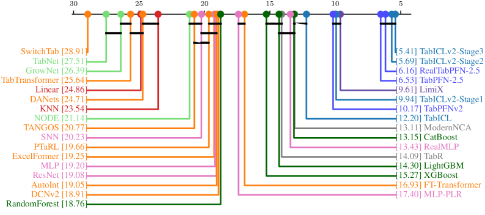

<figcaption>図B.1(a): TALENT 全データセットでの各事前訓練段後の結果。</figcaption>
</figure>

### B.2 Speed and memory optimization（速度とメモリの最適化）

自動混合精度を常に使う。段 3 ではサンプルサイズが 20K を超えると OOM 回避のため勾配チェックポイントを有効化。段 2・3 では FlashAttention-3 を使い、大規模事前訓練で FlashAttention-2 より平均 1.3× の高速化を得る。

## Appendix C Additional ablation results（付録 C: 追加のアブレーション結果）

本文（§7）では log-loss に基づくアブレーション結果を示した。ここでは正規化精度（図 C.1(a)）と Elo（図 C.1(b)）の追加結果を提供する。3 指標すべてでアブレーションの順序は一貫し、各成分の寄与について同じ結論に至る。

加えて 2 つのアブレーションを行う。

**モデル深さの増加**　深さを増やす効果（図 C.1 の薄赤線）をアブレーションする。$\text{TF}_{\text{col}}$・$\text{TF}_{\text{row}}$ を 4 層（3 でなく）、$\text{TF}_{\text{icl}}$ を 18 層（12 でなく）。log-loss では参照モデルより明確な改善を示さない。ただし正規化精度と Elo は事前訓練終盤でわずかな改善を示唆する。この限界的利得はおそらく、より大きいモデルが完全収束するには事前訓練が不十分なため。とはいえ我々の目標は単なるモデルサイズ拡大でなく原理的革新による最先端達成なので、この方向は追わなかった。

**事前分布へのノイズ追加**　合成データ生成時に因果グラフの各辺でガウスノイズを加えて不確実性を導入する TabPFNv2 に従い、似たノイズを我々の事前分布に組み込む実験をした（図 C.1 の緑実線）。しかしこの変更は全指標で性能への影響が無視できる。

<figure>

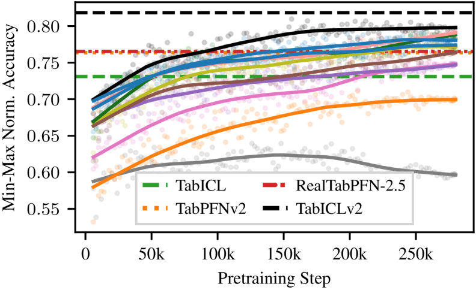

<figcaption>図C.1(a): 正規化精度に基づくアブレーション結果。</figcaption>
</figure>

## Appendix D Other things we tried（付録 D: 試した他のこと）

ここでは、試したが採用しなかったことを述べる。主に小規模実験で慎重な分析なしに行ったものである。他のモデル開発者への逸話的証拠になることを願う。一般に事前訓練実行の結果はやや noisy なので、これらの観察は少なくとも一抹の留保とともに受け取るべきである。事前訓練ノイズの低減自体が将来研究の有用な貢献になりうる。

**事前訓練**　ある先行研究と異なり、コサインスケジュールの通常 AdamW より schedule-free AdamW の利点は見られなかった。小規模実行で AdEMAMix に AdamW より利点を見たが Muon より劣り、両者の組合せも役立たないようだった。AdamW では $\beta_{2}$ を下げると少なくとも短い実行で改善が見られた。cautious weight decay・weight decay・no weight decay の比較はあまり明確でなく、NanoGPT speedrun に含まれることから cautious weight decay を採った。ある先行研究はラベルスムージングを使ったが logloss のような指標を害しうるため、訓練終盤でゼロに減衰するラベルスムージングスケジュールを試したが、性能は同等だった。

**アーキテクチャ: 埋め込み**　$x$ の埋め込みに線形層でなく MLP を使う利点は見られなかった。$\log(n)$ を $x$ と一緒に加えるのも小規模実行で役立たなかった。意外にも、ISAB でなく通常の列ごとアテンションを使うと一部の実行で悪化した。列・行アテンション段の層を混ぜるのは有益に見えず、より多くの転置を要し CPU・ディスクオフロードの最適化が落ちる不利もある。そのような混合をしても、$y$ の埋め込みを列 $x_{i}$ の埋め込みに加えるより $y$ に別列を持たせる方が悪いようだった。

**アーキテクチャ: 行相互作用**　完全な行ごとアテンション（行内の列横断アテンション）が重要なようで、誘導自己アテンションで置き換えるとかなり悪化した。LimiX 版のランダム特徴量識別子を少し実験したが、有益かは不明瞭だった。

**アーキテクチャ: 正規化**　正規化層の異なる配置から改善は見られなかった（実験はより浅いネットを使った）。加えて、バイアスなし/パラメータなしの layernorm は完全な layernorm と同程度に機能しつつ高速に見えたが、測定が十分良いか確信は持てなかった。

**アーキテクチャ: その他**　TabPFNv2 型アーキテクチャはよく機能するようで、TabICLv2 アーキテクチャより良い/悪い状況について明確な結論はない。より高い実行時間計算量とステップあたり時間のため、TabPFNv2 アーキテクチャは破棄した。残差接続の実験は結果に大差を示さなかった。$\text{TF}_{\text{col}}$・$\text{TF}_{\text{icl}}$ でヘッド数を 4 から 8 に増やすのは、より小さいモデルの小規模実行ではわずかに有益に見えたが、大規模実行では必ずしもそうでなかった。

**その他**　回帰（MSE で判断）では incremental spline 分位点関数が通常の分位点回帰と同程度に機能したが、計算的（・概念的）オーバーヘッドのため破棄した。LimiX は事前分布に畳み込みベース関数を含めたが、少なくとも我々の事前分布で TabICL をファインチューンする際、これらを含める測定可能な利点は見られなかった。TabICL は一部データセットの列数が少ないマイクロバッチを扱うマスキング機構（残りの列をゼロで埋める）を使うが、我々はこれを実装せず事前訓練はうまく機能した。

## Appendix E Details on the prior（付録 E: 事前分布の詳細）

以下、§5 の事前分布記述から省いた詳細を、より実装寄りに述べる。事前分布をモジュラーに保つため、異なる対象（ランダムデータセット、ランダム関数、ランダム点、ランダム行列など）のサンプリング法に分解する。一部の構成要素は付録 F で可視化する。

### E.1 Differences to previous priors（先行事前分布との違い）

我々に最も近い事前分布はおそらく TabPFNv2 の事前分布だが、その詳細はすべて知られているわけではない。我々の事前分布は新しい機構の導入で多くの点で異なる: 新しい相関スカラーサンプリング（E.2）、新しいランダムグラフサンプリング（E.4）、ランダムなノード・特徴量重要度を作る各ノードでの追加計算（E.5）、random converters による数値・カテゴリ特徴抽出の精緻化とカテゴリ converter の追加変種（E.6）、複数親ノードでのランダム関数適用の複数方法（E.7）、新しいランダム関数型と既存の多様化（E.8。特に木ベース関数は TabPFNv2 の単一木でなく CatBoost 風対称木のアンサンブルを使い、GP 関数は TabICL のランダム GP 活性化の多変量拡張版で詳細な理論分析を伴う。ランダム線形・二次・クラスタリング・積関数も導入）、より多くのランダム活性化（E.9）、TabPFNv2 のランダムガウス行列に加え 4 つの行列型（E.10）、複数箇所で有用なランダム重み（E.11）、ランダム点のより多くの機構（E.12）、フィルタリング機構（E.14）。加えてスカラー確率変数には一般に異なる分布選択を使う。

### E.2 Sampling correlated scalars（相関スカラーのサンプリング）

事前分布内でスカラーの数値・カテゴリ値をサンプリングする際、一部を相関させたい。実データでは一部の性質が相関すると期待されるからである（例: 異なるカテゴリ列の基数、グラフの異なるノードのランダム関数型）。どの値を相関させるかを知るため、それらに「categorical_cardinality」のような名前を割り当てる。同名の全値は同じ分布からサンプリングされ、そのパラメータ自体が名前ごとに 1 回サンプリングされる。

**数値**: 各変数名で $t\sim\operatorname{Uniform}[0,1]$, $s\sim\operatorname{LogUniform}[0.1,10000]$ をサンプリングし $\alpha:=st,\beta:=s(1-t)$ とする。その名前で変数をサンプリングするたび、ベース変数 $u\sim\operatorname{Beta}(\alpha,\beta)$ をサンプリングし、所望範囲へアフィン変換し、log 型分布では指数を取り、整数値変数では切り下げる。境界 $a,b$ の一様様・整数値乱数を $\operatorname{Num}(a,b),\operatorname{Int}(a,b)$、対数一様様版を $\operatorname{LogNum}(a,b),\operatorname{LogInt}(a,b)$ と表す。

**カテゴリ**: 各変数名でランダム重みベクトル $w\in\mathbb{R}^{c}$（$c$ は所望カテゴリ数）を生成する。その名前でサンプリングするたび、正規化重みベクトル $w$ が表す分布からサンプリングする。$w$ の生成はスカラーパラメータに数値サンプリング機構を使うため、異なる変数名のランダム重みベクトルは相関する。

### E.3 Random dataset（ランダムデータセット）

まずデータセットの一般特性をサンプリングする。分類ではクラス数を $\operatorname{UniformInt}(2,10)$ から。カテゴリ列の比率を $\operatorname{Uniform}(-0.5,1.2)$ からサンプリングし $[0,1]$ にクリップ。カテゴリ基数を $\operatorname{LogInt}(2,M)$ から（最大基数は 1 回 $M\sim\operatorname{LogInt}(2,9)$ としてサンプリングし、その一様ランダムな一部を相関サンプリング機構でサンプリング）。総列数は設定可能だが訓練では $\operatorname{UniformInt}(2,100)$ から。次に $\operatorname{LogInt}(2,32)$ ノードのランダムグラフをサンプリングする。各列型（入力列 $x$ かターゲット列 $y$）について、適格ノード数を一様にサンプリングし、そのサイズのノード部分集合をサンプリングし、各列をその部分集合中のランダムノードに割り当てる。グラフサンプリングとノード割当は、グラフフィルタリング機構が受け入れるまで繰り返されうる。ノードはトポロジカル順に走査され、対応するランダムノード関数が全親ノードのデータを入力に呼ばれる。最終データセット計算に不要なノードは刈り取られる。最後にデータセットをランダムにシャッフルし train/test に分割する。

### E.4 Random graph（ランダムグラフ）

ノードインデックス $i<j$ に対し、確率 $p_{ij}=\mathrm{sigmoid}(A+B_{i}+C_{j})$ で辺を置く。$A,B_{i},C_{j}$ は独立な標準コーシー乱数。$A$ は一般的接続レベル、$B_{i},C_{j}$ はノードの出・入接続性を制御する。独立なベルヌーイ確率と比べ、このモデルはより多様な接続パターンを生む。コーシー乱数は重い裾を持つため「ルールの例外」の確率が高くなる。

### E.5 Random node function（ランダムノード関数）

まず親ノードデータにランダム多関数を適用して（親がなければランダム点機構から）行列 $X\in\mathbb{R}^{n\times d_{i}}$ を得る。ここで $d_{i}=\sum_{j}d_{ij}+\operatorname{LogInt}(1,32)$（$d_{ij}$ は random converters がノードから列を抽出するのに要する次元）。random converter は列を抽出しノードデータの対応部分を変更（例: 離散化）できる。次に $X$ の列を標準化する。重みベクトル $w\in\mathbb{R}^{d_{i}}$ をサンプリングし $X$ の各列を対応重みで乗じる。その後 $X$ をベクトルの（サンプル平均）$L^{2}$ ノルムで割る（高次元でベクトルノルムを小さく保ち高次元関数が学習困難になりすぎないため、RMS ノルムでなく $L^{2}$ ノルムを使う）。割り当てた列の random converters をそれぞれの $d_{ij}$ 次元に適用し $X$ の該当部分を更新。最後に「random rescale」で $X$ をスカラー $\operatorname{LogNum}(0.1,10)$ で乗じる。

### E.6 Random converter（ランダム変換器）

変換器 $X^{\prime},v=\operatorname{converter}(X)$（$X,X^{\prime}\in\mathbb{R}^{n\times d},v\in\mathbb{R}^{n}$）を導入し、生成データセットの列 $v$ を抽出しつつノードデータ $X$ を $X^{\prime}$ に変更しうる。

**数値変換器**: $v=X$, $d=1$ とし、$X^{\prime}=f(X)$（$f$ は恒等、または min-max スケール後の Kumaraswamy 分布ベースのワーピング）。Kumaraswamy ワーピングは値 $x$ を $[0,1]$ に min-max スケールし $1-(1-x^{a})^{b}$（$a,b\sim\operatorname{LogNum}(0.2,5)$）を計算する。

**カテゴリ変換器**: 所望カテゴリ数を $c$ とし 2 主アプローチを使う。
- 近傍ベース: データから $c$ 点のランダム部分集合を選び、各点 $x$ を $L^{p}$ 距離（$p=\operatorname{LogNum}(0.5,4)$）で最も近い点に写像。最近傍中心のインデックスがクラスインデックス。$x$ の所望次元 $d$ を確率 1/2 で $c$、それ以外で $\operatorname{Int}(1,c-1)$ とサンプリング。
- ソフトマックスベース: $\mathrm{softmax}(a\tilde{x}+b)$ からカテゴリをサンプリング。$\tilde{x}$ は入力 $x\in\mathbb{R}^{c}$ の標準化版、$a\sim\operatorname{LogNum}(0.1,10)$、$b=\log(w+10^{-4})$（$w$ はランダム重み）。$a$ の変動はカテゴリ間分離の度合いを、$b$ の変動は不均衡の度合いを作る。常に $d=c$ が必要。

変換ノードベクトル $x^{\prime}$ の計算に異なるアプローチを区別する: 入力 $x$ を出力、カテゴリインデックス $i$ を繰り返し $d$ 次元ベクトルに、最近傍中心（または中心へのランダム関数適用）を出力、ランダム点 $\{z_{1},\ldots,z_{c}\}$ をサンプリングしカテゴリインデックス $i$ の $z_{i}$ を出力。計 7 通りのカテゴリ変換器を得てランダムに 1 つをサンプリングする。

### E.7 Random multi-function（ランダム多関数）

入力ノードが 1 つならランダム関数（後述）を使う。$n_{\mathrm{in}}$ 個の入力ノードがある場合: 確率 1/2 で全入力ノードのテンソルを特徴次元で連結しランダム関数を適用。さもなくば各入力ノードに別々のランダム関数を適用し、得た $n_{\mathrm{in}}$ 個の $n\times d$ テンソルを sum/product/max/logsumexp の要素ごと集約のいずれかで $n_{\mathrm{in}}$ 軸に沿って集約する。

### E.8 Random functions（ランダム関数）

**RandomNNFunction**　$\operatorname{LogInt}(1,3)$ 線形層・隠れ幅 $\operatorname{LogInt}(1,127)$ のランダム NN で、開始・終了に活性化を含む確率各 50%。線形層は RandomLinearFunction を使う（バイアスなし、ただし活性化にバイアスあり）。

**RandomTreeFunction**　深さ $\operatorname{Int}(1,7)$ の木を $\operatorname{LogInt}(1,128)$ 本生成。各木は対称（oblivious）で同層の全ノードで同じ分割基準を使う。分割次元は次元のデータ標準偏差に比例する確率でランダムに選ぶ（入力ノードでサンプリングした特徴量重要度を尊重）。分割点は該当次元の到着データからのランダムサンプル。葉値は標準正規乱数。各木をデータで評価し対応葉値を平均する。

**RandomDiscretizationFunction**　$X$ から $\operatorname{LogInt}(2,255)$ 個のサンプルを中心として選び、各点 $x$ を $L^{p}$ 距離（$p=\operatorname{LogNum}(0.5,4)$）で最近傍中心に写像し、結果にランダム線形関数を適用。

**RandomGPFunction**　$f(Mx)=(f_{1}(Mx),\ldots,f_{d}(Mx))$ を計算する。各成分 $f_{i}$ は全 $i$ で共有するランダムカーネル $k$ を持つガウス過程からサンプリング。$M_{ij}=\alpha w_{i}A_{ij}$（ランダム重み $w$、ランダムスケール $\alpha\sim\operatorname{LogNum}(0.5,10)$、ランダムガウス行列 $A$）。これは TabICL のランダム GP 活性化と、xRFM の異なるバンド幅・学習可能線形入力変換のカーネル調整の成功に着想を得る。ランダムフーリエ特徴近似のため、カーネル $k$ をフーリエ領域で直接設計する。$g:\mathbb{R}^{d}\to\mathbb{R}_{\geq 0}$ が可積分かつ偶のとき、$k(x,x^{\prime})=\check{g}(x-x^{\prime})$ は実数値カーネル。付録 G で、$g$ の裾の振る舞いが GP からサンプリングされる関数の滑らかさに直接関係することを示す: $c\|\omega\|^{-q}\leq g(\omega)\leq C\|\omega\|^{-q}$（$\|\omega\|\geq r_{0}$）なら、サンプルパスは本質的に滑らかさ $(q-d)/2$ を持つ（少なくとも $q>2d$ のとき）。$g$ が確率密度なら $k(x,x^{\prime})\approx\phi(x)^{\top}\phi(x^{\prime})$, $\phi(x)=\sqrt{2/p}\cos(Wx+b)\in\mathbb{R}^{p}$ で近似でき（$W$ の行は $g$ から、$b_{i}\sim$Unif$[0,2\pi]$ i.i.d.）、$p=256$ とする。多出力では $Z\in\mathbb{R}^{d_{\mathrm{out}}\times p}$ を i.i.d. 標準正規でサンプリングし $f(Mx)=p^{-1/2}Z\cos((W\mathrm{diag}(w)A)x+b)$ を計算。$g$ は回転不変分布として $\omega=rz/\|z\|$ でサンプリングでき、裾 $\Theta(\|\omega\|^{-q})$ の密度では $r=\|\omega\|$ の裾が $\Theta(r^{d-1-q})$ となる。べき乗則の裾を持つ 1D 分布族を構成: $a>1$ で CDF $H_{a}(r)=1-(1+r)^{1-a}$、PDF $h_{a}(r)=(a-1)(1+r)^{-a}$、逆 CDF サンプリング $H_{a}^{-1}(u)=(1-u)^{1/(1-a)}-1$。$a\sim\operatorname{LogNum}(2,20)$（$q=a+d-1$ に対応）をサンプリング。50% の確率で軸整列カーネル（xRFM 風）を使い、各 $\omega$ 成分を独立に $H_{a}$ からサンプリングして 1 次元カーネルの積を得る（このとき軸整列を保つため行列 $M$ を適用しない）。

**RandomLinearFunction**　ランダム行列（§E.10）をサンプリングし各ベクトル $x$ をこの行列で乗じる。

**RandomQuadraticFunction**　$f(x)_{i}=\sum_{j,k}M_{ijk}x_{j}x_{k}$ を計算（各 $M_{i}$ は同じ型のランダム行列）。次元の二次計算量を避けるため、$x$ が 20 次元超なら最大 20 次元にサブサンプリング。$x$ に 1 を付加して線形・定数項を含める。

**RandomEMAssignmentFunction**　EM アルゴリズムでの入力 $x$ がクラスタ $i$ 由来である確率の計算に着想。異なる $L^{p}$ ノルムやランダムべき $q$ を加え、関数多様性を増す。$m=\operatorname{LogInt}(2,\max\{16,2d_{\mathrm{out}}\})$ 個の「ガウス」をサンプリングし、中心 $\mu_{1},\ldots,\mu_{m}$ をランダム入力＋標準正規ノイズで、標準偏差 $\sigma_{i}=\exp(0.1\cdot\mathrm{Normal}(0,1))$ で選ぶ。ロジット $l_{i}(x)=-\frac{1}{2}\log(2\pi\sigma_{i}^{2})-(\|x-\mu_{i}\|_{p}/\sigma_{i})^{q}$（$p=\operatorname{LogNum}(1,4)$, $q=\operatorname{LogNum}(1,2)$）を計算し、出力 $L(\mathrm{softmax}(l(x)))$（$L$ はランダム線形関数）。

**RandomProductFunction**　$f(x)g(x)$ を計算（$f,g$ は積・NN・EM 以外の 2 つのランダム関数）。

### E.9 Random activations（ランダム活性化）

TabICL・TabPFNv2 に従い活性化関数集合を拡張する。活性化関数とは入力次元を保つ $f:\mathbb{R}^{d}\to\mathbb{R}^{d}$（要素ごとでなくてよい）。NN 内で次のように使う: (1) バッチ次元で標準化、(2) $x\leftarrow a(x-b)$ でランダム再スケール（$a=\operatorname{LogNum}(1,10)$、$b$ は標準化データのランダムサンプル。ReLU 等で全ゼロを避けるため）、(3) 活性化を適用、(4) 再標準化。活性化は確率 2/3 で固定活性化、さもなくばパラメトリック活性化を選ぶ。

**固定活性化**: Tanh, LeakyReLU, Elu, Identity, SELU, SiLU, ReLU, softplus, ReLU6, HardTanh, signum, Heaviside, $\exp(-x^{2})$, exp, $\mathds{1}_{[0,1]}$, sin, square, abs, softmax, one-hot argmax, argsort, logsigmoid, $\log(\max(|x|,10^{-6}))$, rank, sigmoid, round, modulo 1。

**パラメトリック活性化**: $\mathrm{ReLU}(x)^{q}$, $\mathrm{sign}(x)|x|^{q}$, $(|x|+10^{-3})^{-q}$（$q\sim\operatorname{LogNum}(0.1,10)$）、$x^{m}$（$m\sim\operatorname{Int}(2,5)$）。

### E.10 Random matrix（ランダム行列）

5 つの型から行列をサンプリングする。**RandomGaussianMatrix**: i.i.d. 標準正規。**RandomWeightsMatrix**: $M_{ij}=W_{ij}\odot G_{ij}$（$G$ はガウス行列、$W$ はランダム重みベクトル）後、行を正規化。**RandomSingularValuesMatrix**: $U\mathrm{diag}(w)V^{\top}$（$w$ はランダム重み、$U,V$ はガウス行列）。ガウス $U,V$ は高速で回転不変分布を保つ。**RandomKernelMatrix**: $k+m$ 個のランダム共分散点 $x_{i}\in\mathbb{R}^{3}$ とスケール $\gamma\sim\operatorname{LogNum}(0.1,10)$ をサンプリングし、ラプラスカーネル行列 $K_{ij}=\exp(-\gamma\|x_{i}-x_{m+j}\|)$ を作り各エントリに独立ランダム符号を掛ける。**RandomActivationMatrix**: 他型から行列をサンプリング後、平坦化行列にランダム活性化を適用し標準偏差 $10^{-3}$ のガウスノイズを加える。**後処理**: 行列作成後 1e-6 倍のランダムガウス行列を加え各行を正規化（活性化由来の全ゼロ行を防ぐ）。

### E.11 Random weights（ランダム重み）

ランダムな特徴量重要度・特異値減衰・（非正規化）確率分布を模すため、ランダム正ベクトル $w\in\mathbb{R}_{>0}^{d}$ のサンプリング法を導入。$w_{m}=m^{-q}\cdot\exp(\mathrm{Normal}(0,\sigma^{2}))$（$q\sim\mathrm{LogNum}(0.1/\log(d+1),6)$, $\sigma\sim\mathrm{LogNum}(10^{-4},10)$）を生成し、正規化・シャッフルする。$q$ の上下限は、ゼロに近い重みがないベクトルから、ほぼ全重みがゼロに近いベクトルまでサンプリングできるよう選ぶ。

### E.12 Random points（ランダム点）

ランダム点行列 $X\in\mathbb{R}^{n\times d}$ の生成は数値列のランダムデータセット生成と原理的に同じだが、ここでは安価な機構のみ使う（無限再帰を避ける）。まず標準正規点・$[-1,1]^{d}$ 一様・単位球一様・ランダム共分散正規のいずれかをサンプリングし、ランダム関数を適用。ランダム共分散正規は $A(w\odot x)$（$x$ 標準正規、$w$ ランダム重み、$A$ ガウス行列）でサンプリング。

### E.13 Postprocessing（後処理）

TabICL に従い、単一値の列を除去。全列が除去された/2 クラス未満/train・test 分割が同クラスを含むよう固定できない場合データセットを破棄。カテゴリをオーディナルエンコード。全列 $x_{i}$ と回帰では $y$ も外れ値除去後 standard-scale。列順とクラスインデックスを置換（カテゴリインデックスは置換しない）。

### E.14 Filtering（フィルタリング）

ExtraTrees ベースのフィルタリング: 分類を one-hot エンコーディングで回帰に変換し両ケースを統一。非常に高速なフィルタリングのため、scikit-learn の ExtraTreesRegressor（n_estimators=25, bootstrap=True, max_depth=6）を全データに当てはめる。out-of-bag 予測が平均ラベルより低い MSE を達成できるか、200 ブートストラップ部分標本の 95% 以上でそうかを検査。そうでなければデータセットを棄却。

## Appendix F Plots for the prior（付録 F: 事前分布のプロット）

図 F.1 は事前分布からのランダムデータセットを示す。ランダム関数型は図 F.2〜F.9 に、ランダムグラフは図 F.10 に、ランダム点は図 F.11 に、ランダム行列は図 F.12〜F.16 に示す。

<figure>

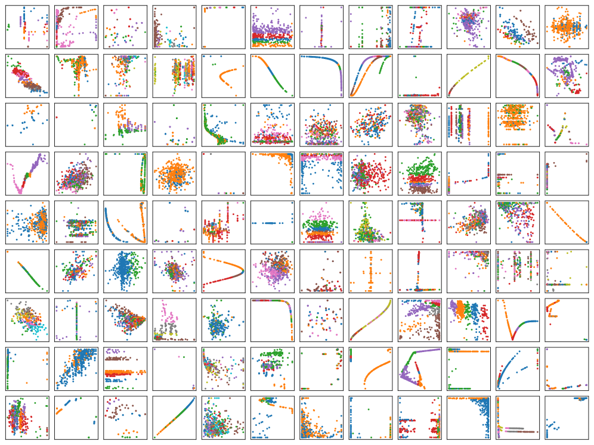

<figcaption>図F.1: 事前分布からのランダム分類データセット。500 サンプル・x に 2 列。色はクラスラベル。各軸に少なくとも 10 のユニーク値を含むデータセットのみ表示（可視化目的）。</figcaption>
</figure>

<figure>

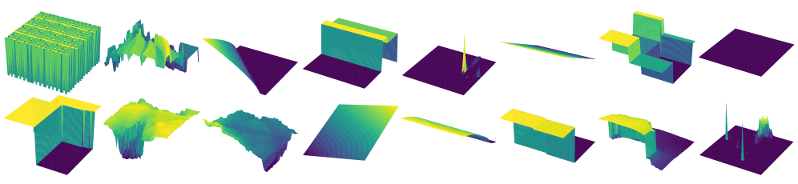

<figcaption>図F.2: RandomNNFunction のサンプル。入力 [-3,3]^2、1 次元出力。</figcaption>
</figure>

<figure>

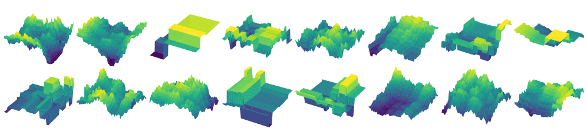

<figcaption>図F.3: RandomTreeFunction のサンプル。入力 [-3,3]^2、1 次元出力。</figcaption>
</figure>

<figure>

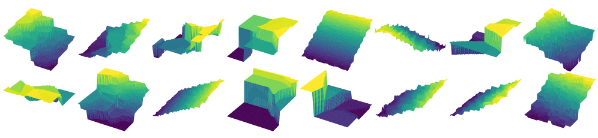

<figcaption>図F.4: RandomDiscretizationFunction のサンプル。入力 [-3,3]^2、1 次元出力。</figcaption>
</figure>

<figure>

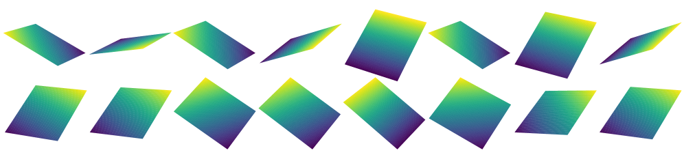

<figcaption>図F.5: RandomLinearFunction のサンプル。入力 [-3,3]^2、1 次元出力。</figcaption>
</figure>

<figure>

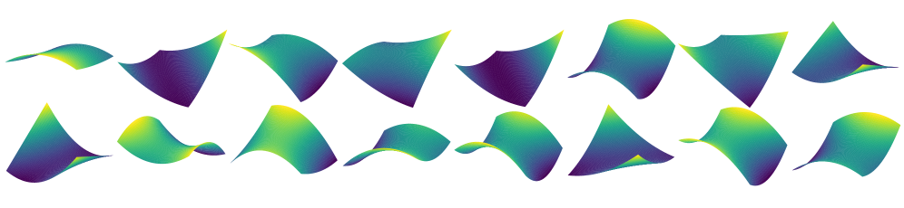

<figcaption>図F.6: RandomQuadraticFunction のサンプル。入力 [-3,3]^2、1 次元出力。</figcaption>
</figure>

<figure>

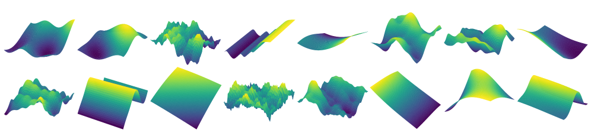

<figcaption>図F.7: RandomGPFunction のサンプル。入力 [-3,3]^2、1 次元出力。</figcaption>
</figure>

<figure>

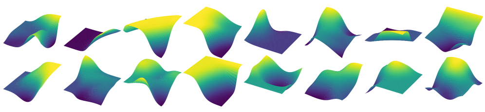

<figcaption>図F.8: RandomEMAssignmentFunction のサンプル。入力 [-3,3]^2、1 次元出力。</figcaption>
</figure>

<figure>

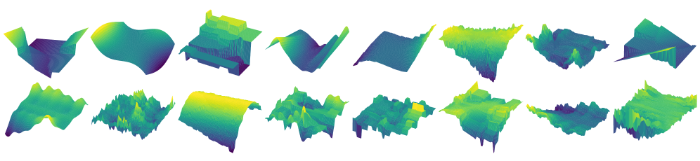

<figcaption>図F.9: RandomProductFunction のサンプル。入力 [-3,3]^2、1 次元出力。</figcaption>
</figure>

<figure>

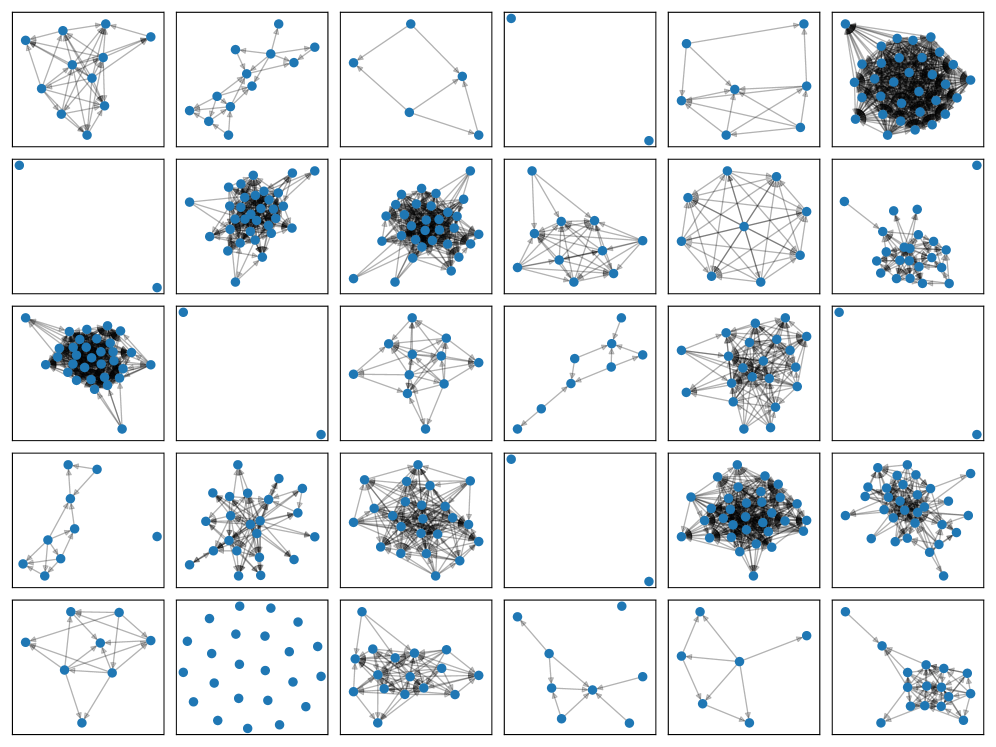

<figcaption>図F.10: ランダムサンプリングされたグラフ（フィルタなし）。</figcaption>
</figure>

<figure>

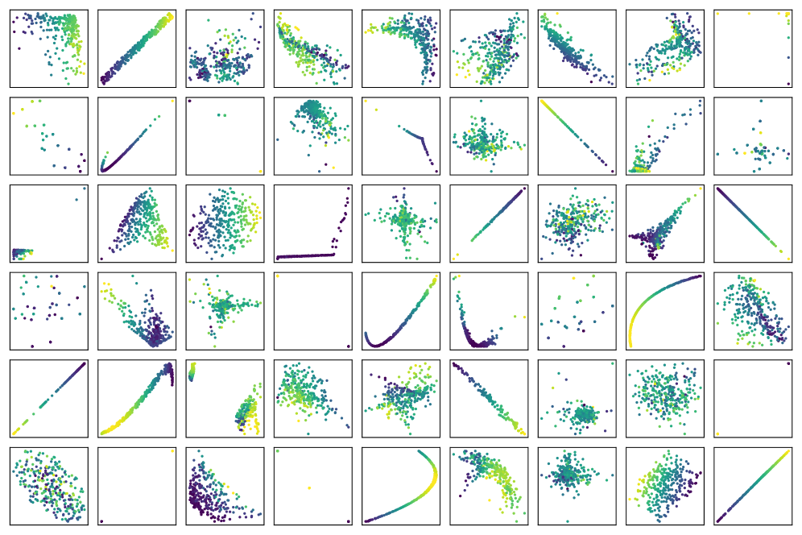

<figcaption>図F.11: 事前分布からの RandomPoints のサンプル。300 個の 3 次元点、第 3 次元を色でエンコード。</figcaption>
</figure>

<figure>

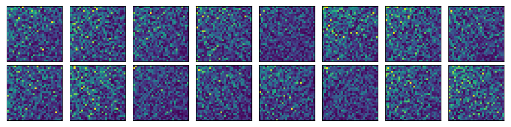

<figcaption>図F.12: RandomGaussianMatrix のサンプル。30×30 行列の絶対値を表示。</figcaption>
</figure>

<figure>

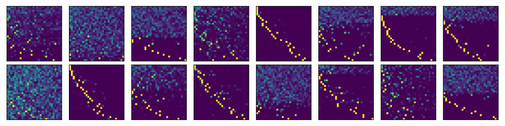

<figcaption>図F.13: RandomWeightsMatrix のサンプル。30×30 行列の絶対値。</figcaption>
</figure>

<figure>

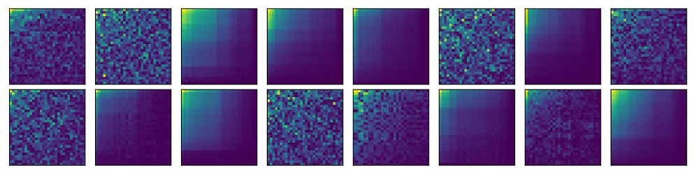

<figcaption>図F.14: RandomSingularValuesMatrix のサンプル。30×30 行列の絶対値。</figcaption>
</figure>

<figure>

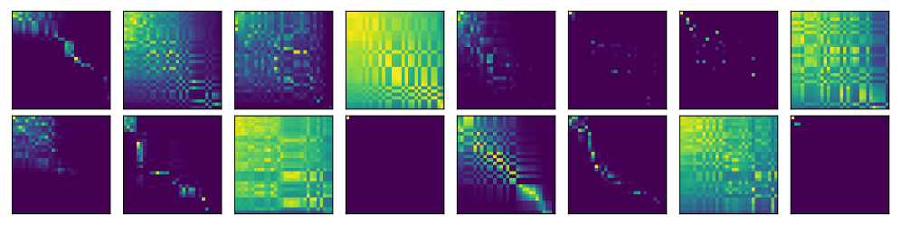

<figcaption>図F.15: RandomKernelMatrix のサンプル。30×30 行列の絶対値。</figcaption>
</figure>

<figure>

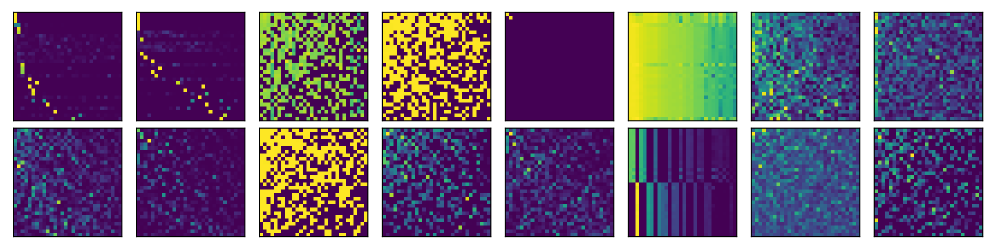

<figcaption>図F.16: RandomActivationMatrix のサンプル。30×30 行列の絶対値。</figcaption>
</figure>

## Appendix G Path smoothness for Gaussian processes（付録 G: ガウス過程のパス滑らかさ）

以下、ガウス過程からサンプリングされる関数の滑らかさに関する結果を証明する。滑らかさは、関数 $f$ がどのソボレフ空間 $H^{s}(B)$（領域 $B\subseteq\mathbb{R}^{d}$、滑らかさ $s\geq 0$）に属するかで定量化する。$H^{s}(B)$ の関数は本質的に $s$ 階微分が二乗可積分である。非整数 $s$ では Sobolev-Slobodeckij ノルムが小数部 $s-\lfloor s\rfloor$ を $\lfloor s\rfloor$ 階微分上のヘルダー的基準で扱う。

**記法**　平均ゼロ・共分散カーネル $k$ のガウス過程の分布を $\operatorname{GP}(0,k)$ と書く。そのような GP は完備確率空間上で定義されると仮定する。同一確率空間上の 2 つの確率過程が、すべての $t$ で $P(X_{t}=Y_{t})=1$ のとき互いの modification（版）であるという。可積分な $g:\mathbb{R}^{d}\to\mathbb{R}_{\geq 0}$ の逆フーリエ変換を $\check{g}(x)=\int e^{i\langle\omega,x\rangle}g(\omega)~d\omega$ と表す。

**定理 G.1（GP サンプルパスの滑らかさ）**　$g:\mathbb{R}^{d}\to\mathbb{R}_{\geq 0}$ が可積分かつ偶で、$\|\omega\|\geq r_{0}$ で $c\|\omega\|^{-q}\leq g(\omega)\leq C\|\omega\|^{-q}$ となる定数 $c,C,r_{0}>0$ と $q>2d$ が存在するとする。すると $k(x,x^{\prime}):=\check{g}(x-x^{\prime})$ はカーネルである。$X\sim\operatorname{GP}(0,k)$、$B\subseteq\mathbb{R}^{d}$ を任意の球、$s_{*}:=(q-d)/2$ とする。すると、すべての $s<s_{*}$ に対し $P(Y|_{B}\in H^{s}(B))=1$ となる $X$ の modification $Y$ が存在し、すべての $s\geq s_{*}$ と任意の modification $Y$ に対し $P(Y|_{B}\in H^{s}(B))=0$。

**証明（概要）**　ステップ 1: スペクトル密度を中心で「修復」する。補題 G.2 より $k$ はカーネル。$g$ を高周波部 $g_{\mathrm{hi}}=g\cdot\mathds{1}_{\mathbb{R}^{d}\setminus B_{r_{0}}}$ と低周波部 $g_{\mathrm{lo}}=g\cdot\mathds{1}_{B_{r_{0}}}$ に分け、$g_{0}(\omega)=(1+\|\omega\|^{2})^{-q/2}\mathds{1}_{B_{r_{0}}}$ を導入して $g_{*}=g_{\mathrm{hi}}+g_{0}$ とすると、$c_{*}(1+\|\omega\|^{2})^{-q/2}\leq g_{*}(\omega)\leq C_{*}(1+\|\omega\|^{2})^{-q/2}$ が全 $\omega$ で成り立つ。独立な GP の和で $X=X_{\mathrm{hi}}+X_{\mathrm{lo}}\sim\operatorname{GP}(0,k)$, $X_{*}=X_{\mathrm{hi}}+X_{0}\sim\operatorname{GP}(0,k_{*})$。ステップ 2: 修復版との同値。$\check{g}_{\mathrm{lo}},\check{g}_{0}$ は無限回微分可能（$g_{\mathrm{lo}}$ が半径 $r_{0}$ の球に台を持つため）なので、対応カーネル $k_{\mathrm{lo}},k_{0}$ も無限回微分可能。よって滑らかさ結果を $X_{*}$ について示せば十分。ステップ 3: $X_{*}$ のサンプルパスの滑らかさ。$k_{*}$ の RKHS $\mathcal{H}_{*}$ は $H^{q/2}(\mathbb{R}^{d})$ と同値で、$\mathcal{H}_{*}|_{B}\ll H^{s}(B)$ は $s<(q-d)/2=s_{*}$ のとき・かつそのときに限る。$X_{*}$ の滑らかさ基準はこれと同値で、証明が完了する。∎

**補題 G.2（ソボレフカーネルのフーリエ特徴づけ）**　$g:\mathbb{R}^{d}\to\mathbb{R}_{\geq 0}$ が偶かつ可積分なら、$k(x,y)=\check{g}(x-y)\in\mathbb{R}$ はカーネル。さらに $C^{-1}(1+\|\omega\|^{2})^{-s}\leq g(\omega)\leq C(1+\|\omega\|^{2})^{-s}$（$s>d/2$）なら、$k$ の RKHS $\mathcal{H}_{k}$ はソボレフ空間 $H^{s}(\mathbb{R}^{d})$ と同値（集合として等しくノルムが同値）。

**証明（概要）**　特徴空間 $H=L^{2}(\mathbb{R}^{d},\mathbb{C})$ への特徴写像 $\phi_{i}(x)(\omega)=e^{-i\langle x,\omega\rangle}\sqrt{g_{i}(\omega)}$（$g_{0}(\omega)=(1+\|\omega\|^{2})^{-s}$, $g_{1}=g$）を定義する。これは内積 $k_{i}(x,y)=\check{g}_{i}(x-y)$ を与える。$C^{-1}g_{0}\leq g_{1}\leq Cg_{0}$ より $\mathcal{H}_{0}$ と $\mathcal{H}_{1}$ は同値。そして $\mathcal{H}_{0}$ は定数因子を除き $H^{s}(\mathbb{R}^{d})$ のカーネルなので、$g$ の RKHS は $H^{s}(\mathbb{R}^{d})$ と同値。∎

## Appendix H Inference optimization for TabICLv2（付録 H: 推論最適化）

### H.1 Efficient attention computation via selective query-key-value projections（選択的 QKV 射影による効率的アテンション計算）

各段で必要なアテンションパターンに基づき QKV 射影を選択的に計算し、冗長計算を削減する 2 つの最適化を実装する。

**行ごと特徴間相互作用**　行ごと相互作用で、$c$ 個（$C=4$）の学習可能 [CLS] トークンを特徴量埋め込みに前置し、その最終出力のみを連結して行表現に使う。[CLS] 出力のみ必要なので、$\text{TF}_{\text{row}}$ の最終ブロックでクエリ計算をこれら $c$ 位置に制限しつつ全系列（[CLS]＋全特徴）にキー・値としてアテンションさせる。すなわち長さ $c+m$ の系列に対し最初の $c$ クエリ位置のみアテンション出力 $\text{Attention}(\mathbf{Q}_{1:c},\mathbf{K}_{1:c+m},\mathbf{V}_{1:c+m})$ を計算。クエリ射影コストを $\mathcal{O}((c+m)d^{2})$ から $\mathcal{O}(cd^{2})$ に、アテンション計算を $\mathcal{O}((c+m)^{2}d)$ から $\mathcal{O}(c(c+m)d)$ に削減。

**データセット単位 ICL**　最終 ICL でテストサンプルは交差アテンションで訓練サンプルから学ぶ。テストサンプルが他のサンプルの文脈になることはないので、そのキー・値射影は不要。$n_{\text{train}}$ 訓練サンプルのみキー・値を計算し、$n_{\text{train}}+n_{\text{test}}$ 全サンプルのクエリを計算: $\text{Attention}(\mathbf{Q}_{1:n_{\text{train}}+n_{\text{test}}},\mathbf{K}_{1:n_{\text{train}}},\mathbf{V}_{1:n_{\text{train}}})$。キー・値射影コストを各 $\mathcal{O}((n_{\text{train}}+n_{\text{test}})d^{2})$ から $\mathcal{O}(n_{\text{train}}d^{2})$ に削減。

**層正規化の再利用**　pre-norm 設定で、まず全入力系列に層正規化を適用してからスライスして QKV 用部分集合を抽出する。正規化統計を完全系列で 1 回計算し、スライスした表現は別々の正規化なしに正規化を保つ。

### H.2 Offloading technique（オフロード技術）

**バッチサイズ推定**　TabICL に従い、3 つの transformer のバッチサイズを利用可能メモリに基づき動的調整し OOM を避けるため、推論ピーク GPU メモリを多項式回帰 $\text{MEM}=\alpha_{1}\cdot\text{bs}+\alpha_{2}\cdot\text{sl}+\alpha_{3}\cdot\text{bs}\cdot\text{sl}+\alpha_{4}$ で推定する。QASSMax を $\text{TF}_{\text{col}}$・$\text{TF}_{\text{icl}}$ に導入したため係数を再評価した（$\text{TF}_{\text{row}}$ は TabICL から不変）。$\text{MEM}_{\text{col}}=0.146\cdot\text{bs}+1.94\times10^{-5}\cdot\text{sl}+0.00488\cdot\text{bs}\cdot\text{sl}+142.91$, $\text{MEM}_{\text{icl}}=-0.04\cdot\text{bs}+5.43\times10^{-7}\cdot\text{sl}+0.0195\cdot\text{bs}\cdot\text{sl}+142.84$（MB 単位）。

**メモリボトルネック分析**　入力 $X\in\mathbb{R}^{b\times n\times m}$ をまず $\mathbb{R}^{(b\times m)\times n}$ に reshape し $\text{TF}_{\text{col}}$ で特徴量埋め込み $E\in\mathbb{R}^{(b\times m)\times n\times d}$ を生む。メモリボトルネックはこの中間テンソル $E$ の保存。100 万サンプル・500 特徴量では $E$ は約 250GB（$d=128$, float32）を要する。TabICL は $E$ を CPU にオフロードするが、250GB CPU メモリは多くのユーザに法外。そこでディスクオフロードを実装。

**メモリマップファイルによるディスクオフロード**　NumPy のメモリマップファイル（memmap）を使い、OS にディスク・メモリ間のページングを透過的に処理させる。鍵となる構成要素: (1) 事前割当（処理前に正確なサイズの memmap ファイルをディスクに事前割当）、(2) 逐次書き込み（列ごと埋め込み中、各バッチ出力を対応インデックスに直接書き込む）、(3) 定期フラッシュ（設定可能量（デフォルト 8GB）蓄積後に periodicにフラッシュ）、(4) 自動クリーンアップ（弱参照ファイナライザで関連テンソルの GC 時に自動削除）。

**非同期データ転送**　GPU 計算とデータ移動を重ねるため、device-to-host（D2H）転送に専用 CUDA ストリームを使う。(1) GPU テンソルをピン留め CPU バッファに非同期コピー、(2) CUDA イベントで完了追跡、(3) 完了時に最終ターゲット（CPU テンソルかディスク）へ書き込み、(4) ピン留めバッファをプールに返却。これがパイプライン化で転送レイテンシを隠しスループットを上げる。保留中非同期コピーの最大数（デフォルト 4）を設定可能。

**自動モード選択**　GPU/CPU/DISK/AUTO の 4 オフロードモードをサポート。AUTO は出力テンソルサイズを推定し、利用可能 GPU/CPU メモリ・ディスク空間と安全係数で比較して最適バックエンドを選ぶ。

<figure>

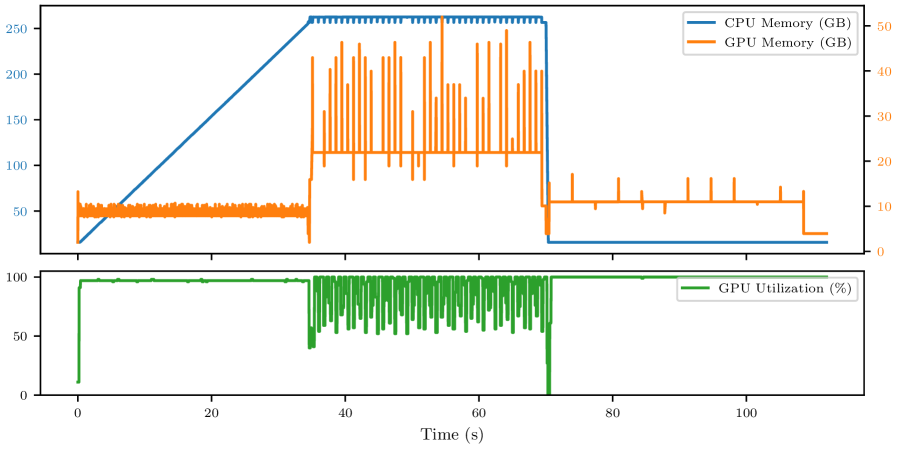

<figcaption>図H.1: 100 万サンプル・500 特徴量の表での CPU オフロード。中間特徴量埋め込み E は約 250GB。列ごと埋め込み中(0–35s)、E が CPU メモリに漸進的にオフロードされ CPU メモリ使用が線形増加。行ごと相互作用中(35–70s)、バッチが CPU→GPU にロードされ GPU 利用率が変動。順伝播は 115 秒・ピーク GPU 50GB で完了。ただし 250GB CPU メモリ要件は多くのシステムに法外。</figcaption>
</figure>

<figure>

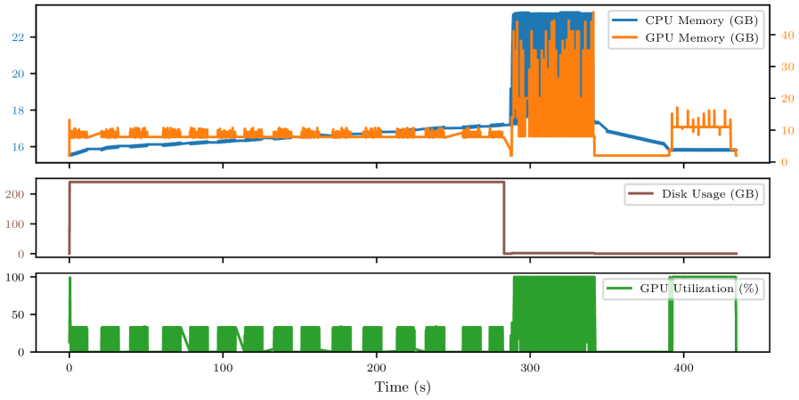

<figcaption>図H.2: 同表でのディスクオフロード。250GB の memmap ファイルを事前割当。列ごと埋め込み中(0–280s)、特徴量埋め込みがディスクに直接ストリーム。行ごと相互作用中(280–350s)、データをバッチでディスクからロード。総順伝播は 450 秒（CPU オフロードより約 4× 遅い、ディスク I/O レイテンシのため）だが、メモリ要件が劇的に削減（CPU 24GB 未満・GPU 50GB 未満）され、百万規模推論がコモディティハードウェアで可能に。</figcaption>
</figure>

図 H.1・H.2 は、H100 GPU で FlashAttention-3 と自動混合精度を有効にして 100 万サンプル・500 特徴量（訓練 80%・テスト 20%）を処理する CPU・ディスクオフロードの資源利用プロファイルを示す。CPU オフロードは高速（115s 対 450s）だが 250GB RAM を要する。ディスクオフロードは速度をアクセス性と引き換え、CPU 24GB・GPU 50GB のみで 250GB のディスク空間を使う（現代の多くのワークステーションで利用可能な構成）。

## Appendix I Quantile distribution（付録 I: 分位点分布）

### I.1 Problem setup（問題設定）

回帰タスクで、入力特徴ベクトル $x$ が与えられると、TabICLv2 は条件付き分位点の集合 $\hat{Q}(\alpha|x)$（$\alpha\in\{\alpha_{1},\ldots,\alpha_{K}\}$）を予測する。本研究では $K=999$、$\alpha_{L}=0.001$ から $\alpha_{R}=0.999$ まで一様に並べた確率レベル $\boldsymbol{\alpha}=\{0.001,0.002,\ldots,0.999\}$ を使う。しかし生の予測分位点は課題を抱える: (1) 分位点交差（$\alpha_{i}<\alpha_{j}$ なのに $\hat{Q}(\alpha_{i})>\hat{Q}(\alpha_{j})$ の非単調性）、(2) 不完全サポート（$[\alpha_{L},\alpha_{R}]$ のみで極端な裾が未定義）、(3) 解析関数の欠如（PDF/CDF/解析モーメントを直接与えない）。そこで予測分位点から確率分布を構築するアプローチを提案: (1) 単調性強制、(2) パラメトリック指数裾モデルでの裾外挿、(3) PDF/CDF/解析モーメントの閉形式。

### I.2 Quantile function（分位点関数）

完全な分位点関数は 3 領域で定義される。内部 $[\alpha_{L},\alpha_{R}]$ では予測分位点ノットを結ぶ区分線形スプライン: $\alpha\in[\alpha_{i},\alpha_{i+1}]$ で $Q_{\text{spline}}(\alpha)=q_{i}+m_{i}(\alpha-\alpha_{i})$（傾き $m_{i}=\Delta q_{i}/\Delta\alpha_{i}$）。傾きは有効な分位点関数のため非負でなければならず、後述の単調性補正で保証される。観測範囲を超える外挿には、劣指数分布（ガウス等）に適したパラメトリック指数裾モデルを使う。左裾（$\alpha<\alpha_{L}$）: $Q_{\text{left}}(\alpha)=q_{L}+\beta_{L}\ln(\alpha/\alpha_{L})$（$\beta_{L}>0$、連続性から決定）。右裾（$\alpha>\alpha_{R}$）: $Q_{\text{right}}(\alpha)=q_{R}-\beta_{R}\ln((1-\alpha)/(1-\alpha_{R}))$。PDF 計算に重要な導関数は $dQ/d\alpha=\beta_{L}/\alpha$（左裾）, $\Delta q_i/\Delta\alpha_i$（スプライン）, $\beta_{R}/(1-\alpha)$（右裾）。

### I.3 Quantile crossing correction（分位点交差の補正）

$i<j$ で $\hat{Q}(\alpha_{i})>\hat{Q}(\alpha_{j})$ となる交差違反は単調性要件に反する。3 つの扱い方: (1) 補正なし（交差が稀なら許容しうるが、無効な確率密度を招きうる）、(2) ソート（予測分位点をソート、$O(K\log K)$、単調性を保証するが分位点値と確率レベルの対応を壊しうる）、(3) isotonic regression（$L^{2}$ 最適。Pool Adjacent Violators Algorithm (PAVA) で $O(K)$。隣接違反ブロックを反復併合して重み付き平均で置換するが、逐次依存があり完全ベクトル化が難しい）。Numba の JIT で PAVA を最適化し CPU 並列を達成（図 I.1）。ただし GPU の torch.sort には及ばず、交差が稀という観察から、デフォルトは単調性強制にソートを使う。

<figure>

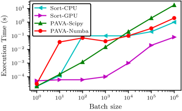

<figcaption>図I.1: 単調性強制法の実行時間比較（K=999 分位点/サンプル）。Sort-GPU (CUDA の torch.sort) が最良。Numba（並列 PAVA）と Sort-CPU は CPU で競争的。Scipy の isotonic_regression は逐次処理で大バッチで Numba より遅い。</figcaption>
</figure>

### I.4 Tail parameter estimation（裾パラメータ推定）

指数裾のスケールパラメータ $\beta_{L},\beta_{R}$ を境界分位点から log 空間線形回帰で推定する。左裾は $Q(\alpha)=\beta_{L}\ln(\alpha)+c_{L}$ で、$K_{\text{tail}}$ 個（デフォルト 20）の左裾分位点から OLS で $\hat{\beta}_{L}=\text{Cov}(Q,\ln\alpha)/\text{Var}(\ln\alpha)$。右裾も同様に $\hat{\beta}_{R}=-\text{Cov}(Q,\ln(1-\alpha))/\text{Var}(\ln(1-\alpha))$。推定パラメータは数値安定性のため $[\beta_{\min},\beta_{\max}]=[0.01,100]$ にクランプ。

### I.5 Cumulative distribution function (CDF)

CDF $F(z)=Q^{-1}(z)$。スプライン領域 $z\in[q_{i},q_{i+1})$: $F_{\text{spline}}(z)=\alpha_{i}+\frac{z-q_{i}}{q_{i+1}-q_{i}}(\alpha_{i+1}-\alpha_{i})$。左裾 $z<q_{L}$: $F_{\text{left}}(z)=\alpha_{L}\exp((z-q_{L})/\beta_{L})$。右裾 $z>q_{R}$: $F_{\text{right}}(z)=1-(1-\alpha_{R})\exp(-(z-q_{R})/\beta_{R})$。

### I.6 Probability density function (PDF)

逆関数定理より $f(z)=1/Q^{\prime}(F(z))$。スプライン領域: $f_{\text{spline}}(z)=1/m_{i}=(\alpha_{i+1}-\alpha_{i})/(q_{i+1}-q_{i})$。左裾: $f_{\text{left}}(z)=(\alpha_{L}/\beta_{L})\exp((z-q_{L})/\beta_{L})$。右裾: $f_{\text{right}}(z)=((1-\alpha_{R})/\beta_{R})\exp(-(z-q_{R})/\beta_{R})$。対数密度 $\ln f(z)=-\ln(dQ/d\alpha|_{\alpha=F(z)})$ を直接計算して数値問題を避ける。

### I.7 Continuous ranked probability score (CRPS)

CDF $F$ と観測 $z$ の CRPS は $\text{CRPS}(F,z)=\int_{-\infty}^{\infty}(F(y)-\mathbf{1}_{y\geq z})^{2}dy$。分位点空間で $\text{CRPS}(F,z)=\int_{0}^{1}2\rho_{\alpha}(z-Q(\alpha))d\alpha$（$\rho_{\alpha}(u)=u(\alpha-\mathbf{1}_{u<0})$ は pinball 損失）と等価で、$\int_{0}^{F(z)}2\alpha(z-Q(\alpha))d\alpha+\int_{F(z)}^{1}2(1-\alpha)(Q(\alpha)-z)d\alpha$ に分解される。各領域で解析的に積分して CRPS を計算する。

**I.7.1 スプライン領域の寄与**　セグメント $i$（$\alpha\in[\alpha_{i},\alpha_{i+1}]$, $Q(\alpha)=q_{i}+m_{i}(\alpha-\alpha_{i})$）で、$r=\min(\max(F(z),\alpha_{i}),\alpha_{i+1})$ をクランプ CDF 値とする。寄与 $\text{CRPS}_{i}=I_{1}^{(i)}+I_{2}^{(i)}$。第 1 積分（$\alpha\leq F(z)$）は $\int_{\alpha_{i}}^{r}\alpha\,d\alpha=(r^{2}-\alpha_{i}^{2})/2$ と $\int_{\alpha_{i}}^{r}\alpha(\alpha-\alpha_{i})\,d\alpha=(r^{3}-\alpha_{i}^{3})/3-\alpha_{i}(r^{2}-\alpha_{i}^{2})/2$ を用い $I_{1}^{(i)}=(z-q_{i})(r^{2}-\alpha_{i}^{2})-2m_{i}(r^{3}/3-\alpha_{i}r^{2}/2+\alpha_{i}^{3}/6)$。第 2 積分 $I_{2}^{(i)}=2\int_{r}^{\alpha_{i+1}}(1-\alpha)(Q(\alpha)-z)d\alpha$ も同様。総スプライン CRPS は $\text{CRPS}_{\text{spline}}=\sum_{i=1}^{K-1}\text{CRPS}_{i}$。

**I.7.2 左指数裾の寄与**　$Q(\alpha)=q_{L}+\beta_{L}\ln(\alpha/\alpha_{L})$ で $\tilde{\alpha}=\min(F(z),\alpha_{L})$, $b_{L}=q_{L}-\beta_{L}\ln\alpha_{L}$ とすると $\text{CRPS}_{\text{left}}=(z-b_{L})(\alpha_{L}^{2}-2\alpha_{L}+2\tilde{\alpha})+\alpha_{L}^{2}\beta_{L}(-\ln\alpha_{L}+1/2)+T_{\text{left}}$（$T_{\text{left}}$ は $z<q_{L}$ で $2\alpha_{L}\beta_{L}(\ln\alpha_{L}-1)+2\tilde{\alpha}(-z+b_{L}+\beta_{L})$、それ以外 0）。

**I.7.3 右指数裾の寄与**　$Q(\alpha)=q_{R}-\beta_{R}\ln((1-\alpha)/(1-\alpha_{R}))$ で $\tilde{\alpha}=\max(F(z),\alpha_{R})$, $a_{R}=-\beta_{R}$, $b_{R}=q_{R}+\beta_{R}\ln(1-\alpha_{R})$ とすると $\text{CRPS}_{\text{right}}=(z-b_{R})(-1-\alpha_{R}^{2}+2\tilde{\alpha})+a_{R}(-(1+\alpha_{R})^{2}/2+(\alpha_{R}^{2}-1)\ln(1-\alpha_{R})+2\tilde{\alpha})+T_{\text{right}}$。

### I.8 Moment calculations（モーメント計算）

**I.8.1 平均**　$\mathbb{E}[Z]=\int_{0}^{1}Q(\alpha)d\alpha$。スプライン寄与 $\sum_{i}(q_{i}+q_{i+1})\Delta\alpha_{i}/2$、左裾寄与 $\alpha_{L}(q_{L}-\beta_{L})$、右裾寄与 $(1-\alpha_{R})(q_{R}+\beta_{R})$。総平均 $\mathbb{E}[Z]=\alpha_{L}(q_{L}-\beta_{L})+\sum_{i=1}^{K-1}\frac{(q_{i}+q_{i+1})\Delta\alpha_{i}}{2}+(1-\alpha_{R})(q_{R}+\beta_{R})$。

**I.8.2 分散**　$\text{Var}[Z]=\mathbb{E}[Z^{2}]-(\mathbb{E}[Z])^{2}$。スプライン寄与 $\sum_{i}\Delta\alpha_{i}(q_{i}^{2}+q_{i}q_{i+1}+q_{i+1}^{2})/3$、左裾寄与 $\alpha_{L}(q_{L}^{2}-2\beta_{L}q_{L}+2\beta_{L}^{2})$、右裾寄与 $(1-\alpha_{R})(q_{R}^{2}+2\beta_{R}q_{R}+2\beta_{R}^{2})$。

### I.9 Empirical validation on synthetic regression tasks（合成回帰タスクでの経験的検証）

QuantileDistribution が TabICLv2 の予測分位点から正しく確率分布を構築することを検証するため、既知の真値分布を持つ 4 つの合成回帰データセットを設計する。

**I.9.1 合成回帰データセット**　データセット1: 等分散ガウスノイズ付き二次 $y=0.15x^{2}-0.5+\epsilon,\epsilon\sim\mathcal{N}(0,0.25^{2})$。データセット2: 異分散ノイズ付き正弦 $y=\sin(2x)+0.2x+\epsilon,\sigma(x)=0.12+0.1|x|$。データセット3: ノイズ付きステップ関数 $y=\text{sign}(x)+\epsilon,\epsilon\sim\mathcal{N}(0,0.3^{2})$。データセット4: 重い裾（ガウス混合）の線形 $y=0.3x+\epsilon,\epsilon\sim 0.9\mathcal{N}(0,0.2^{2})+0.1\mathcal{N}(0,0.8^{2})$。

**I.9.2 可視化と分析**　図 I.2 は予測分布（実線）対真値分布（破線）の 6 行×4 列の可視化を示す。行 1（分位点線）・行 2（分位点関数）・行 3（PDF）・行 4（CDF）・行 5（密度ヒートマップ）・行 6（再サンプリングデータ）。予測曲線は全データセットで真の関数によく一致し、交差補正と指数裾外挿が確認できる。異分散データセットでは境界 $|x|=3$ で分位点帯が広がり、入力依存分散を正しく捉える。

<figure>

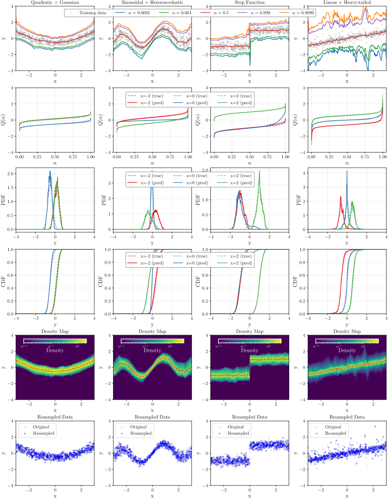

<figcaption>図I.2: 既知の真値分布を持つ 4 つの合成回帰タスクでの QuantileDistribution の検証。</figcaption>
</figure>

## Appendix J Detailed results on the TabArena benchmark（付録 J: TabArena の詳細結果）

### J.1 Aggregation metrics（集約指標）

TabArena はタスク固有の誤差指標でモデルを評価し、複数の補完的指標でデータセット横断に集約する。

**データセットごとの誤差指標**　各データセット $i$ で、全外側交差検証フォールドを平均した誤差 $\mathrm{err}_{i}$ を計算（二値: $1-\text{ROC AUC}$、多クラス: Log-Loss、回帰: RMSE）。

**Elo レーティング**　ペアワイズ比較ベースのレーティング。各モデルのレーティングが他に対する期待勝率を予測する。400 点差は 10:1（91%）の期待勝率に対応。$\mathbb{E}[A\text{ wins}]=1/(1+10^{(R_{B}-R_{A})/400})$。Elo は勝敗のみに基づき性能差の大きさを無視し、各データセットを等しく扱う。TabArena はデフォルト RandomForest を 1000 Elo に較正し 200 ブートストラップで 95% 信頼区間を出す。

**Improvability**　各データセットでの最良手法との相対誤差ギャップを測りデータセット平均する: $\text{Improvability}_{i}(m)=(\mathrm{err}_{i}(m)-\mathrm{err}_{i}^{*})/\mathrm{err}_{i}(m)\times 100\%$（$\mathrm{err}_{i}^{*}$ は最良手法の誤差）。0%（最適）〜100%。Elo と違い性能差の大きさに敏感で、実務者に有益。

**平均ランク**　各データセットで誤差順にランク付け（1 が最良）し平均。$\text{AvgRank}(m)=\frac{1}{|\mathcal{D}|}\sum_{i}\text{rank}_{i}(m)$。低いほど良い。

**議論**　各集約指標に長所・限界がある。Elo は性能差に関わらず全データセットを等しく扱い、improvability は差の大きさを捉え、ランクベースは外れ値にロバスト。本文では解釈性のため主に improvability を報告し、付録で Elo・ランクを提供。全指標で TabICLv2 が一貫して最先端を達成。

### J.2 Results on all datasets（全データセットの結果）

**ランクと Elo**　TabICLv2（default）は平均ランク 4.82 で、AutoGluon 1.4（extreme, 4h）の 5.24、RealTabPFN-2.5（T+E）の 5.88 を上回る。単一順伝播・無調整にもかかわらず、重く最適化したアンサンブルシステムより良い性能を達成。

**ペアワイズ勝率**　平均ランクでは AutoGluon 1.5（extreme, 4h）に劣る（4.82 対 3.88）が、ペアワイズ勝率行列（図 J.2）はより微妙な像を示す。TabICLv2 は AutoGluon 1.5 に 57%、RealTabPFN-2.5（T+E）に 59% の勝率。勝率と平均ランクの乖離は、勝率が勝敗のみを数えるのに対し平均ランクは特定データセットでの不振を罰することから生じる。TabICLv2 はより頻繁に勝つが、事前訓練分布外の特定データセットで苦しみうることを示唆する。

**パレート効率**　図 J.3・J.4 のように、TabICLv2 は improvability 対実行時間と Elo 対実行時間の両パレートフロントを全 TFM 中で支配。RealTabPFN-2.5・TabPFN-2.5・TabICL・LimiX・Mitra を含む競合 TFM より速く正確。

<figure>

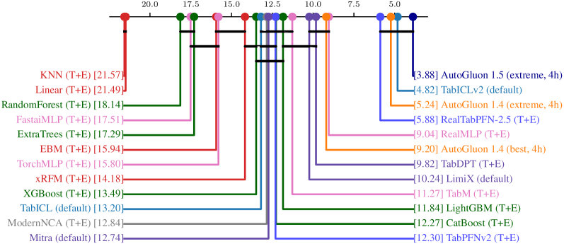

<figcaption>図J.1: TabArena ベンチマークでの臨界差図。</figcaption>
</figure>

<figure>

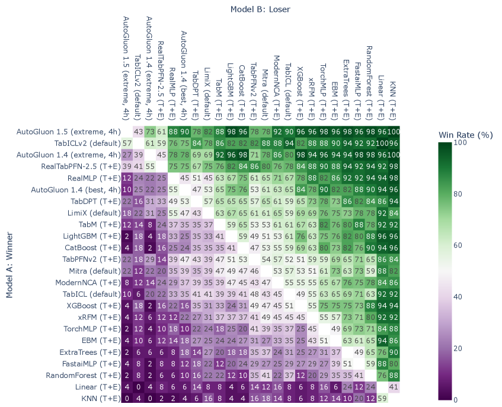

<figcaption>図J.2: TabArena ベンチマークでの勝率行列。</figcaption>
</figure>

<figure>

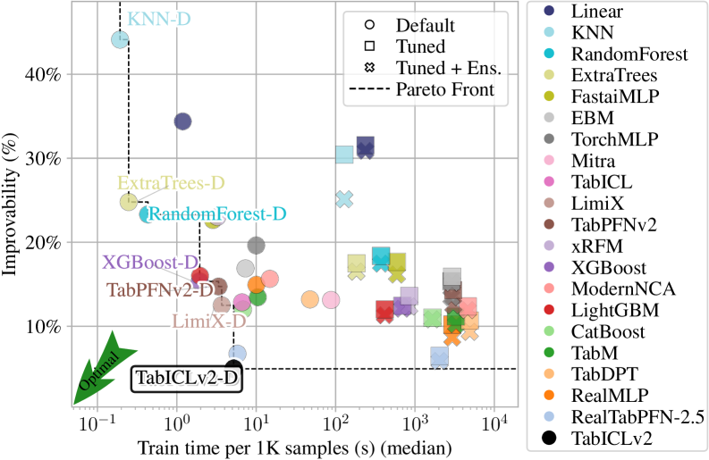

<figcaption>図J.3(a): improvability と訓練時間のパレートフロント。</figcaption>
</figure>

<figure>

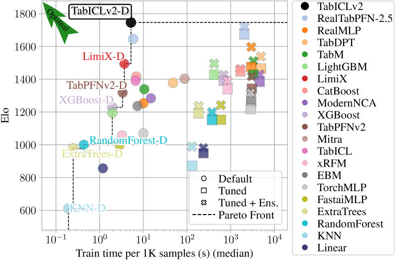

<figcaption>図J.4(a): Elo と訓練時間のパレートフロント。</figcaption>
</figure>

<figure>

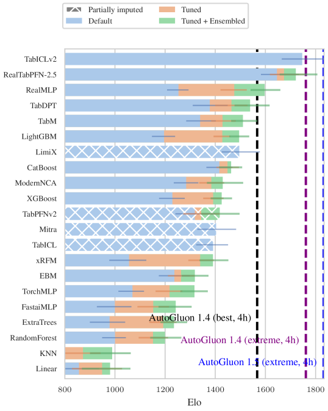

<figcaption>図J.5: TabArena Elo。</figcaption>
</figure>

### J.3 Results on binary classification datasets（二値分類データセットの結果）

TabArena の 24 二値分類データセットで、TabICLv2 は平均ランク 4.43 で AutoGluon 1.5（extreme, 4h）の 3.83 に次ぐ 2 位。RealTabPFN-2.5（T+E）の 6.90 を実質的に上回る。二値分類でパレートフロント上、全 TFM 中で最強のまま。

<figure>

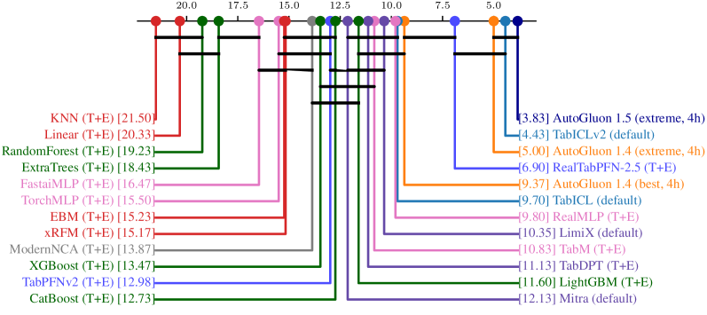

<figcaption>図J.6: TabArena 二値分類データセットでの臨界差図。</figcaption>
</figure>

<figure>

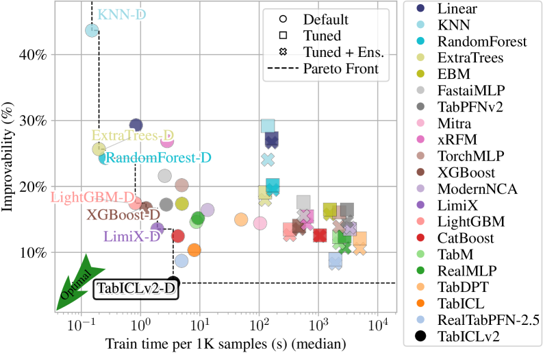

<figcaption>図J.7(a): improvability と訓練時間のパレートフロント（二値分類）。</figcaption>
</figure>

<figure>

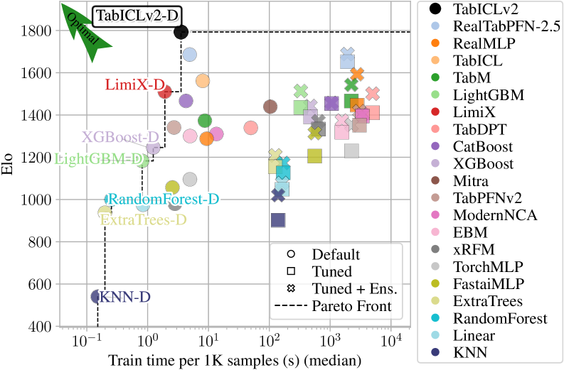

<figcaption>図J.8(a): Elo と訓練時間のパレートフロント（二値分類）。</figcaption>
</figure>

### J.4 Results on multiclass classification datasets（多クラス分類データセットの結果）

14 多クラスデータセットで、TabICLv2（default）は平均ランク 6.75 で、AutoGluon 1.5（4.00）、RealTabPFN-2.5（T+E）（4.25）、AutoGluon 1.4（4.50）に次ぐ。RealTabPFN-2.5（T+E）を超えないが、後者は調整・アンサンブルを使い TabICLv2 は無調整。TabPFNv2（T+E）（8.62）や LimiX（default）（9.31）など他 TFM は実質的に上回る。

<figure>

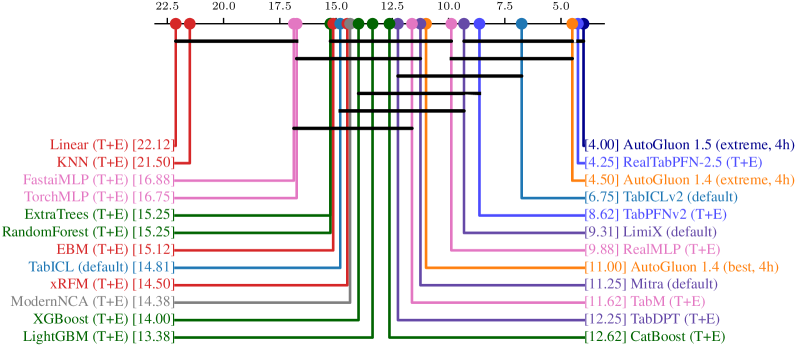

<figcaption>図J.9: TabArena 多クラス分類データセットでの臨界差図。</figcaption>
</figure>

<figure>

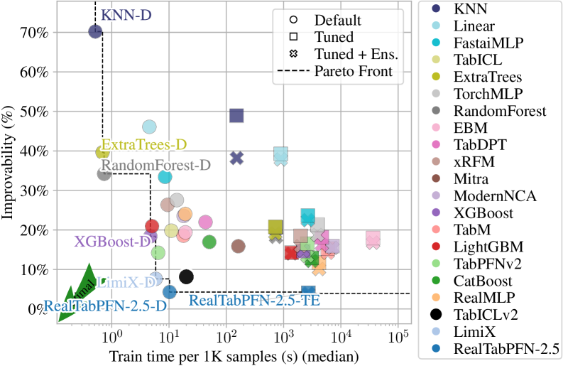

<figcaption>図J.10(a): improvability と訓練時間のパレートフロント（多クラス）。</figcaption>
</figure>

<figure>

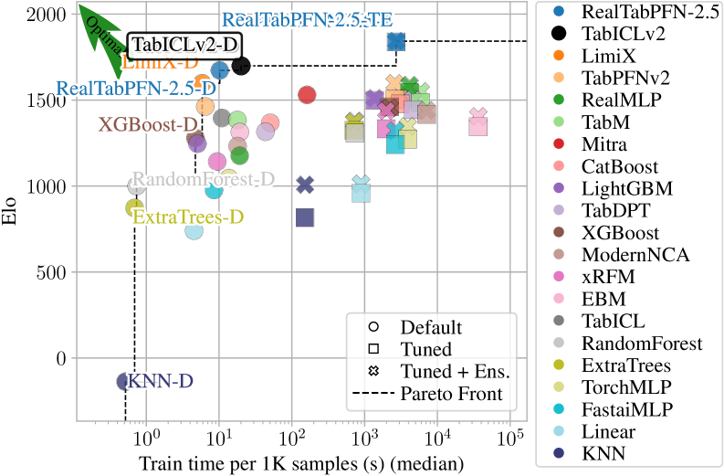

<figcaption>図J.11(a): Elo と訓練時間のパレートフロント（多クラス）。</figcaption>
</figure>

### J.5 Results on regression datasets（回帰データセットの結果）

13 回帰データセットで、TabICLv2（default）は平均ランク 4.54 で RealTabPFN-2.5（T+E）と同点、AutoGluon 1.5（3.92）にのみ次ぐ。興味深いことに実データ事前訓練の TabDPT（T+E）が回帰でランク 5.31（分類より大幅に良い）を達成し、TabDPT の訓練コーパスと TabArena 回帰データセット間のデータリークの可能性を提起する。

<figure>

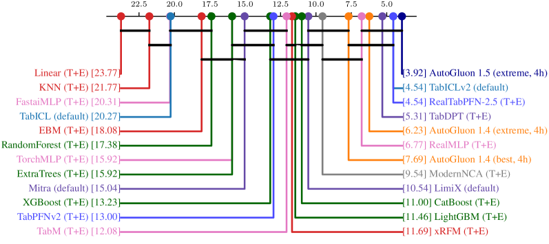

<figcaption>図J.12: TabArena 回帰データセットでの臨界差図。</figcaption>
</figure>

<figure>

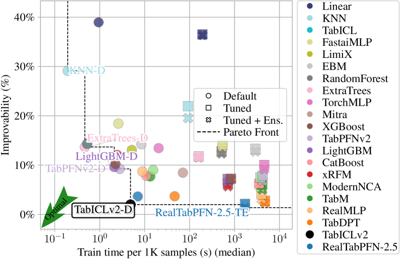

<figcaption>図J.13(a): improvability と訓練時間のパレートフロント（回帰）。</figcaption>
</figure>

<figure>

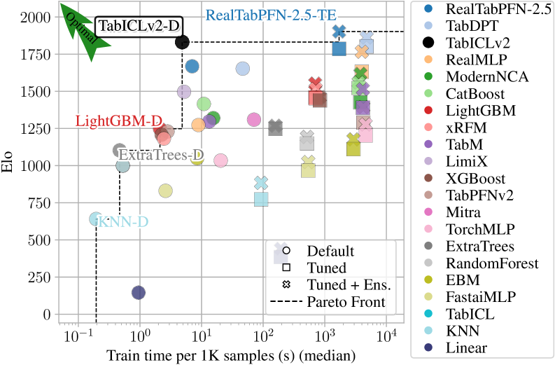

<figcaption>図J.14(a): Elo と訓練時間のパレートフロント（回帰）。</figcaption>
</figure>

## Appendix K Detailed results on the TALENT benchmark（付録 K: TALENT の詳細結果）

### K.1 Benchmark overview（ベンチマーク概観）

TALENT は 300 データセット（二値分類 120、多クラス分類 80、回帰 100）から成る。各データセットは 64%/16%/20% に分割。ハイパラは検証集合で精度に基づき選択し、最終性能は保留テスト集合で報告。評価指標は分類で精度、回帰で RMSE。集約には improvability・Elo・平均ランクを計算。TALENT は log-loss・AUC（分類）、MAE・$R^{2}$（回帰）も提供。公平な比較のため、TabICLv2 開発に使った開発データセットを除外する。

### K.2 Results on all datasets（全データセットの結果）

TabICLv2 は平均ランク 4.66 で最良、RealTabPFN-2.5（5.11）・TabPFN-2.5（5.45）を上回る。ペアワイズ勝率も支配を確認: RealTabPFN-2.5 に 62%、TabPFN-2.5 に 65%。RealTabPFN-2.5（実データ FT 済み）が TabPFN-2.5（FT なし）を上回り（5.11 対 5.45）、実データ FT の測定可能な利点を示す。LimiX・TabPFNv2 は平均ランク 8.34・8.82 で、TabICLv2 のほぼ 2 倍。

<figure>

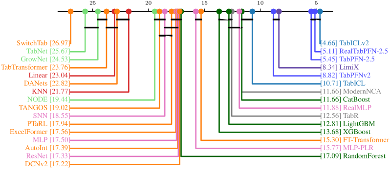

<figcaption>図K.1: TALENT ベンチマークでの臨界差図。</figcaption>
</figure>

<figure>

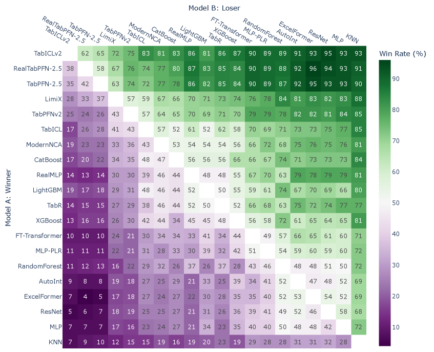

<figcaption>図K.2: TALENT ベンチマークでの勝率行列。</figcaption>
</figure>

<figure>

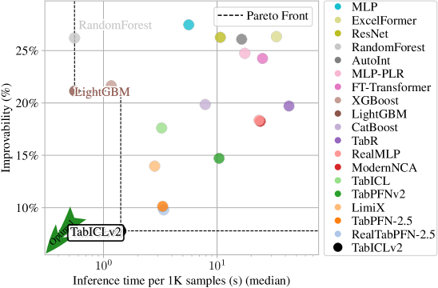

<figcaption>図K.3: TALENT での improvability と推論時間のパレートフロント。</figcaption>
</figure>

<figure>

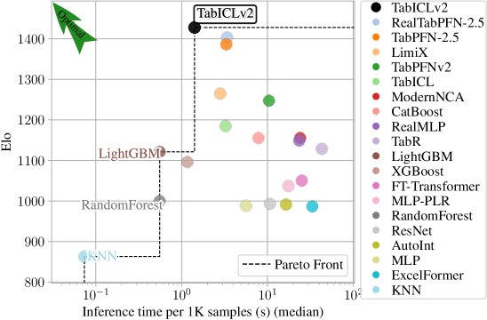

<figcaption>図K.4: TALENT での Elo と推論時間のパレートフロント。</figcaption>
</figure>

### K.3 Results on binary classification datasets（二値分類）

二値分類で TabICLv2（4.98）は精度で RealTabPFN-2.5（4.82）とほぼ同点、両者とも TabPFN-2.5（5.28）・TabICL（8.48）・LimiX（8.61）を上回る。ただし AUC・log-loss では TabICLv2 が明確にリード（AUC: 3.31 対 4.62 対 5.45、log-loss: 2.83 対 3.78 対 4.31）。精度は固定閾値の予測のみ評価するのに対し AUC は全閾値のランキング品質、log-loss は確率較正を評価する。TabICLv2 が精度では同点だが AUC・log-loss で上回ることは、より良い確率推定を生むことを示唆する。

<figure>

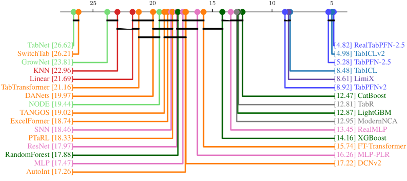

<figcaption>図K.5(a): 二値分類の精度に基づく結果（TALENT）。</figcaption>
</figure>

<figure>

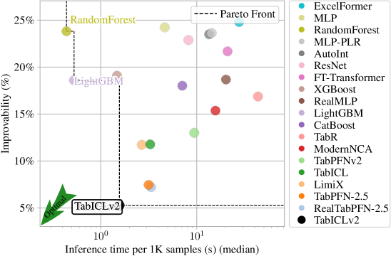

<figcaption>図K.6: 二値分類での improvability と推論時間のパレートフロント。</figcaption>
</figure>

<figure>

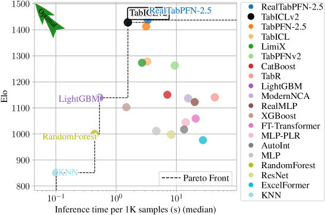

<figcaption>図K.7: 二値分類での Elo と推論時間のパレートフロント。</figcaption>
</figure>

### K.4 Results on multiclass classification datasets (≤10 classes)（多クラス分類 ≤10）

二値と違い、TabICLv2 は多クラスで全指標で明確に優位（精度: 4.58 対 5.64、AUC: 3.38 対 5.20、log-loss: 2.67 対 4.48、いずれも RealTabPFN-2.5 比）。

<figure>

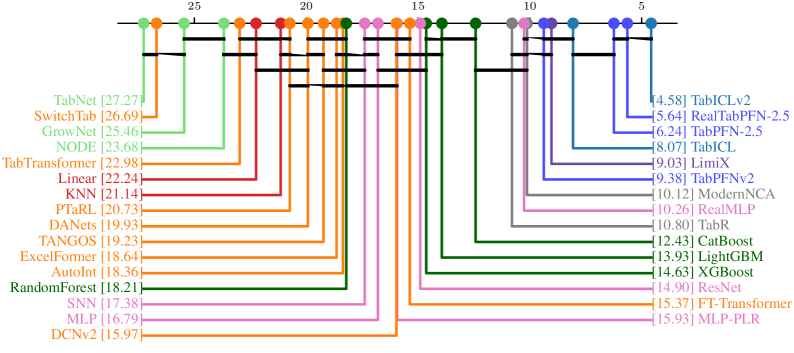

<figcaption>図K.8(a): 多クラス分類（≤10）の精度に基づく結果。</figcaption>
</figure>

<figure>

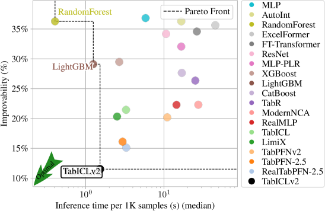

<figcaption>図K.9: 多クラス分類（≤10）での improvability と推論時間のパレートフロント。</figcaption>
</figure>

<figure>

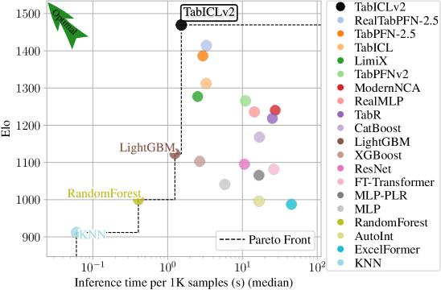

<figcaption>図K.10: 多クラス分類（≤10）での Elo と推論時間のパレートフロント。</figcaption>
</figure>

### K.5 Results on multiclass classification datasets (>10 classes)（多クラス分類 >10）

10 クラス超の 12 データセットで、TabICLv2 は RealTabPFN-2.5 を明確に上回る。ECOC は TabPFNv2 の誤り訂正出力符号ラッパ。TabICLv2 は ECOC ラッパとネイティブの mixed-radix ensembling の両方で強く、いずれも RealTabPFN-2.5-ECOC を上回る。

<figure>

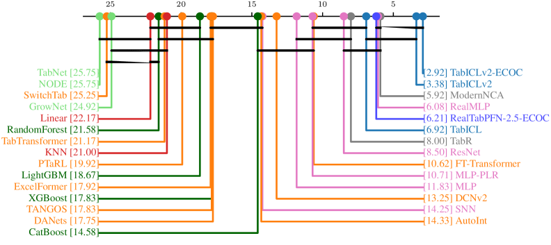

<figcaption>図K.11(a): 多クラス分類（>10）の精度に基づく結果。</figcaption>
</figure>

### K.6 Results on regression datasets（回帰）

TabICLv2 は RMSE・$R^{2}$ で TabPFN-2.5 を上回るが、MAE では TabPFN-2.5 がわずかに勝る。RMSE は大誤差を罰し外れ値・裾に敏感、MAE は全誤差を等しく扱う。999 分位点の pinball 損失で訓練する TabICLv2 の分位点回帰は、単一点推定でなく完全な条件付き分布を捉えるよう設計され、分散・極値の正確なモデリングを報いる RMSE・$R^{2}$ で良い性能。MAE のわずかな不利は、TabPFN-2.5 のビンベースが中央値予測にやや最適化されている可能性を示唆するが差は小さい（4.43 対 4.63）。

<figure>

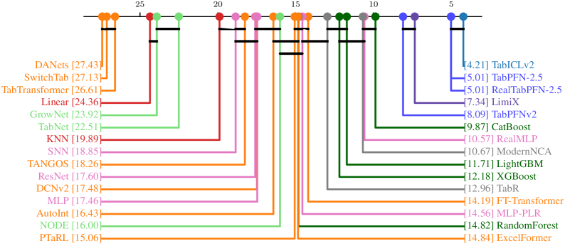

<figcaption>図K.12(a): 回帰の RMSE に基づく結果（TALENT）。</figcaption>
</figure>

<figure>

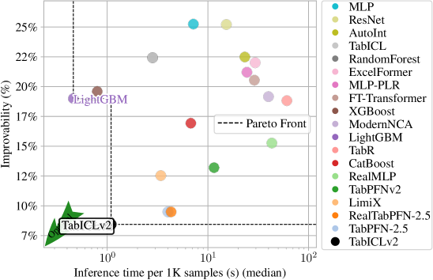

<figcaption>図K.13: 回帰での improvability と推論時間のパレートフロント。</figcaption>
</figure>

<figure>

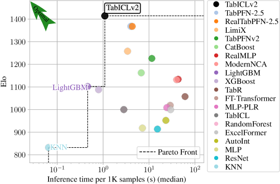

<figcaption>図K.14: 回帰での Elo と推論時間のパレートフロント。</figcaption>
</figure>

### K.7 Results on small datasets with less than 10K samples（小規模 <10K）

小規模データセット（TFM が本来優れるよう設計された領域）で、TabICLv2 と RealTabPFN-2.5 は同等の性能。

<figure>

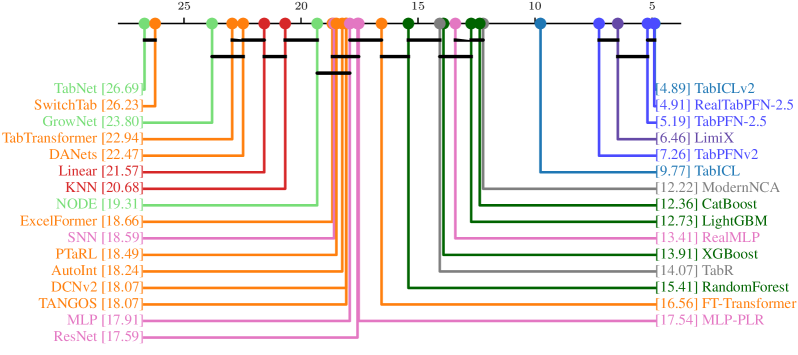

<figcaption>図K.15: TALENT 小規模データセットでの臨界差図。</figcaption>
</figure>

<figure>

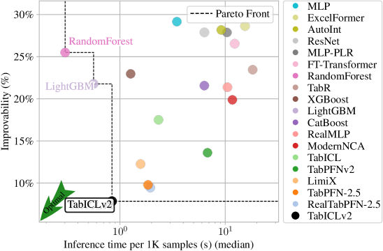

<figcaption>図K.16: 小規模データセットでの improvability と推論時間のパレートフロント。</figcaption>
</figure>

<figure>

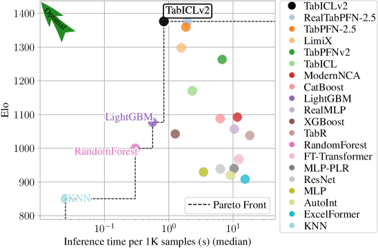

<figcaption>図K.17: 小規模データセットでの Elo と推論時間のパレートフロント。</figcaption>
</figure>

### K.8 Results on large datasets with more than 10K samples（大規模 >10K）

大規模データセットで、TabICLv2 は RealTabPFN-2.5・TabPFN-2.5 の両方に明確な優位を示す。

<figure>

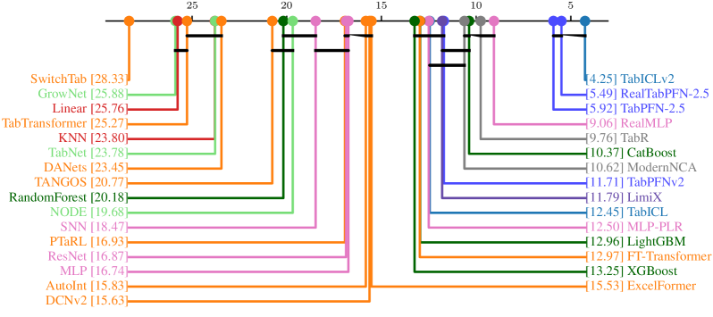

<figcaption>図K.18: TALENT 大規模データセットでの臨界差図。</figcaption>
</figure>

<figure>

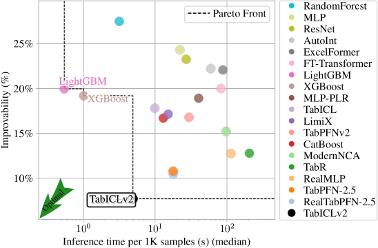

<figcaption>図K.19: 大規模データセットでの improvability と推論時間のパレートフロント。</figcaption>
</figure>

<figure>

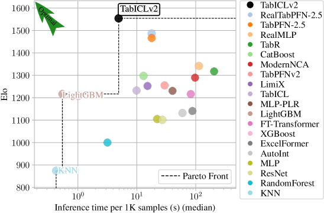

<figcaption>図K.20: 大規模データセットでの Elo と推論時間のパレートフロント。</figcaption>
</figure>

### K.9 Model rankings with respect to meta-features（メタ特徴量に対するモデルランキング）

データセットのメタ特徴量（クラス数・特徴量数・カテゴリ比率など）に対する各手法のランキング依存性を示す。

<figure>

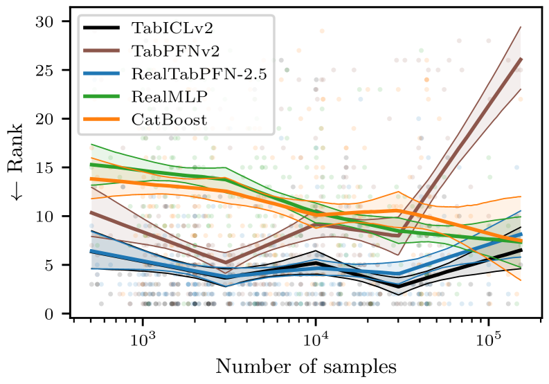

<figcaption>図K.21(a): メタ特徴量に対するモデルランキング。</figcaption>
</figure>

<figure>

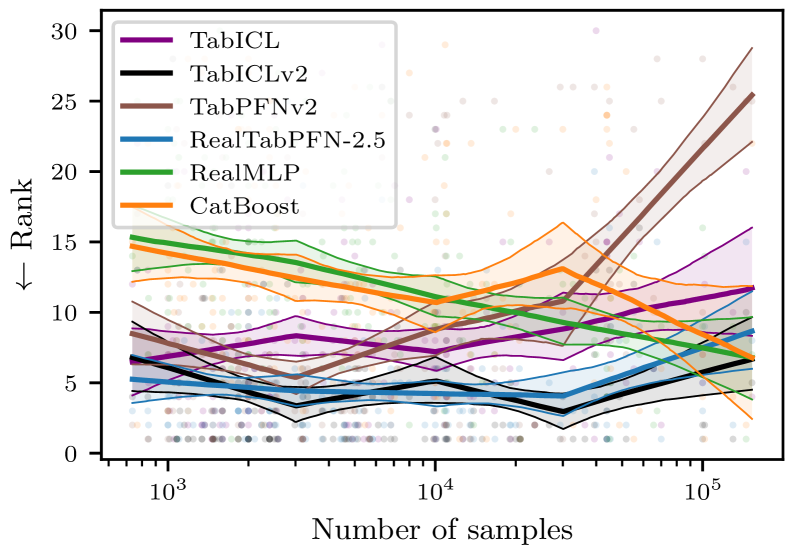

<figcaption>図K.22(a): メタ特徴量に対するモデルランキング。</figcaption>
</figure>

<figure>

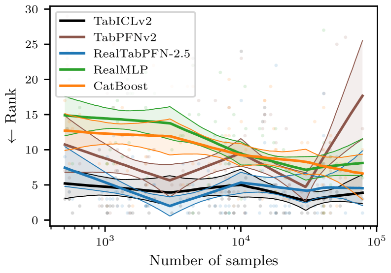

<figcaption>図K.23(a): メタ特徴量に対するモデルランキング。</figcaption>
</figure>
