# TabPFN-3: テクニカルレポート

> 原題: TabPFN-3: Technical Report
> 著者: Prior Labs Team（貢献者一覧は Appendix A）
> 出典: arXiv:2605.13986v1（2026年5月12日）

> 注: 本翻訳は **本文 §1〜5 のみ**を一文ずつ訳出する（ユーザー指示で appendix 指定なし。提供された図 fig1〜22 も本文図に一致）。References（参考文献一覧）と Appendix（付録）は対象外。原典は PDF で、図はユーザー提供分を `raw/assets/2026-tabpfn-3/` にローカル保存して該当位置に引用する。文献参照記号は省略。

## Abstract（要旨）

表形式データは科学と産業における高価値な予測問題のほとんどを支えており、TabPFN はこのモダリティの基盤モデル革命を牽引してきた。

ユーザーからのフィードバックをもとに設計された TabPFN-3 はこの基礎の上に構築され、最先端の性能を **100 万訓練行**のデータセットへスケールさせ、訓練・推論時間を大幅に削減する。

我々の事前分布からの合成データのみで事前訓練された TabPFN-3 は、表形式予測のフロンティアを劇的に押し広げ、時系列・関係データ・表形式テキストデータで大きな利得をもたらす。

**新しい性能基準**　標準的な表形式ベンチマーク TabArena において、TabPFN-3 の順伝播は、チューニング・アンサンブルされたベースラインを含む他のすべてのモデルを大差で上回り、速度/性能のフロンティアをパレート支配する。TabPFN-3 はより多様なデータセットへもスケールし、多クラスのデータセットで首位にランクし、最大 100 万行・200 特徴量のデータセットで 8 時間チューニングの勾配ブースティング木ベースラインを上回る。

**思考モード（Thinking mode）**　TabPFN-3 は表形式基盤モデルにテスト時計算スケーリングを導入する。我々の API 提供 TabPFN-3-Plus（Thinking）はこれを活用し、標準 TabArena ベンチマークで非 TabPFN モデルすべてを 200 Elo 以上上回り、最大データ部分集合では 420 Elo まで上昇し、AutoGluon 1.5 extreme をその実行時間の 1/10 未満で上回る。LLM・実データ・インターネット検索・TabPFN 以外のモデルを一切使わない。

**より広い能力**　TabPFN-3 はモデルの能力を拡張し、多クラスデータセット・関係データ（RelBenchV1 の新 SOTA 基盤モデル）・表形式テキストデータ（TabPFN-3-Plus 経由で TabSTAR の SOTA）での SOTA 予測を可能にする。既存の TabPFN 統合も直接改善する。専用の TabPFN-3 チェックポイント TabPFN-TS-3 は時系列ベンチマーク fev-bench で 2 位にランクし、shapiq による SHAP 値計算は KV キャッシュで最大 120× 高速になる。

**エンタープライズ対応モデル**　TabPFN-3 はこの性能を、TabPFN-2.5 比で最大 20× 高速でありながら達成する。加えて、削減された KV キャッシュと行チャンクにより、単一 H100 で 100 万行へ高速にスケールする。

我々は TabPFN-3 を TABPFN-3.0 License v1.0（研究と内部評価に寛容）の下で公開する。TabPFN-3-Plus（Thinking）は API と、オンプレ/VPC 環境（AWS SageMaker, Azure AI Foundry）を含むエンタープライズライセンスで利用できる。

> 日付: 2026年5月12日 ・ ライセンス: TABPFN-3.0 License v1.0（詳細は §5）・ ドキュメント: https://docs.priorlabs.ai

<figure>

<figcaption>図1: TabArena ベンチマークの最大データ部分集合（1万〜10万サンプル）での性能。TabPFN-3 は順伝播で他のどのモデルも上回る。TabPFN-3-Plus（Thinking）はさらに劇的に良く、TabPFNv2 を含む 4 時間チューニングのアンサンブル AutoGluon 1.5 extreme を、10× 高速でありながら上回る。</figcaption>
</figure>

## 1 Introduction（はじめに）

表形式データは、臨床リスク予測・信用スコアリング・予知保全・科学的計測など、科学と産業の運用的意思決定の中心に位置する。

数十年にわたり勾配ブースティング木が信頼できるデフォルトだったが、表形式基盤モデルがこの 1 年で標準的な小〜中規模ベンチマークで最強の予測器としてそれらを置き換えた。

これまでの TabPFN リリースがこのパラダイムを確立・拡張してきた。TabPFN v1 は、Transformer が合成タスクで事前訓練されてベイズ推論を 1 順伝播で近似できることを示したが、クリーンな数値の 1000 行に限られた。TabPFN v2 はこれをカテゴリ特徴量・欠損値・外れ値を持つ 10,000 行データセットへスケールし、標準ベンチマークでチューニングした勾配ブースティング木を上回る最初の表形式基盤モデルになった。TabPFN-2.5 は強い性能を 100,000 行・2,000 特徴量へ拡張し、4 時間チューニングのアンサンブルに 1 順伝播で並んだ。

これらのリリースを通じて、コアモデルの上に拡張の活発な研究エコシステムが育った——時系列予測・因果推論・ベイズ最適化・グラフ学習・解釈可能性・強化学習など——200 を超える公開応用と 300 万超の PyPI ダウンロードがある（Appendix I）。

TabPFN-3 はユーザーとエコシステム全体のフィードバックによって形作られた。共通のボトルネックを取り除くため、10 万行を超えて 100 万行へスケールし、大規模での推論のメモリとレイテンシを削減し、多クラス分類のネイティブサポートを追加し、較正された予測分布を 1 順伝播に磨き上げた。さらに、コア表形式予測と、時系列予測・マルチテーブル関係データ・解釈可能性といった多くの下流拡張の両方で性能を引き上げるよう、TabPFN-3 のモデルと訓練プロセスを注意深く設計した。

本レポートの残りは、TabPFN-3 のアーキテクチャ・事前分布・推論時最適化（§2）、分類・回帰・多クラス・時系列・関係データにわたる公開/内部ベンチマークでの性能（§3）、モデルが築かれた採用とエコシステム（§4）、ライセンスと提供（§5）を述べる。付録は詳細なアーキテクチャのハイパーパラメータ・事前分布の可視化・追加の内部ベンチマーク・より詳細なベンチマーク結果・公開された TabPFN ユースケースの広範なリストを提供する。

<figure>

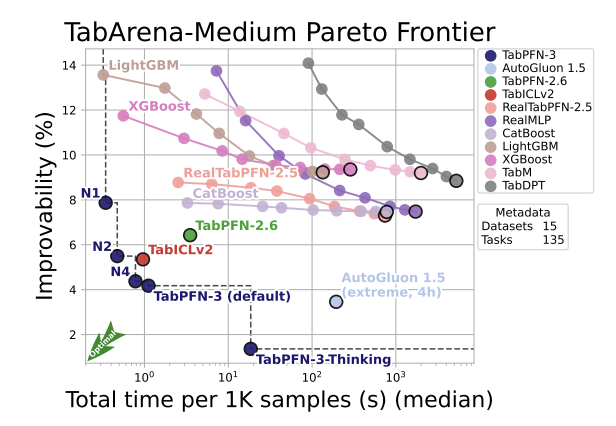

<figcaption>図2: TabPFN-3 は TabArena 最大データ（1万〜10万行）でパレートフロンティアを支配する。N1・N2・N4 は推定器 1・2・4 個のモデル版。Improvability は「各データセットで最良モデルに乗り換えたらどれだけ改善するか」を測る。</figcaption>
</figure>

<figure>

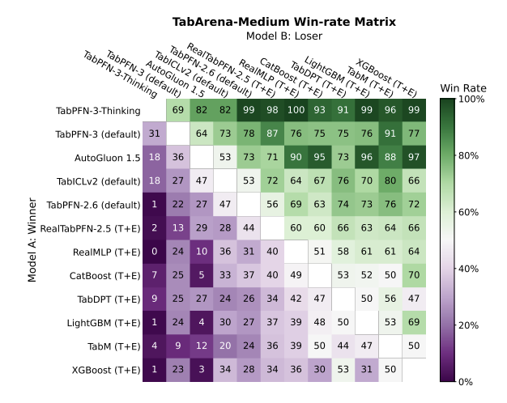

<figcaption>図3: TabArena-medium（1万〜10万行）の、TabArena 上で最強のモデル群の厳選セットに対するペアワイズ勝率。</figcaption>
</figure>

<figure>

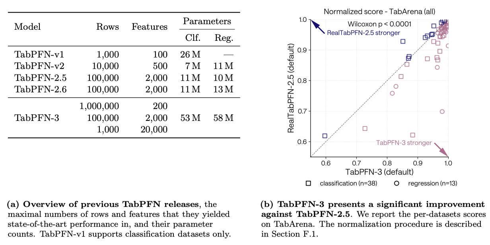

<figcaption>図4: TabPFN モデルファミリーの進化と性能。表中の行数・特徴量数は、公開/内部評価が SOTA を実証したベンチマーク検証済みのレジームを示す（v1 は分類のみ。v2: 1万行・500特徴量・7M/11Mパラメータ。2.5/2.6: 10万行・2000特徴量。3: 100万行×200特徴量／10万行×2000特徴量／1000行×2万特徴量、53M/58Mパラメータ）。右パネルは TabArena でのデータセット単位スコアで、対角線より下の点は TabPFN-3 がより強いことを示し、Wilcoxon 検定（p<0.0001）が改善の有意性を確認する。</figcaption>
</figure>

## 2 TabPFN-3

TabPFN-3 は新しいアーキテクチャ（§2.1）を備え、アテンションベースの多クラスデコーダ（§2.2）、改良された前処理パイプライン（§2.3）、単一 GPU で 100 万行へスケールできる推論時最適化（§2.4）、事前訓練に用いる改良された合成 SCM 事前分布（§2.5）を含む。また、表中のテキストをネイティブに扱う API・エンタープライズ機能 TabPFN-3-Plus と、テスト時計算で性能を劇的に改善する TabPFN-3-Plus（Thinking）も導入する（§2.6）。

### 2.1 Architecture（アーキテクチャ）

TabPFN-3 の全アーキテクチャの概観は図 5 に示す。TabPFN-3 は、文脈内学習を 100 万行のデータセットへスケールさせる、大幅に再設計されたアーキテクチャを導入する。

TabPFN v1 は、データセット全体の行の埋め込みに対して文脈内学習（ICL）を行う Transformer アーキテクチャを用いた。TabPFN-2.x（v2, v2.5, v2.6）は、行方向と特徴量方向のアテンション層を交互に行う Transformer アーキテクチャを用いた。これは性能を改善するが、データセットサイズが大きくなると法外に高コストになる。TabPFN-3 は TabPFN v1 の「行全体の埋め込みに対する ICL」へ回帰する。これは Qu らが TablICL アーキテクチャで導入した 2 段の行圧縮設計の上に構築され、列ごとの特徴量埋め込み層に続いて行ごとの特徴量集約を行い、TabPFN v1 流の ICL 層で用いる行表現を得る。

2 つの圧縮段に入る前に、TabPFN-2.x と同様に特徴量をグループ化するが、TabICLv2 のグループ割当を採用する。これは各特徴量をその 2 つの巡回シフト近傍と組にして三つ組を作る。各三つ組は学習された線形射影（セル埋め込み）でモデルの隠れ次元に写像され、訓練行のセル埋め込みにはターゲット認識埋め込みが加えられる。

得られたグループ化特徴量埋め込みは、次の 3 段で処理される。

- **段 1: 特徴量分布埋め込み（列ごと）**。各特徴量列は、効率的な誘導点アテンション機構を持つ Transformer で独立に埋め込まれる。これは全行アテンションの二次コストを避けつつ、任意のデータセット規模で列レベルの統計を捉える。
- **段 2: 特徴量集約（行ごと）**。各データ点について、学習された CLS トークンの集合とその行の特徴量埋め込みが非因果的に互いにアテンションし、特徴量横断情報を固定数のベクトルへ蒸留する。CLS トークンの隠れ状態を連結すると、行ごとに単一の固定次元埋め込みが得られ、後続の ICL 段を入力特徴量数から切り離す。
- **段 3: 文脈内学習**。訓練・テスト集合の行埋め込みが ICL を行う Transformer に同時に渡される。訓練行埋め込みは訓練集合内の関係を捉えるよう互いにアテンションし、テスト行埋め込みは訓練行埋め込みにアテンションして予測を生成する。各データ点が単一ベクトルになったため、この段は行数にのみ比例する系列で動作し、大規模データへの効率的スケーリングを可能にする。

段 1・3 と（後述の）多クラスデコーダでは、各アテンション層が query-aware scalable softmax（QASSMax）を適用する。これは SSMAX に着想を得て、アテンションクエリを入力長の関数として再スケールし、ICL の長さ汎化を大きな訓練集合へ改善する。詳細なアーキテクチャのハイパーパラメータは Appendix C にある。

TabPFN-3 は 3 段アーキテクチャの上にいくつかのアーキテクチャ的革新を導入する。

- **アテンションベースの多クラスデコーダ**。分類では、従来 TabPFN の固定幅 MLP 出力ヘッドを、クラス予測を文脈内訓練集合上の soft nearest-neighbor retrieval として扱うアテンションベースの検索デコーダで置き換える。デコーダはクラス数に非パラメトリックで、任意のクラス数をネイティブにサポートする（§2.2）。
- **行チャンク（Row-chunking）**。ピーク GPU 活性化メモリをデータセットサイズ（行×列）から切り離す 2 段の推論スキーム。チャンクなし計算と等価な出力を生む（§2.4.1）。
- **マルチクエリアテンションによる削減 KV キャッシュ**。ICL Transformer で、テスト行クエリは単一 KV ヘッド（マルチクエリアテンション）で訓練行のキー/値にアテンションし、訓練行は完全マルチヘッドアテンションを保つ。これにより 100 万行で推定器あたり KV キャッシュを約 7GB に削減（§2.4.2）。
- **直交ターゲット埋め込み**。訓練ラベルは直交分解で初期化された学習埋め込みでエンコードされ、訓練開始時にほぼ最大限分離されたクラス表現を提供し、多クラス領域での勾配流を改善する。
- **RMSNorm**。すべての正規化層は TabPFN-2.5 の層正規化の代わりに RMSNorm を用いる。RMSNorm は平均中心化項を省き、訓練安定性を保ちつつ計算を削減する。
- **ネイティブな欠損値処理**。NaN の各セルについて、TabPFN-3 は二値指標を計算し、埋め込み前にセル値と連結する。モデルは欠損データについて明示的な信号を受け取り、上流の補完に頼らず予測を条件付けられる。

<figure>

<figcaption>図5: TabICLv2 アーキテクチャから適応した TabPFN-3 のアーキテクチャ。変更点は、新しい直交埋め込み・多クラスデコーダ・NaN/Inf 指標変数の追加、低メモリのチャンク推論オプション（点線パスはチャンク、破線は完全並列）。C は列数、N は行数、K は誘導点数、𝒴 はラベル集合。図は分類用 TabPFN-3 で、回帰版は多クラスデコーダを使わない。</figcaption>
</figure>

### 2.2 Many-class Decoder（多クラスデコーダ）

多クラス分類で、TabPFN-3 は TabPFN-2.6（以前の版）で用いた固定幅 MLP 分類ヘッドを、文脈内訓練集合上の**アテンションベースの検索デコーダ**で置き換える。これはクラス予測を soft nearest-neighbor retrieval として扱う。最終層の訓練埋め込み $\{h^{\text{train}}_n\}_{n=1}^{N_{\text{train}}}$ がキー、対応する one-hot ラベルベクトル $\mathbf{y}_n\in\{0,1\}^{C}$ が値、テスト埋め込み $h^{\text{test}}_m$ がクエリとして働く。学習線形射影 $W_Q, W_K$ とマルチヘッド分割の後、デコーダは次を計算する。

$$
p_m=\frac{1}{H}\sum_{h=1}^{H}\sum_{n=1}^{N}\alpha^{(h)}_{m,n}\mathbf{y}_n,\qquad \alpha^{(h)}_{m,n}=\text{softmax}_n\!\left(\frac{q^{(h)}_m\cdot k^{(h)}_n}{\sqrt{D_h}}\right),
$$

すなわち、（ヘッド平均した）アテンション加重した文脈内 one-hot ラベルの平均で、これを $\log(\text{clip}(p_m))$ でロジットに変換する。

この定式化は 2 つの帰結を持つ。第一に、クラスはもはやパラメトリックヘッドの固定出力位置に縛られないので、デコーダはクラスインデックスに自然に置換同変になる。第二に、デコードが $C$ に非パラメトリックである。デコーダのパラメータは埋め込み次元とアテンションヘッド数にのみ依存し、ある $C_{\max}$ には依存しないため、ヘッドの容量がサポートするラベル基数から切り離される。

**事前訓練からのクラス数上限**。デコーダは $C$ に非パラメトリックだが、訓練済み TabPFN-3 は事前訓練時に 3 つのチェックポイント拘束テンソルを通じて $C_{\max}=160$ の硬い上限を固定する。列エンコーダと ICL Transformer が用いる学習可能な直交ラベル埋め込み $E_{\text{col}}, E_{\text{icl}}\in\mathbb{R}^{C_{\max}\times D}$ と、デコーダが消費する one-hot 値テンソルである。$C_{\max}$ を事前訓練時に拡大しても $\mathcal{O}(C_{\max}D)$ の追加パラメータのみで、デコード時の追加メモリはない。

### 2.3 Preprocessing（前処理）

以前の版と同様、TabPFN-3 は複数の推定器にわたって予測を集約する。各推定器はデータセット順列と特徴量変換の異なる組合せで動作し、ロバスト性と汎化を高める効果的なアンサンブルを形成する。個々の推定器は補完的な特徴量変換を適用する——ロバストスケーリングとソフトクリッピングを、分位点変換と標準スケーリングと組み合わせ、様々な特徴量分布で安定性と感度のバランスを取る。TabPFN-2.5 と同様、推定器の一部は特異値分解（SVD）成分で特徴量行列を拡張し、大域分散の高エネルギー方向を捉える。

TabPFN-3 はこのパイプラインに 2 つの改善を導入する。第一に、特徴量がラウンドロビン方式でサブサンプリングされ、各特徴量が少なくとも 1 つの推定器に現れ、アンサンブルから体系的に除外されないことを保証する。100,000 行を超えるデータセットでは、ランダムな特徴量サブサンプリングを、サブサンプルに当てはめた軽量木モデルから導いた Gini 重要度に基づく情報的選択で置き換え、各推定器を最も識別的な特徴量に集中させる。第二に、分位点正規化のような特徴量変換が今や GPU で実行され、前処理レイテンシを大幅に削減し、TabPFN-3 がサポートするより大きなデータ規模でパイプラインを実用的にする。TabPFN-2.5 と同様、後処理機能（メトリック特化最適化のための決定閾値チューニング〔例: F1〕、確率較正のための温度スケーリング）も利用できる。

### 2.4 Inference Optimization（推論最適化）

TabPFN-3 は、計算とメモリのフットプリントを十分に削減して、サブ秒の推論レイテンシで単一 GPU で 100 万行へスケールできる、いくつかの推論時最適化を導入する。

#### 2.4.1 Row-Chunking（行チャンク）

TabPFN-3 の ICL 前の段（セル埋め込み・特徴量分布埋め込み・特徴量集約）は $(n_{\text{train}}+n_{\text{test}})\times n_{\text{features}}\times d$ の活性化を実体化するため、何らかの演算が計算律速になる前にピークメモリが GPU を飽和させうる。1 つの解は TabICLv2 のように活性化を CPU メモリやディスクへオフロードすることだが、これは大量の CPU メモリ（1M×500 表で 250GB）を要するか、実質的な I/O オーバーヘッド（4× 減速）を招く。代わりに我々は行次元を固定サイズスライスでストリームし、全活性化を GPU に保つ。

素朴な行方向ストリームは直接は適用できない。分布埋め込みが全訓練行への交差アテンションで訓練集合を固定サイズの誘導点に要約するため、その呼び出しをチャンク横断で分割すると意味が変わる。TabPFN-3 はこれを、チャンクなし計算と厳密に等価な 2 段スキームで解く。(i) 誘導状態を全訓練集合で一度計算し、（独立な）列次元に沿ってチャンクしてメモリコストを抑える。(ii) その後、行を固定サイズチャンクでストリームして特徴量分布埋め込みと特徴量集約器に通し、各チャンクが事前計算した誘導状態をアテンションのキー/値集合として再利用し、行ごとのチャンク埋め込みを行軸に沿って連結する。このスキームは段 (ii) でセル埋め込みを再計算する小さなオーバーヘッドを加えるが、ディスク帯域のボトルネックを避ける。$n_{\text{train}}+n_{\text{test}}>2048$ でチャンクを有効化する。

<figure>

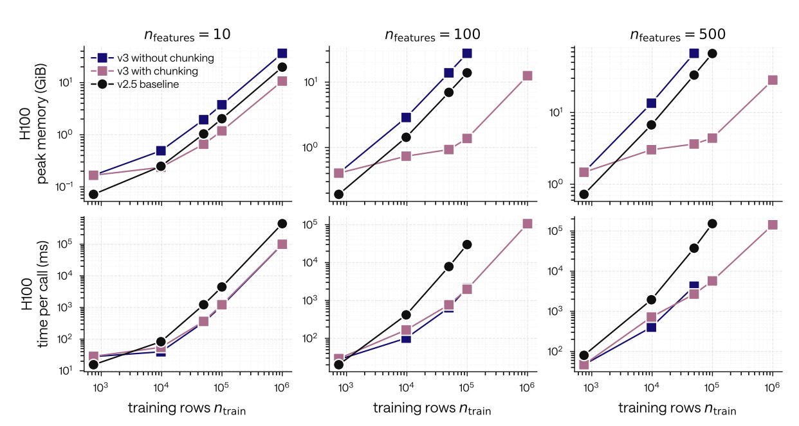

<figcaption>図6: チャンクは time-per-call に影響せずピークメモリを平坦化する。H100 で前処理なしの順伝播、$n_{\text{features}}\in\{10,100,500\}$。上段: ピーク GPU メモリ（GiB）対訓練行数、下段: call あたり時間（ms）。3 系列: チャンクなし v3（青）・チャンクあり v3（ピンク）・v2.5 ベースライン（黒）。両軸対数。TabPFN-3 は特に特徴量数が多いとき v2.5 よりはるかに速い。</figcaption>
</figure>

#### 2.4.2 Fast Inference with a Small KV-cache（小さな KV キャッシュによる高速推論）

文脈内学習モデルである TabPFN-3 は、訓練（fit）と推論（predict）を 1 順伝播で結合する。これは非常に速い訓練を可能にするが、本番ユースケースではオンライン/バッチ予測が遅くなりうる。訓練集合のキー/値（KV）をキャッシュするとこの問題が解消する。KV キャッシュは以前のモデルでも利用できたが、より大きなデータセットではキャッシュのメモリコストが法外だった。TabPFN-3 はこれを 2 つの方法で解く。

- TabPFN-2.5 が表の各セルの埋め込みを保存する必要があったのに対し、TabPFN-3 は 3 成分のみ保存すればよい。特徴量分布埋め込みが生むブロックごとの誘導状態、ICL 段の各 Transformer ブロックの ICL 自己アテンションの訓練側キー/値、多クラスデコーダが消費する最終 ICL 層の訓練埋め込みである。誘導状態は小さく、他の 2 成分は行×特徴量ではなく行数にのみ比例する。
- テスト/訓練サンプル間の交差アテンションに単一ヘッドのマルチクエリを用い、KV キャッシュサイズを 8 分の 1 に削減する。

これにより 100 万行データセットで推定器あたり KV キャッシュサイズ 7GiB を達成し、最大規模でも TabPFN-3 のデフォルト 8 推定器を一般的な GPU で使えるようにする。図 7a に示すように、（チャンクした）cached-predict のピークメモリは特徴量数にわたってほぼ平坦である。H100 で cached-predict は、TabPFN-2.5 ベースラインや TabPFN-3 自身の cold「fit+predict」パスより 1〜3 桁速く、100 テスト点バッチでテスト点あたり 0.1〜3ms を達成する（図 7b）。fit-with-cache のコストは、測定したすべての形状で cold fit+predict とほぼ同じで、$n_{\text{train}}=10^6$ では約 107 秒で完了する（図 8）。

<figure>

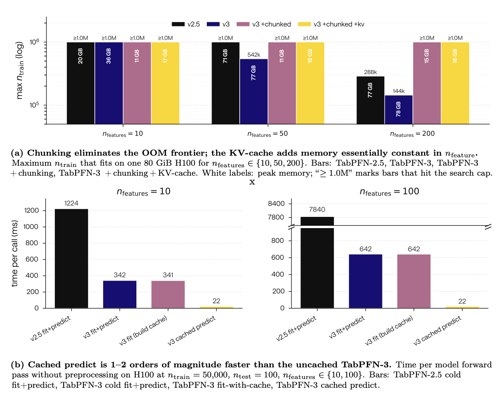

<figcaption>図7: 単一推定器・前処理なし・H100 での KV キャッシュ。(a) チャンク＋KV キャッシュで OOM フロンティアを解消し、KV キャッシュは $n_{\text{features}}$ に対してほぼ一定のメモリを加える。(b) cached-predict は未キャッシュの TabPFN-3 より 1〜2 桁速い。</figcaption>
</figure>

<figure>

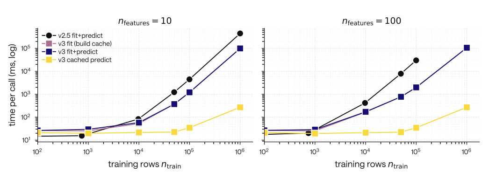

<figcaption>図8: TabPFN-3 の KV-cached predict は 1〜3 桁の高速化を可能にする。H100・前処理なし・単一推定器、$n_{\text{features}}\in\{10,100\}$・$n_{\text{test}}=100$。4 系列: TabPFN-2.5 fit+predict（黒, ベースライン）・TabPFN-3 cold fit+predict（青）・TabPFN-3 fit(build cache)（マゼンタ）・TabPFN-3 cached predict（黄）。</figcaption>
</figure>

#### 2.4.3 Model Distillation（モデル蒸留）

レイテンシ・メモリ予算・ハードウェア可用性・馴染みのモデルクラスを要する規制要件で制約される本番環境のため、TabPFN-3 は TabPFN-2.5 で導入したエンジンを通じて、データセット固有の MLP または木アンサンブルへの蒸留もサポートする。蒸留された成果物は標準的な MLP・木アンサンブルのサブミリ秒レイテンシで CPU 上で動作し、蒸留元データセットでの TabPFN-3 の予測性能の大半を保持する。

#### 2.4.4 Compilation and FlashAttention-3（コンパイルと FlashAttention-3）

TabPFN-3 は異なるボトルネックを標的とする 2 つのオプトイン性能機能を備える。非アテンションのホットパスでディスパッチを融合する `torch.compile` と、ICL アテンション用の Hopper 特化カーネル FlashAttention-3（FA3）である。MI-250x で `torch.compile` は非チャンク順伝播で最大 1.58× 高速、H100 で FA3 は $n_{\text{train}}=10^6$ で SDPA フォールバックより 1.5〜1.7× を達成する。両者は行チャンクとクリーンに合成し、実行時に自動検出される（詳細は Appendix G.1）。

#### 2.4.5 Improved interpretability for TabPFN（TabPFN の解釈可能性の改善）

TabPFN-3 の削減された KV キャッシュ（§2.4.2）と高速推論は、解釈可能性拡張を大幅に実用的にする。`tabpfn-extensions` パッケージを通じて、TabPFN は人気の `shapiq` ライブラリと直接統合され、任意次数の Shapley 相互作用の効率的近似を可能にする。付録の図 38 は絶対実行時間と KV キャッシュによる相対高速化の両方を示す。大規模データセットでは KV キャッシュが 120× 超の効率利得をもたらし、20 万行・500 特徴量の訓練表でもテスト行あたり実行時間を 1.08 秒に削減する。

### 2.5 Synthetic Prior（合成事前分布）

これまでの TabPFN モデル各種に従い、TabPFN-3 は我々の構造的因果モデル（SCM）事前分布に基づく合成生成データで訓練される。SCM 事前分布の動作を示す模式フローチャートは図 9 に示す。

我々の事前分布設計の哲学は、可能なデータセットの幅を最大化しつつ、モデルが実世界データで遭遇する構造を捉えることである。結果は、訓練をスケールアップし、生成する幅広い合成データセットから信号を抽出し続けられる、更新されたより洗練された事前分布である。最終的な TabPFN-3 モデルは 8 兆トークン超で訓練された。

<figure>

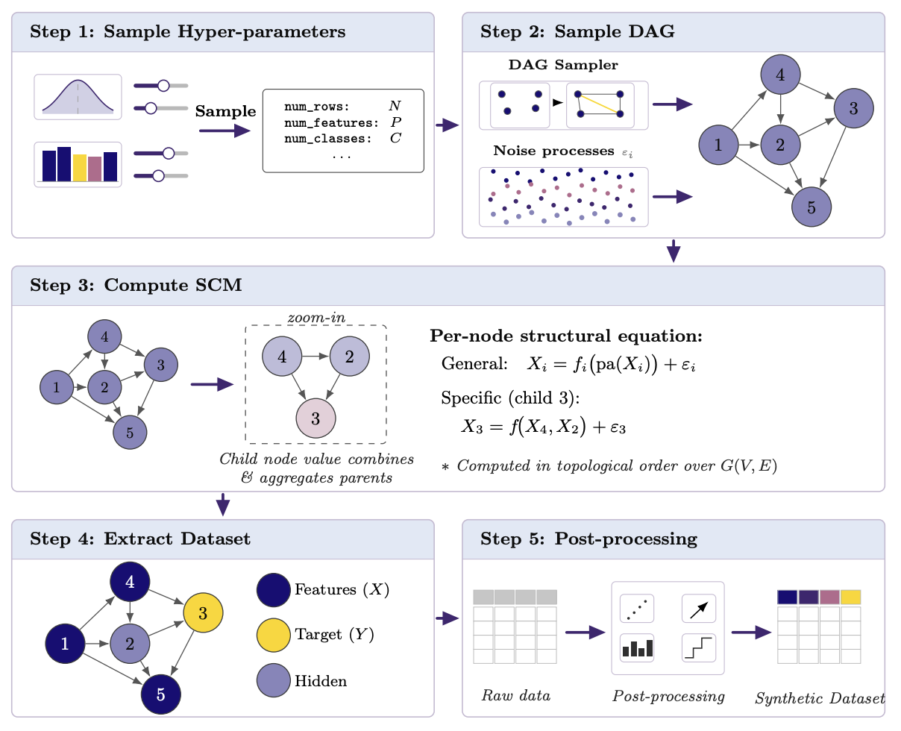

<figcaption>図9: 我々の SCM 事前分布の模式的可視化。(i) まずデータセットの高レベルなハイパーパラメータ（行数・特徴量数など）をサンプリング。(ii) ハイパーパラメータに基づき、グラフサンプリングで SCM の基底となる DAG を生成。並行して各ノードに i.i.d. ノイズ $\varepsilon_i$ を引く。(iii) DAG のトポロジカル順序を計算し、ルートノードを埋めてから combiner 機構で親ノードの値・活性を集約して子ノードへ伝播。(iv) 完全計算した SCM から特徴量とターゲット変数を選択。(v) データセットに後処理を適用。</figcaption>
</figure>

1. **グラフ生成**。SCM の基底グラフの分布を新しいサンプリングアルゴリズムで拡張し、より豊かな構造多様性を可能にする。サンプルグラフは図 23 に示す。
2. **Combiner 機構**。親ノードの値を組み合わせて子ノードへ伝播する新しい combiner 機構を多数導入する（簡単な 2 次元の例は図 24）。子ノードが親ノードに依存する関数形の多様性を増すことで、SCM 内のより豊かなノード関係を可能にする。
3. **カテゴリ変数**。TabPFN-2.5 と比べ、SCM のカテゴリ変数の扱いを、比較的単純なカテゴリデータモデルからより表現力のある変種へと作り直した。
4. **高周波振動子**。TabPFN-2.5 は正弦データ全般ではよく機能したが高周波振動に苦労した。改良された正弦活性化により TabPFN-3 は全周波数スペクトルで強い性能を持つ。
5. **空間事前分布**。多くの表形式データセットは基底に空間構造を持つ（経度・緯度を共変量とする、センサーのグリッドなど）。変数間の空間関係をエンコードできる空間活性化を追加する。
6. **多クラス事前分布**。TabPFN-3 の柔軟な多クラスデコーダは任意クラス数のネイティブ分類を可能にする。この設計を事前分布でも合わせ、二値から数百クラスのデータセットまで高品質を保証する。
7. **時間事前分布**。多くの表形式データセットは時間構造を持つ（行が時間間隔で収集され、訓練/テスト分割が時間順、変数間の時間依存など）。SCM を離散時間の動的構造的因果モデル（Dynamic SCM）へ拡張する。
8. **分布外（OOD）事前分布**。分布シフト下でも事前分布データで訓練したモデルが高性能を保つよう、また純粋な内挿から外挿へ移れるよう、OOD 予測タスクを追加する。OOD 事前分布が TabPFN-3 の外挿を可能にする簡単な例は図 26 に示す——木ベースや他の表形式基盤モデルの多くに顕著に欠ける能力である。

### 2.6 TabPFN-3-Plus and Thinking mode（TabPFN-3-Plus と思考モード）

オープンソース公開する TabPFN-3 の上に、我々の API・エンタープライズ展開は、テキストを表中でネイティブに扱う TabPFN-3-Plus と、テスト時計算を適用して性能を劇的に改善する TabPFN-3-Plus（Thinking）（プロットでは TabPFN-3-Thinking）へのアクセスを提供する。これらの変種はオープンソースの TabPFN-3 インタフェースと完全互換で、ドロップイン置換として使え、追加機能を提供する。

**ネイティブなテキスト特徴量サポート**。TabPFN-3-Plus は文字列値の列を、上流の特徴量化なしに直接受け取る。自由テキストフィールド（製品名・保険請求の記述・顧客レビューなど）が数値・カテゴリ特徴量と一緒にモデル内部でエンコードされ、テキストと構造化列の交差特徴量相互作用が固定エンコーダで課されるのでなくエンドツーエンドで学習される。

**思考モード（Thinking mode）**。TabPFN-3-Plus（Thinking）は TabPFN-3-Plus の上に追加の推論時計算を適用して予測品質をさらに押し上げる。思考モードはネイティブなテキスト特徴量サポートと合成するので、単一の呼び出しで数値・カテゴリ・テキスト列を同じ推論時計算レジームで扱える。我々の思考モードは、LLM・インターネット検索・実データ・TabPFN 以外のモデルを一切使わずにこの強い性能を達成することを強調する。

思考モードを含む TabPFN-3-Plus は、API と、オンプレ/VPC（AWS SageMaker, Azure AI Foundry）を含むエンタープライズ展開で利用できる（ライセンスとアクセスは §5）。ベンチマーク結果は §3.1.1（TabArena）・§3.1.3（TabSTAR）・§3.2.1（Large data）で報告する。

## 3 Experimental Results（実験結果）

本節では多様なベンチマークにわたる実験結果を報告する。§3.1 は公開表形式ベンチマーク（TabArena, TALENT, テキスト表 TabSTAR）に焦点を当てる。§3.2 は内部ベンチマーク（大規模データ・多特徴量・多クラス分類・分位点回帰）を述べる。後続の節は古典的表形式学習を超えて拡張する。§3.3 時系列、§3.4 関係学習、§3.6 埋め込み。

### 3.1 Public Tabular Benchmarks（公開表形式ベンチマーク）

#### 3.1.1 TabArena

TabArena（NeurIPS 2025 Datasets & Benchmarks）は、考慮された候補データセット数が最大の、最近の高度に厳選された表形式ベンチマークで、幅広い機関のオープンソース貢献者により作成・保守される。木ベース（CatBoost, LightGBM, XGBoost）、新しい深層学習モデル（RealMLP, TabM, ModernNCA, xRFM）、AutoML（AutoGluon）、他の表形式基盤モデル（TabICL, TabDPT, TabSTAR, LimiX, Mitra, TabPFN v2）を比較する。1053 から選ばれた 51 データセットを含む。

**TabArena で性能フロンティアを押し上げる**。図 10 は TabArena での TabPFN-3 と TabPFN-3-Plus（Thinking）の性能を示す。TabPFN-3 は 1 順伝播で、チューニング・アンサンブルされたベースラインを含む他のすべてのモデルを上回り、前世代の Real-TabPFN-2.5（チューニング・アンサンブル）より 72 Elo 上回る。テスト時計算を活用する TabPFN-3-Plus（Thinking）は、オープンソースの TabPFN-3 を TabArena で大きく上回り、非 TabPFN モデル（チューニング・アンサンブルのベースライン含む）を 200 Elo 超上回り、4 時間チューニングの複雑なアンサンブル AutoGluon 1.5 extreme を 100 Elo 超上回りつつ 10× 高速。図 12 の勝率行列を見ると、TabPFN-3-Plus（Thinking）は（それぞれ TabPFN-3 は）チューニング・アンサンブルの CatBoost/LightGBM/XGBoost に 93%（80%）超、4 時間チューニングの AutoGluon 1.5 extreme に 69%（56%）の勝率。

**時間/性能パレートフロンティアの支配**。我々のモデル群（推定器 1・2・4 個の TabPFN-3 と思考モードの TabPFN-3-Plus）は、TabArena で訓練＋推論時間/性能パレートフロンティアを大差で厳密に支配する（図 11）。

**より大きなデータセットへのスケーリング**。TabPFN-3 は大規模データセット向けに作られ、TabPFN-3-Plus（Thinking）はこのスケーラビリティの恩恵を受ける。TabArena は最大 10 万行のデータセットしか含まないが、1 万〜10 万行の最大 15 データセットで非常に強い性能を観察できる（図 1）。この部分集合で TabPFN-3 は他のどのモデルも 100 Elo 上回り、TabPFN-3-Plus（Thinking）は非 TabPFN モデルを 420 Elo 超上回り、AutoGluon 1.5 extreme（4h）を 220 Elo 上回る。勝率行列（図 3）では TabPFN-3-Plus（Thinking）はチューニング・アンサンブルの LightGBM/XGBoost に 99% 超、CatBoost に 98%、4 時間 AutoGluon 1.5 extreme に 82% の勝率。§3.2.1 で 10 万行を超え 100 万行までの性能を調べる。

<figure>

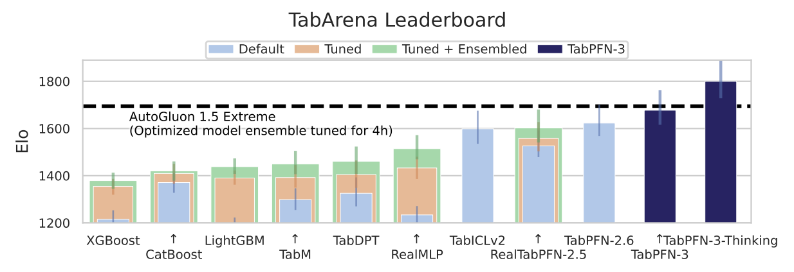

<figcaption>図10: 標準 TabArena ベンチマーク（全 51 データセット、最大 10 万行）での TabPFN-3 の性能。TabPFN-3 は 1 順伝播で他のどのモデルも上回り、TabPFN-3-Plus（Thinking）は AutoGluon 1.5 extreme（TabPFNv2 を 4 時間チューニングしたアンサンブル）を 1/10 未満の実行時間で強く上回る。</figcaption>
</figure>

<figure>

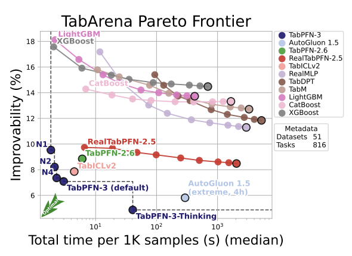

<figcaption>図11: TabArena のパレートフロンティア（予測品質と総訓練＋推論コストのトレードオフ）。N1・N2・N4 は推定器 1・2・4 個の TabPFN-3 版。Improvability は各データセットで最良モデルに乗り換えた場合の改善量。</figcaption>
</figure>

<figure>

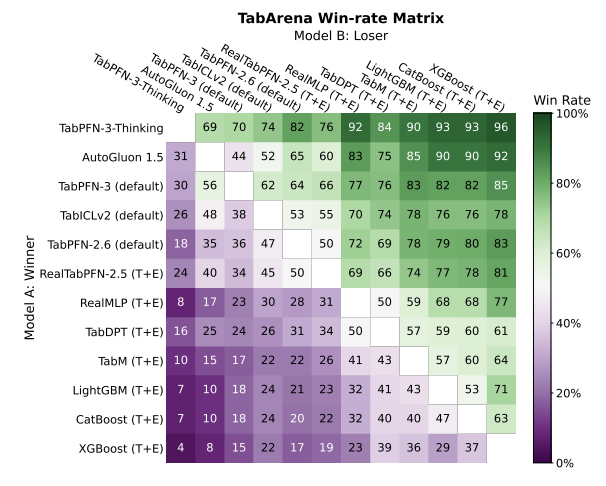

<figcaption>図12: TabArena 上の最強モデル群の厳選セットに対するペアワイズ勝率（全結果は Appendix E.2.4）。</figcaption>
</figure>

#### 3.1.2 TALENT

TALENT ベンチマークは TabPFN-3 の性能に補完的な視点を与える。小さく厳選したデータセット集合の代わりに、幅広い領域の多数の多様なデータセット（300）を使う。TabPFN-3 はこのベンチマークでも強い結果を示し、ロバスト性を確認する。実際、TabPFN-3 は集計で TALENT ベンチマーク首位（図 13）であり、タスク型別（回帰・二値・多クラス分類）でも首位（図 28）。

<figure>

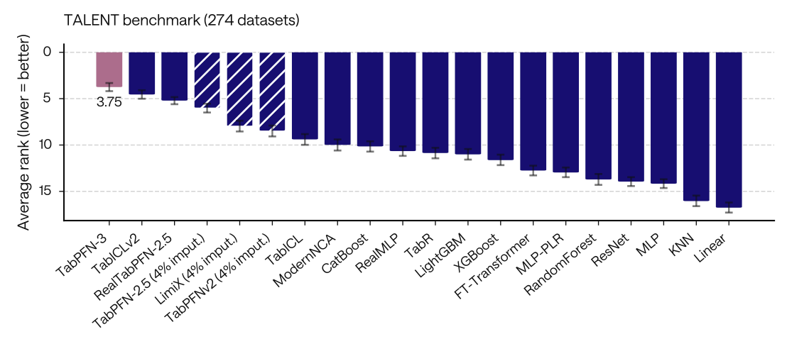

<figcaption>図13: TALENT ベンチマーク（TabICLv2 評価プロトコル、274 データセット）での平均ランク。元の 300 データセットから TabICLv2 開発に使った 26 を除いたもの。回帰・二値・多クラスを横断。バーは平均ランク（低いほど良い）、誤差棒は 95% ブートストラップ信頼区間。「(N imputed, X%)」タグは一部データで失敗し、そのスコアセルを k 近傍で埋めた手法。</figcaption>
</figure>

#### 3.1.3 TabSTAR

TabSTAR 研究は 50 のテキスト表データセットを集めた。これらは少なくとも 1 特徴量がテキストベースで、テキスト処理なしには忠実に表現できない実世界タスクを表す。オープンソースの TabPFN-3 は数値・カテゴリ変数のみをサポートするが、TabPFN-3-Plus はテキスト特徴量のネイティブサポートも提供する。我々は TabPFN API モデルを、テキスト認識モデルと数値のみベースラインの両方と比較する。図 14 は TabPFN-3-Plus がリーダーボードを大差で支配し、思考モードとネイティブテキストサポートの組合せが性能をさらに押し上げることを示す。さらに、ネイティブテキストサポートがないためテキスト特徴量を省くモデルの中でも、TabPFN-3 は最高性能。

<figure>

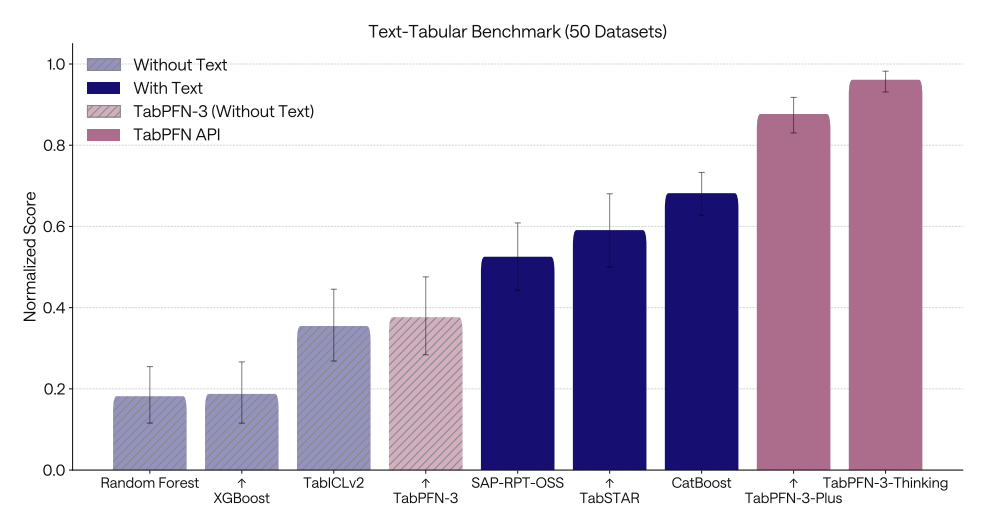

<figcaption>図14: TabSTAR テキスト表コレクション（50 データセット）での性能。TabPFN-3-Plus（Thinking）と TabPFN-3-Plus は CatBoost・TabSTAR・SAP-RPT-OSS のようなテキスト認識モデルを大きく上回る。これらは数値のみベースラインを支配し、その中では TabPFN-3 が最良。</figcaption>
</figure>

### 3.2 Internal Benchmarks（内部ベンチマーク）

公開 TabArena と TALENT を補完するため、既存の公開評価が部分的にしかカバーしない能力をストレステストするよう設計した内部ベンチマークで TabPFN-3 を評価する。これらは TabPFN-3 が小〜中規模データのフロンティアを超えるかを検証する。特に 100 万サンプル超へのスケーリング、高次元特徴量空間、多クラス分類、分位点回帰を評価する。主要比較対象は XGBoost・CatBoost・LightGBM と、強い公開結果を持つ表形式基盤モデル TabICLv2。

#### 3.2.1 Large Data（大規模データ）

**評価プロトコル**。大規模データ評価の主要ベースラインは木ベース手法で、最近の大規模ベンチマークが 10 万サンプル超で非常に競争力があると示している。我々の大規模データベンチマークは 10 万〜100 万訓練行・最大 200 特徴量のデータセットに焦点を当てる。

このベンチマークは TabPFN-3 が設計された大規模行レジームを標的とする。§2.1 で述べたように、TabPFN-3 はまず特徴量情報を固定次元の行表現に圧縮し、その後これらの行で ICL を行う。このアーキテクチャ分解は単一 GPU で最大 100 万行の推論を可能にする。同時に、行数と特徴量数の両方が非常に大きいとき早期の特徴量情報圧縮がボトルネックになりうるというスケーリングトレードオフを誘発する。高次元・低サンプルレジームは別の評価設定として §3.2.3 で扱う。

ベンチマークデータセットはヘルスケア・金融・物流・環境科学など多様な実世界領域に及ぶ。回帰では時間構造を示し、モデルは過去データで訓練し未来に汎化する必要がある。これは実展開条件として最も一般的で代表的と分かった。

**結果**。TabPFN-3 は大規模データベンチマークで SOTA を達成し、デフォルトおよび 8 時間チューニングの勾配ブースティング木ベースラインを 1 順伝播で上回る（図 15）。TabPFN-3-Plus（Thinking）のプレビュー版が分類で TabPFN-3 をさらに改善する（思考モードはまだ時間データに非対応のため回帰では評価できず）。訓練サイズに対するスケーリングを理解するため、1M 行データセットのサブサンプル版で性能を報告する（図 16）。10 万〜100 万行の範囲で TabPFN-3 は滑らかにスケールし、各訓練サイズで最高の正規化スコアを保つ。

**TALENT からの大規模データ結果**。内部結果を確認するため、TALENT の 10 万〜100 万訓練サンプルの 14 データセットも抽出（Appendix F.2）。この部分集合でも TabPFN-3 はベースラインに対し最良ランク（図 30）。

<figure>

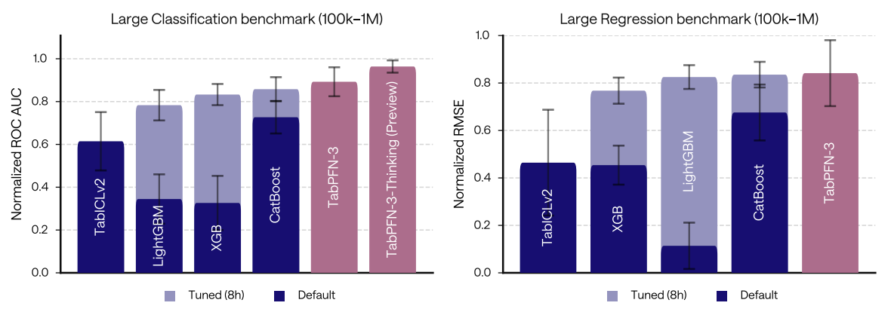

<figcaption>図15: TabPFN-3 は大規模行ベンチマーク（最大 100 万行・200 特徴量、13 データセット）で SOTA を達成し、デフォルトおよび 8 時間チューニングの勾配ブースティング木ベースラインと TabICLv2 を 1 順伝播で上回る。(a) 分類（9 データセット）。(b) 回帰（4 データセット、時間分割）。スコアは高いほど良い。</figcaption>
</figure>

<figure>

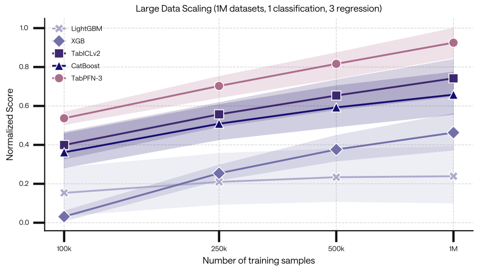

<figcaption>図16: TabPFN-3 は ROC-AUC OvR 分類と RMSE 回帰の正規化スケーリング曲線をデータセット規模横断で先導する。1M 行以上に届くデータセット（分類 1・回帰 3）で、訓練集合を 100k/250k/500k/1M 行へサブサンプル（3 反復）。陰影は 95% ブートストラップ信頼区間。</figcaption>
</figure>

#### 3.2.2 Many-Class Classification（多クラス分類）

TabPFN-3 は最大 160 クラスをサポートするよう訓練した多クラスデコーダ（§2.2）を導入する。多クラスはほとんどの表形式基盤モデルが完全に失敗するレジームである。自然に多クラスを持つ実世界データセットからベンチマークを作るのは難しいため、回帰ターゲットをバケット化して導いた合成ベンチマークで評価する。50 クラス超の TALENT の 4 データセットでも強い性能を確認（§E.3.3）。

**合成多クラスベンチマーク**。TabArena 回帰データセットを jittered quantile binning で多クラス分類問題に変換して構築（詳細は Appendix F.3）。図 17 は ROC-AUC（OvR）と精度を示す。TabPFN-3 は正規化 ROC-AUC 1.00 で全体首位、ベースラインを大差で上回る。次点は TabICLv2 が多クラスラッパで 0.89（10 クラス上限を超えるため）。TabPFN-2.5 は誤り訂正符号ラッパで 0.83。従来の木ベースや KNN は 1 時間チューニング後でも著しく劣る。

<figure>

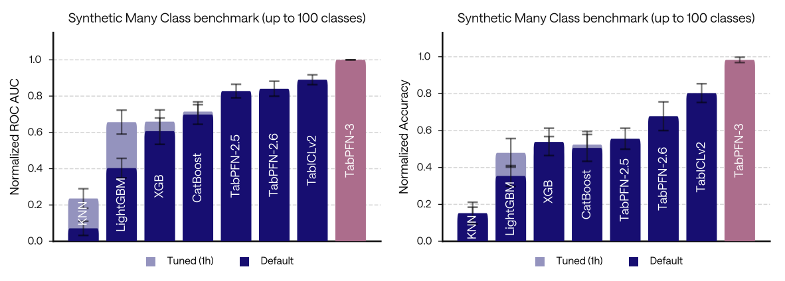

<figcaption>図17: 合成多クラスベンチマーク（最大 100 クラス）で TabPFN-3 は正規化 ROC-AUC（OvR）1.00 を達成し全 GBT ベースラインを大差で上回る。9 データセットを TabArena 回帰タスクから Dirichlet-jittered 分位点ビニング＋ラベルシャッフルで導出。</figcaption>
</figure>

#### 3.2.3 Many Features（多特徴量）

高次元・低サンプルレジームは大規模行設定とは質的に異なる課題を呈する。大規模行ベンチマークが主にスケーラビリティを検証するのに対し、多特徴量設定は候補特徴量数がサンプル数を大きく超えるときのロバストな汎化と特徴量サブセット選択を検証する。

100〜320 サンプル・1,100〜22,200 特徴量・2〜4 クラスの、主に生物医学/遺伝子発現型領域の 6 つの実世界分類データセットの専用 many-features スライスで評価する。このような大きな特徴量対サンプル比は、偽の特徴量相互作用を選ぶリスクを増やすため木ベース手法に難しい。

図 18 は TabPFN-3 がこの難しいスライスで強い性能を示し、32 推定器で最高の正規化 ROC-AUC に達することを示す。以前の TabPFN 変種、特に Real-TabPFN-2.5 と TabPFN v2 も競争力があり、TabPFN 流の事前訓練が高次元・低サンプル問題にロバストな帰納バイアスを与えることを示唆する。

§2.3 で述べたように各 TabPFN-3 推定器はデフォルトで最大 200 入力特徴量に制限される。数万の生特徴量を持つデータセットでは、同じ推定器予算で Real-TabPFN-2.5 が TabPFN-3 をわずかに上回りうる。これは 2 要因を反映すると仮説する。Real-TabPFN-2.5 は推定器あたり最大 500 特徴量を使い、一部データでより広い特徴量空間カバレッジを提供すること、その行方向・特徴量方向交互アテンションが選択した特徴量サブセットをよりよく活用しうること。TabPFN-3 では推定器数を増やすと生特徴量空間のカバレッジが上がり、情報的な特徴量サブセットが含まれる確率が上がる。OSS 版ではこの推定器予算が高次元入力で自動スケールされ、アンサンブルがこのレジームで大幅に効果的になる。

全体として、many-features スライスは、従来の木ベース手法がノイズ的/偽の特徴量相互作用に過適合しがちな高ノイズ特徴量選択レジームで、TabPFN 推定器が効果的にアンサンブルできることを示唆する。

<figure>

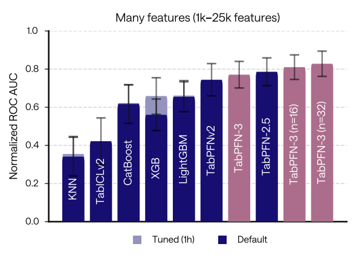

<figcaption>図18: TabPFN は高次元・低サンプル分類によくスケールする。many-features スライス（102〜322 サンプル・1,117〜22,215 特徴量の 6 分類データセット）での正規化 ROC-AUC。標準的な木ベースに特に難しいこのレジームで、TabPFN-3 の推定器数を増やすと特徴量空間カバレッジが上がり性能が大きく向上。</figcaption>
</figure>

#### 3.2.4 Quantile Regression（分位点回帰）

点予測を超え、TabPFN-3 は bar-distribution 回帰ヘッド（§C）を通じて完全な予測分布を提供し、そこから任意の分位点を推論時に予測 CDF を反転して復号する——すべて 1 順伝播で、分位点レベルごとの再訓練なし。TabArena は分位点回帰評価をネイティブにサポートしないため、TabArena 回帰データセットをダウンロードして全モデルを pinball loss（10 分位点 $q\in\{0.1,0.2,\dots,0.9\}$ で平均）で評価する専用ベンチマークを構築する。分位点回帰の典型戦略をカバーする 4 ベースライン（線形分位点回帰・XGBoost 分位点モード・分位点ランダムフォレスト・TabICL-v2）と比較する。

TabPFN-3 は正規化 pinball loss スコア 1.00 に非常に近く全体首位で、全ベースラインを上回る。bar-distribution ヘッドが、分位点レベルごとの追加訓練コストなしに、専用の分位点回帰ベースラインより優れた較正された予測分布を生むことを示す。正規化 pinball loss は図 19、対応する臨界差プロットは付録の図 35。

<figure>

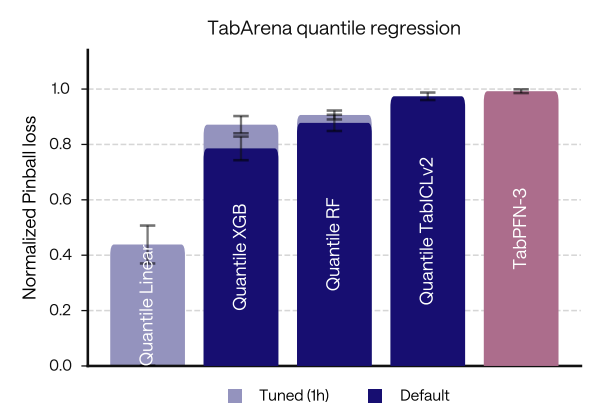

<figcaption>図19: TabPFN-3 は分位点回帰で強い予測分布モデリングを示す。TabArena 回帰データセットから構築した分位点回帰ベンチマークでの正規化 pinball loss（10 分位点で平均）。スコアは高いほど良い。</figcaption>
</figure>

### 3.3 Time-Series Forecasting（時系列予測）

分類・回帰のチェックポイントに加え、確率的時系列予測のため **合成** 時系列データでファインチューンした TabPFN-TS の新しい TabPFN-3 チェックポイントを公開する。このチェックポイントは `tabpfn-time-series` ライブラリで使える。100 の多様な時系列予測タスクを含むベンチマーク fev-bench で評価する。このベンチマークに従い、Seasonal Naive ベースライン相対の勝率とスキルスコアを表 1 に報告（全版は Appendix Table 17）。

**表1**: fev-bench（100 タスク）の予測性能、スキルスコア順。**TabPFN-TS-3 は合成データのみで訓練されながら、SQL・MASE スキルスコアの両方で基盤モデル中 2 位**。全 18 ベースラインのリーダーボードは Appendix H。

(a) SQL（確率的）

| モデル | Win (%) | Skill (%) | Runtime (s) | Leak.(%) | #fails |
| --- | --- | --- | --- | --- | --- |
| Chronos-2 | 91.7 | 47.3 | 0.8 | 0 | 0 |
| **TabPFN-TS-3** | 73.6 | 43.1 | 234.6 | 0 | 0 |
| TiRex | 83.4 | 42.6 | 0.2 | 1 | 0 |
| TimesFM-2.5 | 78.6 | 42.2 | 1.9 | 10 | 0 |
| Toto-1.0 | 71.6 | 40.7 | 22.1 | 8 | 0 |
| TabPFN-v2-TS | 64.1 | 39.6 | 88.9 | 0 | 2 |
| Moirai-2.0 | 66.2 | 39.3 | 0.3 | 28 | 0 |
| Chronos-Bolt | 66.2 | 38.9 | 0.2 | 0 | 0 |
| Sundial-Base | 47.1 | 33.4 | 8.0 | 1 | 0 |
| Stat. Ensemble | 43.8 | 20.2 | 148.6 | 0 | 11 |
| Seasonal Naive | 19.1 | 0.0 | 0.5 | 0 | 0 |

(b) MASE（点）

| モデル | Win (%) | Skill (%) | Runtime (s) | Leak.(%) | #fails |
| --- | --- | --- | --- | --- | --- |
| Chronos-2 | 86.9 | 35.5 | 0.8 | 0 | 0 |
| **TabPFN-TS-3** | 69.8 | 30.6 | 234.6 | 0 | 0 |
| TimesFM-2.5 | 74.9 | 30.2 | 1.9 | 10 | 0 |
| TiRex | 76.9 | 30.0 | 0.2 | 1 | 0 |
| Toto-1.0 | 66.3 | 28.2 | 22.1 | 8 | 0 |
| TabPFN-v2-TS | 58.5 | 27.6 | 88.9 | 0 | 2 |
| Chronos-Bolt | 60.7 | 26.5 | 0.2 | 0 | 0 |
| Sundial-Base | 53.4 | 24.7 | 8.0 | 1 | 0 |
| TabICL-v2 | 46.7 | 15.7 | 148.6 | 0 | 11 |
| Seasonal Naive | 20.0 | 0.0 | 0.5 | 0 | 0 |

我々のチェックポイントは最大 3.2 万の履歴時間ステップの文脈で評価され、patch/window ベースの時系列基盤モデルが通常使う予算を大きく超える。fev-bench 著者が評価した元の TabPFN-TS（SQL skill 39.6, MASE skill 28.8）に対し、我々のファインチューン版は **SQL skill 43.1, MASE skill 30.6** に改善する。全 100 タスクで平均 SQL スキルで 2 位（TiRex, TimesFM-2.5 を上回る）、MASE で 2 位（TimesFM-2.5〔10% の train/test リーク疑い〕と TiRex を上回る）、いずれも Chronos-2 に次ぐ。勝率では TabPFN-TS-3 のランクは 4 位に下がるが、これらは少数データセットの微差に非常に敏感と分かった。

TabPFN-TS-3 の強い性能は、それが **純粋に合成データで訓練される** のに対し、Chronos-2・TimesFM-2.5 を含む他の時系列モデルの多くが実世界データで訓練される点で特に注目に値する。この性質は実データ事前訓練の多くの問題を防ぐ。履歴系列はリーク的で予測ライブラリ間で頻繁に再循環する（fev-bench は TimesFM-2.5 で 10%・Moirai-2.0 で 28% のリークをフラグ。表 1 参照）。歴史的事前訓練からの未来予測は本質的に分布外で、公開実世界時系列データの供給は有限なので、それに頼るモデルはバイアスと天井を継承する。我々の合成事前分布は設計上、特定の実時系列からの汚染がゼロである。

定性例は図 20、全リーダーボード（表 17）・ペアワイズ比較（図 45）・追加の定性予測・タスク別 SQL 結果は Appendix H。

<figure>

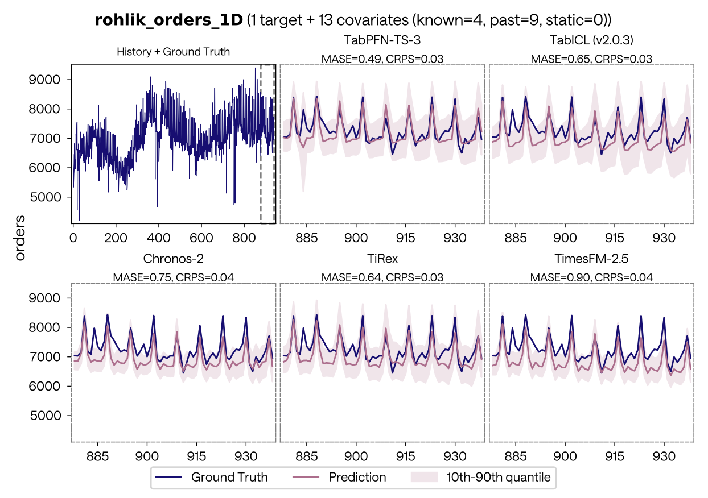

<figcaption>図20: fev-bench タスク（rohlik_orders_1D）での定性的予測比較。各モデル列は予測ホライズン（時刻 880-935 にズーム）を保留グラウンドトゥルースに対して示し、陰影は 10-90% 分位点。左端は全訓練履歴。MASE・CRPS をモデルごとに報告。TabPFN-TS-3 は MASE=0.49・CRPS=0.03 と最良級。</figcaption>
</figure>

### 3.4 Relational Data（関係データ）

実世界データはしばしば関係的である。企業・医療システム・金融機関はコアの運用データを関係データベースの複数の相互接続テーブルに保存する。そのようなデータから予測的洞察を引き出すには、外部キー関係で結ばれた異種テーブルを同時に推論する必要があり、専用の関係基盤モデル（RFM）の開発を動機づけてきた。RFM は、コストのかかるタスクごとのモデル訓練やハイパーパラメータ調整なしに、文脈内学習（ICL）で正確で最新の予測を提供することを目指す。

これは関係データ専用の解の出現を促した。完全教師あり解（GraphSAGE, RelGT, RelGNN）、クローズドソースの RFM（KumoRFMv1, KumoRFMv2）、オープンソース RFM（Griffin, RT_zero）、最近の RDBLearn（TabPFN を含む TFM が基底データベースを自動的に 1 テーブルに平坦化して RFM に変換できると示した）など。本節ではこの研究の上に、TabPFN-3 を用いた **TabPFN-REL** が人気の RelBenchV1 ベンチマークでエンティティ分類・回帰の SOTA 性能を達成することを示す。

**TabPFN-REL は RFM 中の新 SOTA を打ち立てる**。RelBenchV1 でのエンティティ分類・回帰の各 RFM と完全教師ありベースラインの集計性能を図 21 に報告（データセット単位は §E.5）。**TabPFN-REL は両タスクで RFM 中 SOTA**、KumoRFMv1/v2 が回帰/分類で次点。RDBLearn を固定 TabPFN-3 バックエンドで使うと、様々な TFM（TabPFN-2.5 含む）をチューニングする元の RDBLearn を一貫して上回り、ランタイム・性能でパレート支配し、オープンソース RFM の新 SOTA を打ち立てる。執筆時点で TabPFN-3 は最良の全体 RFM（TabPFN-REL）と最良のオープンソース代替（RDBLearn + v3）の両方を支える。

**完全教師ありベースラインとの比較**。完全教師あり RelGNN は TabPFN-REL を上回り、その差は回帰より分類で大きい。回帰では RelGNN との差は僅少で、TabPFN-REL は RelGT・GraphSAGE より低い正規化平均ランクを達成。完全教師あり手法の訓練は TabPFN-REL の数桁高コスト（単一教師ありモデルの訓練が TabPFN-REL の順伝播よりはるかに長く、データセットごとの大がかりな調整を要する）。

<figure>

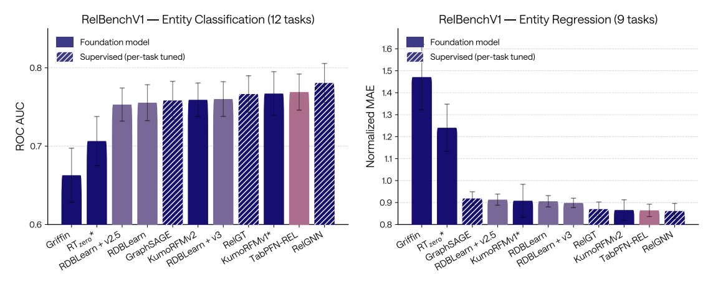

<figcaption>図21: TabPFN-3 は RelBenchV1 で基盤モデル中の性能を先導。エンティティ分類の平均 ROC AUC とエンティティ回帰の MAE（LightGBM の MAE で正規化）。RelGNN が両タスクで SOTA、次いで TabPFN-REL が基盤モデルの新 SOTA。* の手法（KumoRFMv1, RT_zero）は RelBench と異なる評価プロトコルの可能性があり性能を過大評価しうる。</figcaption>
</figure>

### 3.5 Causal Inference（因果推論）

我々の以前の結果（TabPFN-2.5 が RealCause で メタ（T/X/S）学習器として強い性能）に続き、scikit-uplift ベンチマークでの評価を提供する。QINI スコアでは、全 TabPFN-3 メタ学習器が TabPFN-2.5 を上回り、上位 2 つを T・S 学習器が占める（図 27）。一方 RealCause では TabPFN-2.5 と比べやや劣る性能を観察する。より詳細な分析と QINI 評価プロトコルの記述は Appendix E.1。

### 3.6 Embeddings（埋め込み）

最後に、TabPFN-3 が意味的に有意味な埋め込みを生成することを示す。TabPFN v2 で Ye らが開発したアプローチに従う。データセットを交差検証フォールドに分割し、各フォールドのテスト部分の埋め込みを取る。捉える埋め込みは我々のモデルの段 3 の終端の ICL 層の出力である（詳細は §2.1）。図 22 はこのアプローチが TabPFN-3 でも引き続きよく機能し、生成埋め込みがデータセット構造を捉えることを示す。

<figure>

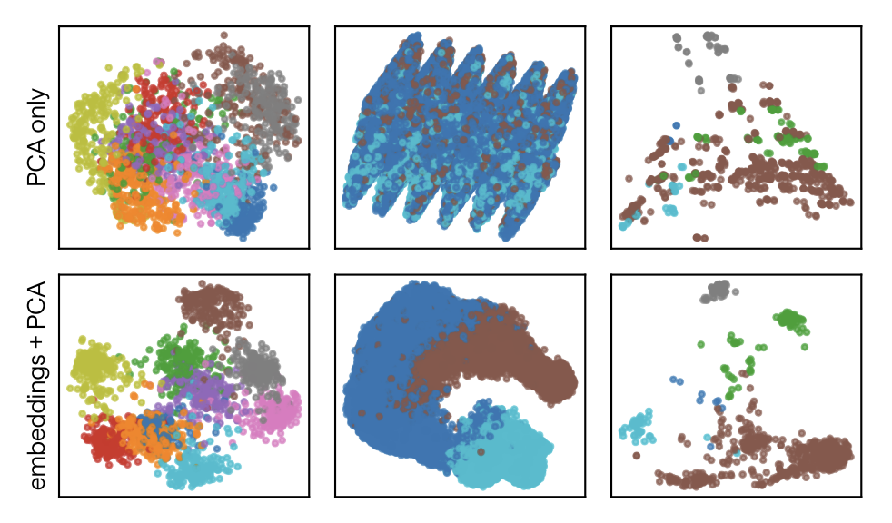

<figcaption>図22: TabPFN-3 は意味的に有意味な行埋め込みを抽出する。上段は 3 つの分類データセットに直接 2D PCA を適用（各点が 1 行）、下段は行の埋め込みに PCA を適用。色はクラスを示す。埋め込みがクラスごとにクラスタ化することがわかる。</figcaption>
</figure>

## 4 Adoption（採用）

TabPFN-3 は既に広がったエコシステムへ出荷される。v2 リリース以来、TabPFN は学術 ML 研究・応用科学・エンタープライズ展開で取り上げられてきた。本レポートで参照する拡張（時系列・因果推論・関係データ・解釈可能性）の相当部分は、社内で始めたのでなくコミュニティが駆動した。本節は採用の形——どこで本番運用され、どこで評価され、どのプラットフォームでアクセス可能で、どの研究領域が公開応用を出したか——を述べ、v3 リリースに実際の運用的文脈を与える。

### 4.1 Community and Open-Source Ecosystem（コミュニティとオープンソース）

オープンソースの `tabpfn` パッケージは 320 万 PyPI ダウンロードを超え、元の TabPFN Nature 論文は出版後 16 か月で 1,000 本超に引用された。2,000 超のユーザーの Discord と数百の解決済み GitHub issue が、クロスプラットフォーム安定性・エッジケース修正・研究成果物から本番グレードライブラリへの成熟を駆動した。

別の `tabpfn-extensions` リポジトリは、コアモデルと合成するコミュニティ駆動拡張をホストする。SHAP/SHAP-IQ 解釈可能性・合成データ生成・欠損値補完・TabPFN ベース特徴量選択・回帰経由分類・生存分析・条件付きランダム化検定。TabPFN-3 の削減 KV キャッシュと推論改善（§2）は、繰り返し順伝播に依存するあらゆる拡張（特に解釈可能性と条件付き独立性検定）を直接加速する。

TabPFN は独立研究として公開された手法の基盤層としても機能する。時系列予測・グラフのノード分類・進化するデータストリーム・因果推論・強化学習・高次元ベイズ最適化・マルチモーダルエンコーディングなど。§3 で示したように、これらの拡張の多くは TabPFN-3 をバックエンドに（v2.5/v2.6 でなく）使うとさらに前進する。

### 4.2 Enterprise Engagements（エンタープライズ導入）

TabPFN は幅広いエンタープライズ設定で展開・評価されてきた。例: *Hitachi Rail* はスペイン鉄道網の予知保全に TabPFN を展開、初期展開で既存ベースライン比 RMSE 約 40% 削減。*Creditplus Bank*（Crédit Agricole グループ）は蒸留 TabPFN モデル（§2.4.3）を、信用リスク規制制約下の自動車金融の CPU ベース信用決定支援に使う予定。*Oxford Cancer Analytics* はプロテオミクス液体生検データに TabPFN を適用し早期肺疾患検出。より長いリストは Prior Labs ウェブサイト。

### 4.3 Platform Availability（プラットフォーム提供）

TabPFN は評価・非商用利用にオープンソース PyPI 配布で、商用ワークロードにマネージド API で利用できる。モデルは現在 *AWS SageMaker Marketplace* と *Azure AI Foundry Model Catalog* に掲載され、分類・回帰タスクのバッチ・リアルタイムを完全サポート。両マーケットプレイスの TabPFN-3 リリースは本レポートに続く。*Databricks* の参照統合は Databricks Industry Solutions リポジトリで利用可能。ライセンス条項・商用利用範囲・本番展開の連絡先は §5。

### 4.4 Research Adoption Across Domains（領域横断の研究採用）

商用導入に加え、幅広い領域で 200 超の公開 TabPFN 研究応用を収集した（全リストは Appendix I）。

採用は *ヘルスケア・ライフサイエンス* で最も強く（98 応用）、データの乏しい設定での TabPFN の相対優位を反映する。診断・予後・治療反応予測・バイオマーカーモデリング・生存分析・創薬・薬物動態・ラジオミクス・オミクス・マルチモーダル臨床データ。*製造・産業*（41 本）はコンクリート/アスファルト強度予測・地盤工学・トンネル建設・鋼/半導体特性・IIoT 侵入検知・回転機械故障分類・電池/回路モデリング・材料発見。*エネルギー・公益*（24 本）は環境監視・再エネ/地球物理予測・水/気候系・産業プロセス最適化。*金融サービス*（7 本）は取引分析・チャーン予測・リターン予測・保険数理・信用リスク予測（公開数の少なさは公開が少ない領域での商用牽引を過小評価している可能性大）。残り 32 応用は不確実性推定・仮説検定・Shapley 値推定・グラフノード分類・サイバーセキュリティ・地球科学・農業・土壌/月レゴリス分析・燃料配合予測・作物収量予測・法科学的祖先予測・合成表データ生成。

これらの応用の分布——限られた/高価な/異質なデータを特徴とする領域に偏る——は TabPFN が設計されたレジームと整合し、§2 で述べた v3 の能力選択の経験的根拠である。

## 5 License and Availability（ライセンスと提供）

我々は TabPFN-3 を TABPFN-3.0 License v1.0 の下で公開する。学術利用・研究・商用設定での評価に寛容に設計されている。ライセンスはテスト・評価・内部ベンチマークを明示的に許可し、組織は商用契約なしにモデルをダウンロードして自分のデータセットで予備評価を実行できる。

主要な制約は、モデル・その派生物・その出力を商用・本番目的に使えないことである。これは収益を生む製品・調達のための競争的ベンチマーク・クライアント成果物・モデル出力を内部の商業的意思決定の入力に使うことを含むが、これに限らない。

本番利用には商用エンタープライズライセンスを提供する。マネージド API・VPC 展開（公表時点で AWS SageMaker と Azure AI Foundry）・他ソフトウェアプラットフォーム（Databricks, SAP）でのオンプレ/カスタム展開で利用できる。商用エンタープライズライセンスは、独自の高速推論エンジン・専用サポート・統合ツール・追加の内部モデル・オープンソース公開に含まれない TabPFN-3-Plus（Thinking）変種へのアクセスを提供する。マネージド API は最適化 GPU インフラで動き、専用ローカル GPU を持たないユーザーに推奨。Python SDK（`pip install tabpfn-client`）または標準 REST API でアクセスできる。

完全な TABPFN-3.0 License v1.0 本文は Hugging Face にある。商用ライセンスの問い合わせは sales@priorlabs.ai へ。
